# Project Log — Tahirelshazli.com Educational Platform

Running narrative of what this project is and how it got here, in prose and diagrams.
Maintained by Claude Code per `CLAUDE.md` §13. Newest dated entries at the bottom;
the **Current state** block below is overwritten each update.

---

## Current state (as of 2026-09-12)

The repository is a monorepo with a **NestJS backend** and a **Next.js frontend**, on the stack
fixed in the signed agreement (Next.js + NestJS + PostgreSQL + Bunny Stream + Cloudflare R2 +
Hostinger VPS, all behind swappable interfaces).

**The size it is built for is now a known number, not an assumption.** Dr. Tahir runs about
**10 groups of ~30 students — roughly 300 students**, one teacher, a few TAs, on a single VPS with
one replica. `CLAUDE.md` §7.3 records this and what it rules out: no Redis, no pagination on
student-facing lists, no scoping cache, because on one replica per-process state is correct rather
than deficient. What it does *not* excuse is anything `O(N)` on a daily screen — the two that
existed were both fixed on 2026-09-09.

**Groups: specified on 2026-09-10 and since built.** The client's instruction that day introduced
an entity the schema had never had — a **group** is a cohort, a **course** is the curriculum, and
several groups share one course. `CLAUDE.md` §§5.16–5.18 record the requirement, and the client
answers that shaped it: a group is a **standalone class of students** enrolled into courses (no
`course_id` on the group), students are **enrolled first and placed second**, and TAs currently
**see everything** — a
posture the client may reverse, so §5.11's scoping machinery deliberately stays standing (§5.11.1).
The shipped code still scopes TAs; that divergence is recorded, not reconciled.
**A task is written once and targeted at selected groups** (`AssessmentTarget`), and the learning
mode moved onto `GroupCourse`; adding a group to a course enrolls nobody. An unplaced student's
course looks empty until a TA places them, which is the design note to carry into the build.
**Groups are specified and the foundation is built** (migration `006`, `backend/src/groups/`):
four tables, a repository on both drivers, staff CRUD and placement, the student classmate list,
and six new audit actions. The learning mode now resolves from the group - migration `007` dropped
`enrollments.learning_mode`, so there is no second copy to drift. **Assessment authoring is built** (§5.18): a TA or teacher writes a task once and
targets it at one or more groups, and a student sees only what was set for a group they are in.
Announcements now have a student-facing page as well as a mailbox line. The **quiz engine is
deliberately unbuilt** - §11 still has "how rich at launch" open. **None of the group or authoring
work now has screens too**: `/manage/groups`, a course Groups tab carrying placement and the
**"enrolled, not yet placed"** list, a course Work tab for authoring, and *Your class* and
*Announcements* panels on the student course page.

**Backend — four of five roles now have a working API.** Of the five roles in `CLAUDE.md` §2,
**Student**, **Assistant** and **Teacher** have full surfaces and **Visitor** now has a real one
(the public catalog *and* the blog); only **Parent** has nothing. Nineteen feature modules (`auth`,
`students`, `courses`, `enrollments`, `dashboard`, `assessments`, `materials`, `recordings`,
`live-sessions`, `reports`, `notifications`, `staff`, `manage`, `announcements`, `groups`, `blog`,
`public`, `audit`, plus `common` — which now also holds `common/storage`)
sit behind global `JwtAuthGuard` + `RolesGuard`. `staff` owns the `CourseStaffAssignment` scoping
every TA endpoint joins through (§5.11); `manage` is the work surface built on it — overview,
roster, grading, the recording library, live-session scheduling and the people directory;
`announcements` carries the send-time audience resolution §5.14 requires; `public` is the only
unauthenticated surface besides health and auth; `audit` owns the append-only log, now covering
**twenty-four actions**; `groups` (§5.16) owns cohorts, staff placement and the classmate list, with
`GroupDataModule` global so the learning mode can be resolved without a module cycle; and `blog`
(§5.19) owns Dr. Tahir's achievements — authored by a teacher *or an assistant*, read by students and
anonymous visitors through **one** public endpoint, with publication decided by a clock comparison in
SQL rather than by a background job. `common/storage` carries the first endpoint in this build that
takes **bytes** rather than a URL (`POST /staff/uploads`), behind a `FileStorage` interface whose
only implementation today is development-only and refused in production.

**Persistence is driver-selected.** All fifteen repository interfaces have *two* implementations —
an `InMemory*Repository` and a `Postgres*Repository` — bound through
`database/repository.provider.ts` by the `PERSISTENCE_DRIVER` env var. `memory` is the default in
development and test and is **refused outright in production**. Eight migrations:
`001_student_platform.sql`, `002_staff_and_audit.sql`, `003_course_catalog.sql`,
`004_public_catalog.sql`, `005_announcements.sql`, `006_groups.sql`,
`007_learning_mode_moves_to_the_group.sql` and `008_blog.sql`.

**The integration suite has run in full for migrations 001-007.** It covers all fifteen
repositories, and as of **2026-09-11 all eight migrations have been applied to a real PostgreSQL 15
from an empty schema with all 79 green** — the announcements DDL and both its CHECK constraints,
the `notifications_type_check` swap, 004's slug backfill, 003's learning-mode UPDATE, 006's four
group tables with their UNIQUE constraints and cascades, 007's column drop and 008's two blog
tables included. The CI guard that fails a job reporting no executed tests still matters, because
the suite self-skips and exits 0 wherever `TEST_DATABASE_URL` is unset.

**There is no longer an unverified migration.** `008_blog.sql` was the exception until 2026-09-11
and has now been applied from an empty schema, with its **twelve** integration tests executed (the
count was previously recorded as thirteen and was wrong). Its two CHECK constraints per table, the
`blog_posts_live_idx` partial index, the `TEXT[]` default, the `BIGINT` round trip and the cascade
to `blog_post_media` were also checked directly against the running database. For the first time in
this project a migration's first real run found nothing wrong with the migration — what it found
was in Docker (see the 2026-09-11 entry).

**The whole stack now runs as containers**, not only as `npm run dev`: Postgres, the API on the
postgres driver, and the web app, with migrations *and* idempotent seeds applied at boot
(`DB_AUTO_SEED`, refused in production) and a named volume behind the upload driver.

Test totals across the three suites: **369 unit, 179 e2e, 79 integration** — all executed.

**The audit trail's one long-standing gap is closed** (2026-09-10). An action and its log entry now
commit together: `DatabaseService` carries the in-flight transaction in `AsyncLocalStorage` so any
repository joins it without knowing, and `AuditService.record` **throws if called outside one** -
which is what keeps §5.4 true as new surfaces land rather than hoping each author remembers. This
was the stated prerequisite for payments (§5.12).

**Delivery is wired.** `npm install && npm run dev` runs the whole thing with no database and no
config; CI lints, builds, and runs unit + e2e + integration (against a Postgres service) plus both
container image builds on every push and PR. Both images built and ran from the repo root when
that was last verified on 2026-09-07; they have **not** been rebuilt since. CI still builds them on
every push.

**Frontend covers the marketing site, the student LMS and the TA/admin console.** `app/(site)`
marketing, `app/(app)` product shell — student LMS *and* `/manage/*` — and `app/(auth)`
authentication: **39 build routes**, a shared token system in `app/tokens.css`, and an API client
in `lib/api.ts` covering every student, staff and admin route. One `AppShell` serves every signed-in
role and picks its rail from `lib/roles.ts`. Builds, typechecks and lints clean.

**Its design system is Twenty's, as of 2026-09-12**, and `docs/frontend-design-system.md` is the
contract — tokens, component mapping, and which parts are deliberately ours. The accent is
**indigo `#3E63DD`**, which replaces the brief's gold; `CLAUDE.md` §4.1 records that decision and
that reverting it is one block of values. Primitives live in `components/ui/` (one per file, behind
a barrel), the type scale is Inter at a 13px base with a four-tint text ramp carrying hierarchy
instead of size, and focus is a global `outline` on `:focus-visible`. The marketing site keeps its
own larger scale behind `[data-surface="site"]`.

The blog adds six of those routes, and the path split is worth knowing because a route group adds no
URL segment: the marketing site owns `/blog` and `/blog/[slug]`, so the in-app student surface is
**`/achievements`** — `(site)/blog` and `(app)/blog` both resolving to `/blog` is a build error.
Authoring is `/manage/blog` and `/manage/blog/[id]`, whose two panels (the post, the gallery) save
independently so an upload cannot be lost to a validation error on the title.

**Tooling:** the ruflo meta-harness (`.claude/`, `.claude-flow/`, `.mcp.json`) plus a
project-specific 10-agent review swarm under `.claude/agents/tahir/`, driven by `/swarm-review`.

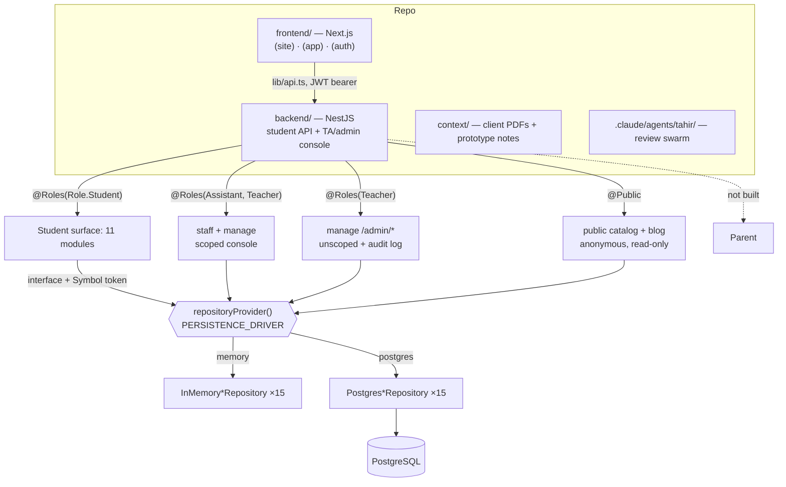
```mermaid
graph TD
    subgraph Repo
      FE["frontend/ — Next.js<br/>(site) · (app) · (auth)"]
      BE["backend/ — NestJS<br/>student API + TA/admin console"]
      CTX["context/ — client PDFs + prototype notes"]
      SWARM[".claude/agents/tahir/ — review swarm"]
    end
    FE -->|"lib/api.ts, JWT bearer"| BE
    BE -->|"@Roles(Role.Student)"| STU["Student surface: 11 modules"]
    BE -->|"@Roles(Assistant, Teacher)"| TA["staff + manage<br/>scoped console"]
    BE -->|"@Roles(Teacher)"| ADM["manage /admin/*<br/>unscoped + audit log"]
    BE -->|"@Public"| VIS["public catalog + blog<br/>anonymous, read-only"]
    BE -.->|not built| OTHERS["Parent"]
    STU -->|"interface + Symbol token"| SEL{{"repositoryProvider()<br/>PERSISTENCE_DRIVER"}}
    TA --> SEL
    ADM --> SEL
    VIS --> SEL
    SEL -->|memory| MEM["InMemory*Repository ×15"]
    SEL -->|postgres| PG["Postgres*Repository ×15"]
    PG --> DB[("PostgreSQL")]
```

### Backend module / route map

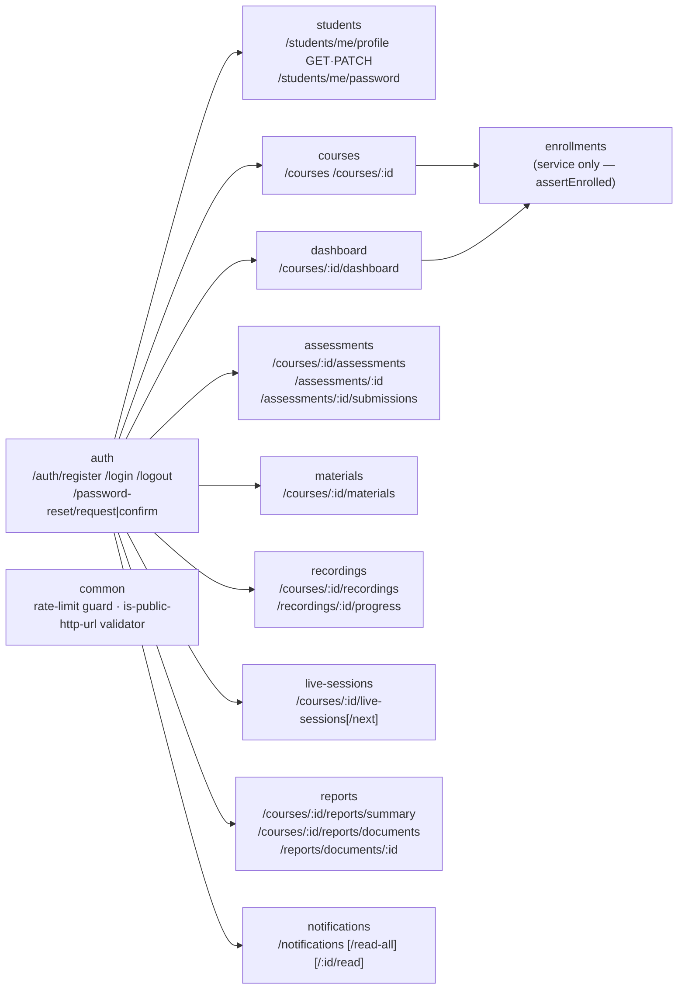
```mermaid
graph LR
    AUTH["auth<br/>/auth/register /login /logout<br/>/password-reset/request|confirm"]
    STUD["students<br/>/students/me/profile GET·PATCH<br/>/students/me/password"]
    CRS["courses<br/>/courses  /courses/:id"]
    DASH["dashboard<br/>/courses/:id/dashboard"]
    ASSESS["assessments<br/>/courses/:id/assessments<br/>/assessments/:id<br/>/assessments/:id/submissions"]
    MAT["materials<br/>/courses/:id/materials"]
    REC["recordings<br/>/courses/:id/recordings<br/>/recordings/:id/progress"]
    LIVE["live-sessions<br/>/courses/:id/live-sessions[/next]"]
    REP["reports<br/>/courses/:id/reports/summary<br/>/courses/:id/reports/documents<br/>/reports/documents/:id"]
    NOT["notifications<br/>/notifications [/read-all] [/:id/read]"]
    ENR["enrollments<br/>(service only — assertEnrolled)"]
    COMMON["common<br/>rate-limit guard · is-public-http-url validator"]

    AUTH --> STUD & CRS & DASH & ASSESS & MAT & REC & LIVE & REP & NOT
    CRS --> ENR
    DASH --> ENR
```

---

## 2026-08-27 — Project scaffold

**What changed.** Initial monorepo created: root `package.json` workspace, `frontend/` from
`create-next-app` (TypeScript + Tailwind), `backend/` from the NestJS starter, `docker-compose.yml`
with separate `Dockerfile.backend` / `Dockerfile.frontend`, a `database/` folder, `.env.example`,
and a `README.md` documenting the agreed stack. `brief.txt` and the `context/` PDFs
(signed agreement, both client meeting reports, prototype walkthroughs) were added as the
source-of-truth material that `CLAUDE.md` §0 ranks.

**Why.** Establishes the stack fixed in `context/download.pdf` — Next.js + NestJS + PostgreSQL on
Hostinger, explicitly *not* the Next.js-API-routes + Supabase path from the older background notes
(`CLAUDE.md` §3).

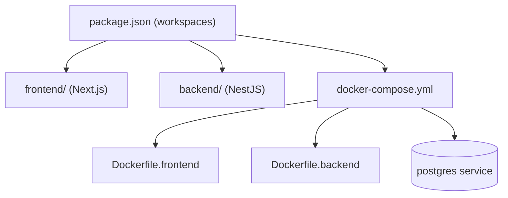
```mermaid
graph TD
    ROOT["package.json (workspaces)"] --> FE["frontend/ (Next.js)"]
    ROOT --> BE["backend/ (NestJS)"]
    ROOT --> DC["docker-compose.yml"]
    DC --> DFE["Dockerfile.frontend"]
    DC --> DBE["Dockerfile.backend"]
    DC --> DB[("postgres service")]
```

**Follow-ups.** Everything — no application code yet. Frontend never progressed past this starter.

---

## 2026-08-29 — Student-facing API modules (commits `2ecae94`, `a09b055`)

**What changed.** The student backend was built out across two commits. First `auth`, `courses`, and
`assessments`; then the rest of the student platform surface — `students` (profile + password
change), `dashboard`, `enrollments`, `materials`, `recordings` + progress, `live-sessions`,
`reports`, `notifications`. Each module follows the same shape: controller → service →
repository-interface (`Symbol` DI token) → `InMemory*Repository`. DTOs with `class-validator`
guard every request body and query. `assertEnrolled` in the enrollments service is the shared
gate for course-scoped student reads. Auth hardening landed alongside: JWT strategy, `RolesGuard` +
`@Roles` decorator, `Role` enum (`visitor|student|parent|assistant|teacher`), bcrypt-style hashing
behind `PasswordHasher`, a token denylist service for logout, per-route rate limiting
(`InMemoryRateLimitStore`), and password-reset request/confirm behind a `PasswordResetNotifier`
interface. Unit specs (14 `*.spec.ts`) and an e2e spec cover the surface.

**Why.** Phase 1 (`CLAUDE.md` §7) — "student authentication, student dashboard & course pages,
database architecture." Maps to prototype areas `ACC-` (accounts/auth), `CRS-` (courses),
`ASG-`/`QUZ-` (assessments), `PRG-` (progress), `REP-` (reports). `CLAUDE.md` §5.1 (progress ≠
performance) and §5.2 (recorded vs. live mode) shape the dashboard and reports responses; §5.10
(status computed server-side) shapes assessment status.

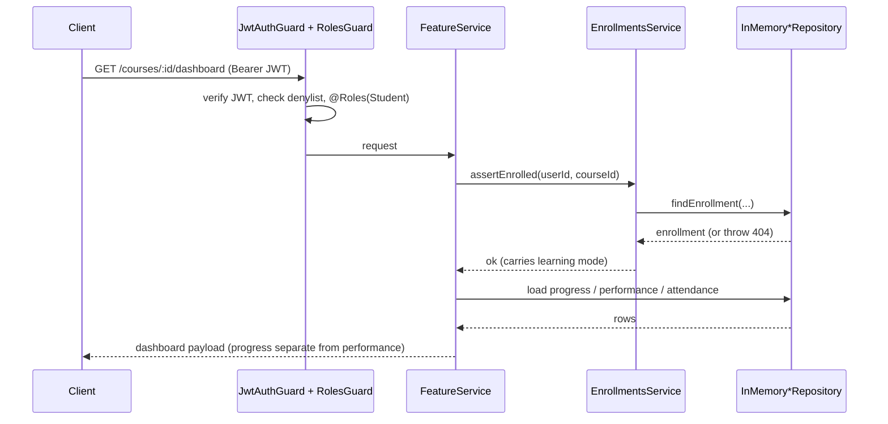
```mermaid
sequenceDiagram
    participant C as Client
    participant G as JwtAuthGuard + RolesGuard
    participant S as FeatureService
    participant E as EnrollmentsService
    participant R as InMemory*Repository
    C->>G: GET /courses/:id/dashboard (Bearer JWT)
    G->>G: verify JWT, check denylist, @Roles(Student)
    G->>S: request
    S->>E: assertEnrolled(userId, courseId)
    E->>R: findEnrollment(...)
    R-->>E: enrollment (or throw 404)
    E-->>S: ok (carries learning mode)
    S->>R: load progress / performance / attendance
    R-->>S: rows
    S-->>C: dashboard payload (progress separate from performance)
```

**Follow-ups / debt.** In-memory only, no Postgres driver. N+1 reads in `assessments.service.ts`
and `courses.service.ts`; dashboard calls `assertEnrolled` 4× / `getProgress` 2× per load; no
pagination anywhere; rate limiter + token denylist are per-process (break under multiple replicas);
`JwtStrategy` does a user lookup per request. All catalogued in `CLAUDE.md` §7.1.
Open decisions this pressures: `due_at` semantics, missing `missed` assessment status,
`Attendance` storing `attended: boolean` (can't encode `late`) — `CLAUDE.md` §11.

---

## 2026-08-29 — Ruflo meta-harness + LMS review swarm (commit `aed7c1d`)

**What changed.** Installed ruflo (`.claude/` settings, helpers, skills, generic agent library;
`.claude-flow/`, `.swarm/`, `.mcp.json`, `.agents/`). Added a **project-specific review swarm** of
8 read-only agents under `.claude/agents/tahir/`, plus the `/swarm-review` command that orchestrates
them in waves of three (a hard-won cap — six parallel agents once hit the session 429 and all died).

| Agent | Team | Owns |
|---|---|---|
| `lms-team-lead` | Lead | Final verdict, dedup, CLAUDE.md drift detection |
| `lms-sec-rbac` | Security | TA scoping via `CourseStaffAssignment`, `@Roles` coverage, IDOR/BOLA |
| `lms-sec-appsec` | Security | Auth, JWT, rate limiting, uploads, signed URLs, secrets |
| `lms-sec-datatrail` | Security | Audit-log coverage, refund trail, server-derived status, PII |
| `lms-arch-scale` | Architecture | In-memory→Postgres path, N+1, pagination, per-process state |
| `lms-arch-maintain` | Architecture | Module boundaries, swappable interfaces, DTO validation, naming |
| `lms-review-code` | Review | Diff correctness **and** verification gate for other agents' findings |
| `lms-review-reqs` | Review | Traceability to prototype codes, scope-creep guard, open-decision surfacing |

**Why.** `CLAUDE.md` is large, the requirements shift (§0), and security is the client's stated top
priority (§8). The swarm encodes the spec into reviewers so finished work is checked against it.

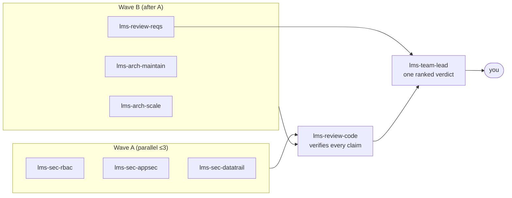
```mermaid
graph LR
    subgraph WaveA["Wave A (parallel ≤3)"]
      RBAC[lms-sec-rbac]
      APPSEC[lms-sec-appsec]
      DATA[lms-sec-datatrail]
    end
    subgraph WaveB["Wave B (after A)"]
      SCALE[lms-arch-scale]
      MAINT[lms-arch-maintain]
      REQS[lms-review-reqs]
    end
    WaveA --> CODE[lms-review-code<br/>verifies every claim]
    WaveB --> CODE
    REQS --> LEAD
    CODE --> LEAD[lms-team-lead<br/>one ranked verdict] --> USER([you])
```

**Follow-ups.** Swarm is read-only — it never edits. Fixes are always a separate explicit step.

---

## 2026-09-06 — Auth defaults + centralized port config (commit `eb8b804`)

**What changed.** Tightened auth defaults and moved port configuration into a single
`common/config/env.ts` module rather than reading `process.env` ad hoc. `docs(claude)` commit
`542ccdb` alongside corrected the `CLAUDE.md` §7.1 debt inventory and closed half of the attendance
keying decision (`AttendanceRecord` now settled to key on `sessionId`, matching §6.1; the
`present|absent|late` vs. `attended: boolean` question stays open).

**Why.** `CLAUDE.md` §3 (infrastructure behind configuration, never hardcoded) and §8 (secure
defaults, secrets in env). Keeps the VPS→cloud migration a config change, not a code change.

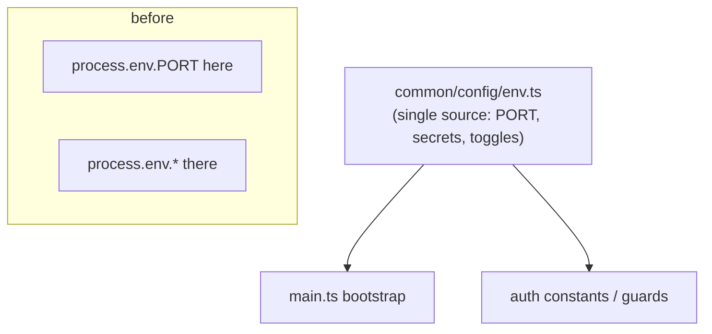
```mermaid
graph TD
    ENV["common/config/env.ts<br/>(single source: PORT, secrets, toggles)"]
    ENV --> MAIN["main.ts bootstrap"]
    ENV --> AUTHC["auth constants / guards"]
    subgraph before["before"]
      PE1["process.env.PORT here"]
      PE2["process.env.* there"]
    end
```

**Follow-ups.** This log file itself was introduced in this session (`CLAUDE.md` §13) and
backfilled with the history above. Next material work is still the Postgres repository
implementation and the first non-student role (TA / `CourseStaffAssignment`, §5.11).

---

## 2026-09-06 — Frontend: marketing site, student LMS shell, auth (commit `6e1e8ad`)

**What changed.** The frontend stopped being the `create-next-app` starter. Three route groups
now cover 20 pages: `app/(site)` — home, about, courses index, course detail, blog, contact;
`app/(app)` — dashboard, notifications, profile, and the seven `learn/[id]` screens (overview,
recordings, materials, assessments, assessment detail, sessions, report); `app/(auth)` — login,
register, forgot-password, reset-password. `lib/api.ts` is a single typed client over every
student route the backend exposes, with `ApiError` carrying the status through; `lib/session.tsx`
holds the JWT and the current user; `lib/types.ts` mirrors the backend response shapes exactly, so
a change to a controller's payload breaks the build rather than a screen at runtime.

**Why.** `CLAUDE.md` §7 Phase 1 — "homepage & marketing pages, about / courses / contact, student
authentication, student dashboard & course pages, fully responsive design". The two surfaces are
deliberately different: the marketing site is editorial and spacious, the LMS is dense and
token-driven, per §4 (black / white / dark grey / gold accent, gold never a background).

Two domain rules are visible in the markup rather than buried. §5.1 — progress and performance
render as **two separate blocks** on the course overview and the report screen; there is no
combined percentage anywhere. §5.2 — the course shell renders checkpoints for a recorded
enrollment and an attendance timeline for a live one, switching on the mode the enrollment
carries, not on a client guess. Live sessions are plain links (Google Meet / Zoom URLs), which is
the client's stated assumption in §11, not API automation.

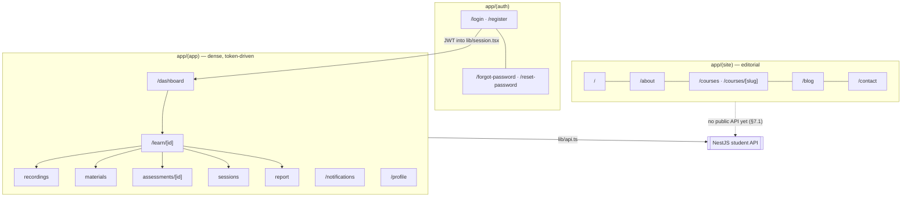
```mermaid
graph TD
    subgraph site["app/(site) — editorial"]
      HOME["/"] --- ABOUT["/about"] --- CRSI["/courses · /courses/[slug]"] --- BLOG["/blog"] --- CONT["/contact"]
    end
    subgraph auth["app/(auth)"]
      LOGIN["/login · /register"] --- RESET["/forgot-password · /reset-password"]
    end
    subgraph app["app/(app) — dense, token-driven"]
      DASH["/dashboard"] --> LEARN["/learn/[id]"]
      LEARN --> RECS["recordings"] & MATS["materials"] & ASSESS["assessments/[id]"] & SESS["sessions"] & REPORT["report"]
      NOTIF["/notifications"]
      PROF["/profile"]
    end
    LOGIN -->|"JWT into lib/session.tsx"| DASH
    app -->|"lib/api.ts"| API[["NestJS student API"]]
    site -.->|"no public API yet (§7.1)"| API
```

**Swarm additions.** The review swarm grew from eight agents to ten with a matched pair for this
surface: `lms-fe-build` (the only agent in the set that writes — it knows the two-surface design
contract and the backend's exact response shapes) and `lms-fe-review`, its read-only counterpart,
which checks token discipline, the surface boundary, contrast in both themes, reduced motion, and
whether the UI actually matches what the API returns.

**Follow-ups / debt.** The marketing site has no backend to read from — §7.1's Visitor row is
still empty, so course cards, blog posts and testimonials come from `lib/site-content.ts`, whose
header marks every seeded image and figure as a placeholder that must not go live unreplaced. The
contact form has nowhere to POST (`components/site/contact-form.tsx`) and says so in a comment
rather than pretending to send. No parent, TA or admin screens — those roles have no API.

---

## 2026-09-06 — Postgres persistence + swarm-driven security and scale fixes

**What changed.** The single largest gap in `CLAUDE.md` §7.1 — *"persistence is entirely
in-memory"* — is closed. Every one of the ten repository interfaces now has a second
implementation, `Postgres*Repository`, alongside the original `InMemory*Repository`. No module
knows which one it got: `database/repository.provider.ts` binds the `Symbol` token to one or the
other from `PERSISTENCE_DRIVER`, read once at wiring time.

The supporting pieces are all new: `DatabaseService` (a pooled `pg` client that stays dormant when
no connection string is configured), `MigrationRunner`, `migrations/001_student_platform.sql` (17
tables — exactly what the student surface touches, not the whole §6 domain), a development seed
that mirrors the in-memory fixtures row for row, and `db:migrate` / `db:seed` CLI entry points.
`test/postgres-repositories.integration-spec.ts` covers all ten against a real database and
`describe.skip`s itself when `DATABASE_URL` is absent, so the suite stays green on a machine with
no Postgres.

The driver choice is a safety boundary, not a preference. `memory` is the default in development
and test and is **refused outright in production** — an unset value there resolves to `postgres`
and then fails on the missing `DATABASE_URL`, rather than quietly serving traffic from a
process-local array. That single rule also disposes of the swarm's one critical finding: the
seeded `teacher@example.com` / `password123` account can no longer exist on a production instance,
because the repository holding it cannot be selected there. `db:seed` refuses production for the
same reason.

**Why.** `CLAUDE.md` §3 (PostgreSQL is the decided stack; infrastructure behind interfaces so the
VPS is migratable without code changes) and §7.1, which called the swap "mechanical" — it was,
because every repository already sat behind an interface and a token. The two implementations
being interchangeable is the point: the in-memory path stays as the zero-dependency development
and test story.

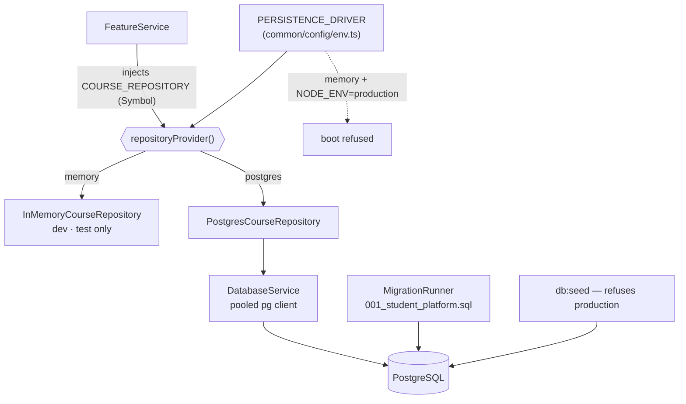
```mermaid
graph TD
    SVC["FeatureService"] -->|"injects COURSE_REPOSITORY (Symbol)"| TOK{{"repositoryProvider()"}}
    ENV["PERSISTENCE_DRIVER<br/>(common/config/env.ts)"] --> TOK
    TOK -->|memory| MEM["InMemoryCourseRepository<br/>dev · test only"]
    TOK -->|postgres| PGR["PostgresCourseRepository"]
    PGR --> DBS["DatabaseService<br/>pooled pg client"]
    DBS --> PG[("PostgreSQL")]
    MIG["MigrationRunner<br/>001_student_platform.sql"] --> PG
    SEED["db:seed — refuses production"] --> PG
    ENV -.->|"memory + NODE_ENV=production"| BOOM["boot refused"]
```

**Alongside it, the review swarm ran and its findings were fixed.** The ones that changed code:

| Finding | Fix |
|---|---|
| Guards were opt-in per controller | `JwtAuthGuard` + `RolesGuard` registered **globally**; `@Public()` and `@AnyRole()` are now the explicit exits, so a new controller is protected by default rather than by remembering |
| No health route, but `Dockerfile.backend` health-checked one | Added `/health` (public); the three e2e tests that pinged `GET /` follow it |
| 404-vs-403 message oracle in assessments and recordings | Collapsed to one indistinguishable 404, so an unenrolled student cannot probe which course ids exist |
| Submission reads and writes took no owner | Owner is now a repository-method parameter, not a service-layer check — changed while there were only two implementors to update |
| N+1 reads (`CLAUDE.md` §7.1) | Batch methods on the course and assessment-submission interfaces; the three service loops now issue one query. Over in-memory arrays these were free; over Postgres they were about to become real round trips |
| Duplicated recordings query in the dashboard | Read once, passed down |
| Light-theme contrast failure, five React Compiler `set-state-in-effect` errors | Fixed; `frontend` lints clean |

**Verification.** 153 unit tests, 63 e2e, `nest build`, frontend `next build` + `tsc --noEmit` +
`eslint` — all green. The integration suite is written but unrun here: no Postgres on this machine.
One e2e run in four failed two tests with `ECONNRESET`; three consecutive runs after it passed, so
it is flaky rather than broken — worth watching, not yet worth chasing.

**Housekeeping.** `.env.example` gained `PERSISTENCE_DRIVER`, `DB_AUTO_MIGRATE` and `PORT`;
`docker-compose.yml` now sets them, including the `PORT: 3001` its forwarded port always assumed.
The scaffold-era `database/schema.sql` and `database/seed.sql` are **not** what runs — they are the
§6 design outline and they disagree with the migration on column shapes, so both now say so in
their headers and point at `backend/src/database/`.

**Follow-ups / debt.** The integration suite needs a real database run before anyone trusts it.
The rate limiter and token denylist are still per-process, and `JwtStrategy` still does a user
lookup per request — all three want the same Redis that `CLAUDE.md` §5.11 says to introduce once,
not four times. No pagination on any list endpoint; the interfaces now have batch reads but still
no list or count methods, and §7.1's warning holds — those are cheapest to add *before* a third
implementor exists. Still only one of five roles has a backend.

---

## 2026-09-06 — User-stories board reconciled into the spec (no commit yet)

**What changed.** No code. The FigJam user-stories board — 129 role-scoped stickies plus nine
sequence diagrams, the artifact of the 30 Jul 2026 client meeting — was read against the built
surface and against `CLAUDE.md`, and four places where the two reference artifacts *disagree with
each other* are now written down instead of living in one session's head.

The board was previously a bare link at the bottom of `CLAUDE.md` §12 with no rank. It now sits at
**§0 item 4**, beside `report 1.pdf` rather than above it: it is that meeting's own output, not a
later correction of it. Everything below it renumbered by one, and the two cross-references inside
§0 that named item numbers were fixed with it.

The substantive edits, all of them recording a conflict rather than resolving one:

- **§2.2** gained a paragraph naming the two TA powers the board grants and the preset omits —
  `ASG-10` (create and publish assignments independently) and `CRS-11` (schedule and share Zoom
  links). The instruction is to ship the narrower preset and treat both as questions, because the
  board and the prototype doc are **peers** under §0, so neither overrides the other.
- **§5.9** now marks its own TA clause as contested. That sentence was the single line a future
  session would have read as settled before writing `@Roles(Role.Assistant)` on a report endpoint.
  The teacher half is untouched; only the TA half is flagged.
- **§11** gained three bullets and had its TA-reports bullet rewritten. The rewrite matters most:
  §11 previously argued "the meeting outranks the prototype, so the default is *yes*." The board
  breaks that argument — it puts all five `REP-*` stickies in the Owner column and gives the TA
  none, while still granting `QUZ-12` and `PRG-05`, so the 30 Jul meeting and the prototype now
  agree *against* §5.9. The bullet now says to check which PDF §5.9 actually came from before
  writing the decorator.
- **§11** also records two board stories that have **no entity anywhere in §6 or §6.1** — `COM-08`
  (student comments and questions on a lesson) and `CMS-13` (course reviews and ratings from past
  students). Neither is in the §9 wish list either, so neither was ever costed, and both are real
  features with their own moderation surface rather than columns on an existing table.

**Why.** `CLAUDE.md` §0 exists to make the precedence between reference artifacts explicit, and it
had a gap: the board was cited nowhere in the ranking while being the source that contradicts §5.9.
§13 asks that entries name the section that motivated them — this one is §0 and §11 themselves.

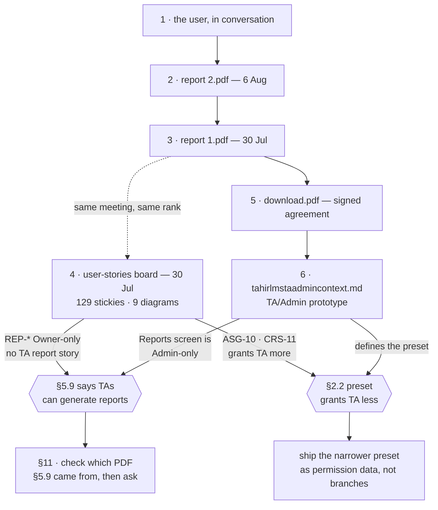
```mermaid
graph TD
    USER["1 · the user, in conversation"]
    R2["2 · report 2.pdf — 6 Aug"]
    R1["3 · report 1.pdf — 30 Jul"]
    BOARD["4 · user-stories board — 30 Jul<br/>129 stickies · 9 diagrams"]
    AGR["5 · download.pdf — signed agreement"]
    PROTO["6 · tahirlmstaadmincontext.md<br/>TA/Admin prototype"]
    USER --> R2 --> R1
    R1 -.->|"same meeting, same rank"| BOARD
    R1 --> AGR --> PROTO
    BOARD -->|"REP-* Owner-only<br/>no TA report story"| CONFLICT{{"§5.9 says TAs<br/>can generate reports"}}
    PROTO -->|"Reports screen is<br/>Admin-only"| CONFLICT
    CONFLICT --> ASK["§11 · check which PDF<br/>§5.9 came from, then ask"]
    BOARD -->|"ASG-10 · CRS-11<br/>grants TA more"| PRESET{{"§2.2 preset<br/>grants TA less"}}
    PROTO -->|"defines the preset"| PRESET
    PRESET --> SHIP["ship the narrower preset<br/>as permission data, not branches"]
```

**Coverage, for the record.** Of the board's 129 stickies: Student ~17 built and 3 partial of 35;
Visitor ~10 of 15 but as static pages only, with no public API behind any of them; Owner 0 of 51,
TA 0 of 16, Parent 0 of 12. Of the nine sequence diagrams only the *read* half of Frame 1
(assignment upload and grading) exists — there is no upload endpoint, so the
`Frontend → BackendAPI → FileStorage` leg is absent and `fileUrl` is a client-supplied URL. The
quiz auto-marking, payment-to-enrollment, reCAPTCHA, Google Sign-In, Google Forms and WhatsApp
flows are all unbuilt. Nothing built *contradicts* the board; it is simply far ahead of the code.

**Follow-ups / debt.** The board transcription was supplied in conversation and is **not** in
`context/` — the same gap §12 already records for the fuller TA/Admin doc, and now noted in the
same place. Two `CLAUDE.md` claims are worth verifying at the source rather than inherited: §5.9's
TA clause (which meeting?) and §2's "parent manages payments", which the board contradicts by
putting every paying story in the Student column and leaving the parent only `PAY-14`/`PAY-15`.
That last one was deliberately left out of this pass and is still unrecorded in §11.

---

## 2026-09-06 — `CourseStaffAssignment` scoping and the audit log (no commit yet)

**What changed.** The two primitives every TA and admin surface will sit on, plus the smallest
surface that makes them live rather than plumbing nobody has run.

Two new modules, `backend/src/staff/` and `backend/src/audit/`, and one migration,
`002_staff_and_audit.sql`. Both follow the shape the student surface already uses: an interface, an
`InMemory*` and a `Postgres*` implementation, bound by `repositoryProvider()` off
`PERSISTENCE_DRIVER`.

**`StaffScopeService` is the piece that matters.** It is the direct counterpart of
`EnrollmentsService.assertEnrolled` — same job, different table — and it takes a `StaffActor`
(`{ id, role }`) rather than a bare user id. That signature is the point: with a bare id there is no
way to express "an admin skips the join", so every caller would re-derive the bypass and one of them
would eventually get it wrong in the direction that grants access. `scopeFor()` returns a
discriminated union rather than an optional `courseIds`, so a caller cannot read an undefined field
and treat it as "no restriction" — the same bug as forgetting the check, arrived at politely.

An unassigned course now **404s rather than 403s** for a TA, implementing the posture `CLAUDE.md`
§5.11 had listed as proposed. A spec asserts that a held-but-wrong course and a course that does not
exist return the identical message, because a 403 confirms existence and lets a TA enumerate the
catalog one id at a time.

**The audit log is append-and-read only**, and that is enforced by the interface having no update
and no delete rather than by a database trigger — a trigger would also block the GDPR redaction path
§8 may need, which should arrive as its own named and itself-audited operation. `audit_log` carries
**no foreign keys**, deliberately: deleting a course is itself an auditable action, and a FK would
either cascade the evidence away or block the deletion the log exists to record. `actor_role` is
stored at write time, so a TA later promoted does not retroactively read as having acted as an
admin.

Two things fell out of building it that are worth naming. Audit ids are not `randomUUID()` — they
are `<ms>-<sequence>-<uuid>`, because the id is also the feed's sort tiebreak and same-millisecond
writes are the normal case, not an edge one; with a random id two events in one request display in a
coin-flip order. And the page cursor is a `(createdAt, id)` pair for the same reason: a keyset cursor
on a non-unique key skips rows. Both are covered by tests that freeze the clock.

**The surface**, three routes, deliberately minimal:

| Route | Role | What it proves |
|---|---|---|
| `GET /staff/courses` | assistant + teacher | The TA sees only assigned courses; the admin reaches the same route unscoped |
| `GET·POST·DELETE /admin/courses/:courseId/staff` | teacher | Assignment is admin-only (§2.2) and audited on both sides |
| `GET /admin/audit-log` | teacher | "Which assistant did what" (§5.4), filterable by actor, course, action, target |

Supporting changes to existing code, each the smallest that would do:
`CourseRepository.findAll(limit, offset)` (the admin's unscoped read, and the first paginated
repository method in the codebase), `UserRepository.findByIds` (so the staff panel does not N+1 for
names), and `CoursesModule` now exports `COURSE_REPOSITORY` so `StaffModule` shares the instance
rather than building a second in-memory store with its own state.

**Why.** §5.11 — scoping is a query filter, and getting the table in before the TA surface exists is
the whole argument; retrofitting the join is how the leak happens. §5.4 for the audit log. §2.2 for
TA-to-course assignment being admin-only. Board codes: `TA-R1`/`TA-R2` (a TA cannot touch accounts),
`ACC-11`, `CRS-13`, and the `who took the action` annotation on `ASG-11`.

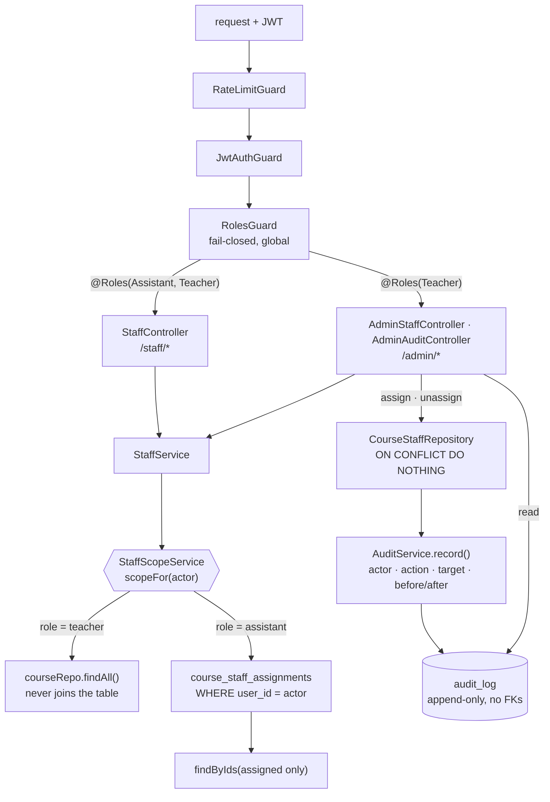
```mermaid
graph TD
    REQ["request + JWT"] --> G1["RateLimitGuard"] --> G2["JwtAuthGuard"] --> G3["RolesGuard<br/>fail-closed, global"]
    G3 -->|"@Roles(Assistant, Teacher)"| STAFFC["StaffController<br/>/staff/*"]
    G3 -->|"@Roles(Teacher)"| ADMINC["AdminStaffController · AdminAuditController<br/>/admin/*"]
    STAFFC --> SVC["StaffService"]
    ADMINC --> SVC
    SVC --> SCOPE{{"StaffScopeService<br/>scopeFor(actor)"}}
    SCOPE -->|"role = teacher"| UNSCOPED["courseRepo.findAll()<br/>never joins the table"]
    SCOPE -->|"role = assistant"| SCOPED["course_staff_assignments<br/>WHERE user_id = actor"]
    SCOPED --> IDS["findByIds(assigned only)"]
    ADMINC -->|"assign · unassign"| WRITE["CourseStaffRepository<br/>ON CONFLICT DO NOTHING"]
    WRITE --> AUDIT["AuditService.record()<br/>actor · action · target · before/after"]
    AUDIT --> LOG[("audit_log<br/>append-only, no FKs")]
    ADMINC -->|"read"| LOG
```

**Verification.** 196 unit tests (31 new across `staff-scope.service.spec.ts`,
`staff.controller.spec.ts`, `audit.service.spec.ts`) and 84 e2e — `test/staff.e2e-spec.ts` is new and
is the only place proving an unassigned TA is stopped over HTTP through the *real* guards, since the
unit specs override them. `nest build` and `tsc --noEmit` clean. The backend has no ESLint config;
lint is a frontend-only step here.

Two honest caveats. The e2e suite crashed one worker on the first parallel run with
`Worker exited unexpectedly` and then passed three runs in a row, parallel and sequential — the same
flakiness the 2026-09-06 persistence entry recorded, now easier to hit with two files booting
`AppModule` at once. And the integration suite now covers twelve repositories instead of ten,
including the ON CONFLICT idempotency, the `ON DELETE CASCADE`/`RESTRICT` split on
`course_staff_assignments`, jsonb round-tripping, and keyset paging over deliberately tied
timestamps — but **it still has not run against a real database**. Docker Desktop was not running on
this machine, so migration `002` has been typechecked and reasoned about, not executed.

**Follow-ups / debt.**

- `AuditService.record` writes after the action it describes has committed, on its own connection.
  A crash between the two leaves an action done and unlogged. The fix is a transaction-scoped
  repository handle, and it should land **before** the payments surface (§5.12), where the gap is a
  money-trail hole rather than a missing line.
- Migration 002 and the two new Postgres repositories are unrun. `docker compose up -d postgres`
  then `TEST_DATABASE_URL=... npm run test:integration` is the whole job.
- No UI. These routes are reachable only over HTTP; there are still no TA or Admin screens.
- The permission preset is still shape, not data. §2.2 asks for it to be configurable and §11 leaves
  per-TA configurability open; today the only thing that varies per TA is *which courses*, which is
  the part that had to exist first. The `ASG-10` and `CRS-11` questions this file's previous entry
  recorded are still unanswered and still cheap to answer while the preset is two roles wide.

---

## 2026-09-07 — Delivery pipeline, a runnable sample, and the first real-database run

**What changed.** The delivery surface went from "documented" to "executed". Everything below was
run on this machine, not reasoned about.

*The sample you can actually run.* `npm install && npm run dev` now works from a fresh clone with
no database and no `.env`. It could not before: `resolvePort` defaulted the API to **3000**, which
is the port Next.js takes, so `npm run dev` started both and one of them lost the race — while
`frontend/lib/api.ts` had always pointed at **3001**. Every other file in the repo already assumed
the 3000/3001 split; the default was the single outlier, so it moved to 3001 rather than the six
files around it moving to 3000. Verified end to end: `GET /health` 200, login as
`student@example.com` returning a 304-character JWT, `GET /courses` returning the seeded AS
Chemistry course with progress and performance as separate objects (§5.1), and `/`, `/courses`,
`/login`, `/dashboard` all rendering 200.

*Containers that build.* All four Dockerfiles were unbuildable and had been since the scaffold.
Each copied only a workspace's `package*.json` and ran `npm ci` — but this is an npm workspaces
monorepo whose only lockfile is at the root, and `npm ci` without a lockfile exits non-zero. There
were also two competing pairs that had already drifted (`docker-compose.yml` built
`backend/Dockerfile`; CI built `Dockerfile.backend`, and only the latter pair had HEALTHCHECKs).
Consolidated to the root pair, both now building from the repo root; the workspace pair is deleted.
Added the root `.dockerignore` that never existed — the build context had been shipping
`node_modules/`, `.git/` and the client's PDFs under `context/`. Both images build, and the API
image was **run** in `NODE_ENV=production` against real Postgres: it boots, reports
`Listening on 3001 (production, persistence=postgres)`, and its container healthcheck reaches
`healthy`.

*CI that runs something.* The old workflow ended in `npm run test --if-present`, and the root
`test` script called `test:frontend`, which called a script the frontend workspace does not have —
so the step failed, and `--if-present` was load-bearing in the worst way. The root `test` now maps
to the workspaces that actually have tests, deliberately without `--if-present`: a missing test
script should be a visible absence, not a silent pass. CI grew an e2e step, a Postgres service
container for the integration suite, and — because that suite `describe.skip`s itself when
`TEST_DATABASE_URL` is unset — a guard step that **fails the job if the suite reports no executed
tests**, which is the only thing standing between "integration tests pass" and "integration tests
never ran". That guard was then tested against real vitest output in three states — green, a
self-skipped suite, and an injected failing test — and rejects the last two. The step writes
`set -o pipefail` explicitly rather than inheriting it from GitHub's default shell, because piping
into `tee` otherwise returns `tee`'s exit code and a failing suite would report success; and the
workflow declares `permissions: contents: read`, since no step writes to the repository. Image
builds moved onto pull requests too; a Dockerfile broken since the scaffold is the argument. A `deploy` job carries the contracted shape (§3) — migrations as their own step
before the new image serves traffic, `DB_AUTO_MIGRATE` left off — and is gated inert on a
`DEPLOY_ENABLED` repository variable, because the VPS is the client's to provision and guessing a
hostname is worse than an obvious gap.

**The bug the integration suite found on its first run.** It had never executed against a real
database; the previous two attempts stopped because Docker was not running. It ran, and 32 of 33
passed. The failure was real, and it was in the audit log.

`audit_log.created_at` was `TIMESTAMPTZ` — microseconds. The feed's keyset cursor `(created_at, id)`
is built in JavaScript from the value read back, and a JS `Date` carries only milliseconds. So
Postgres stored `22:31:29.889842`, the cursor came back as `22:31:29.889`, and the next page's
row-wise `(created_at, id) < (cursor)` compared against a strictly *smaller* timestamp — matching
nothing in that millisecond. Proven directly in SQL: the truncated cursor returned **0** rows where
the full-precision one returned 3.

The consequence is worse than a failing test. **The admin audit log silently stopped after page
one** — no error, just an empty second page — and dropped any entry sharing the boundary
millisecond. §5.4 exists so the teacher can see which assistant did what; an audit trail that
quietly hides its own entries fails that requirement precisely where it matters. It was also
Postgres-only: the in-memory driver compares the same truncated strings on both sides and pages
correctly, so the two drivers disagreed while `audit-cursor.ts` documented that they page
identically.

Fixed by making the column `TIMESTAMPTZ(3)` — matching the storage to the precision the reader can
represent, which is what makes both drivers agree. Ordering inside a millisecond is not lost: audit
ids are `<ms>-<sequence>-<uuid>` exactly so the id breaks the tie. Migration `002` was amended in
place rather than a `003` added, because it has provably never been applied outside a throwaway
test database (§7.1 said so, and this run confirmed it by applying both migrations to an empty
schema). Re-verified over HTTP against the production image: paging with `limit=2` now walks all 7
entries across 4 pages, 7 distinct, no gaps and no repeats.

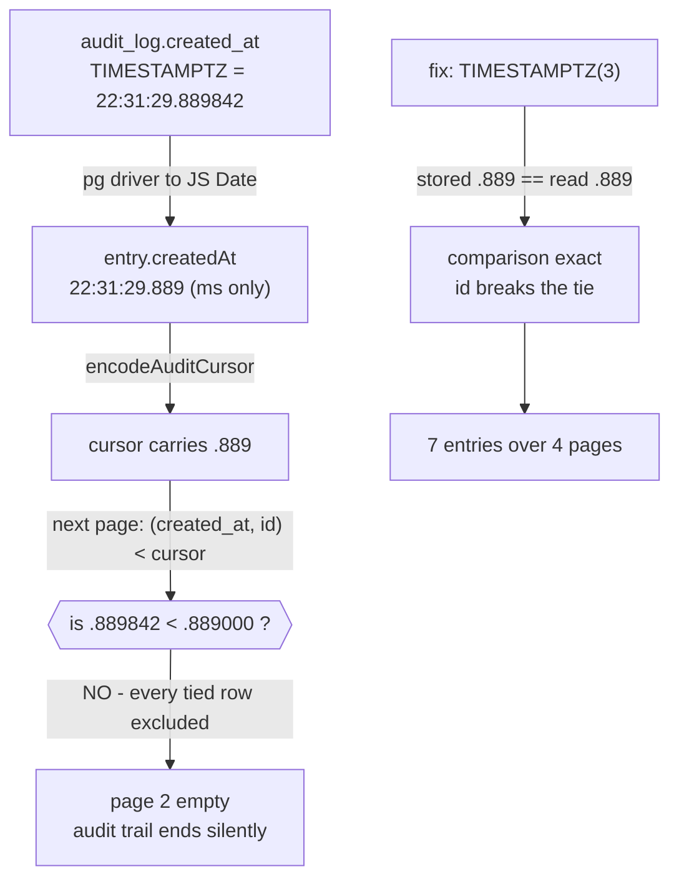
```mermaid
graph TD
    A["audit_log.created_at<br/>TIMESTAMPTZ = 22:31:29.889842"] -->|"pg driver to JS Date"| B["entry.createdAt<br/>22:31:29.889 (ms only)"]
    B -->|encodeAuditCursor| C["cursor carries .889"]
    C -->|"next page: (created_at, id) < cursor"| D{{"is .889842 < .889000 ?"}}
    D -->|"NO - every tied row excluded"| E["page 2 empty<br/>audit trail ends silently"]
    F["fix: TIMESTAMPTZ(3)"] -->|"stored .889 == read .889"| G["comparison exact<br/>id breaks the tie"]
    G --> H["7 entries over 4 pages"]
```

**Why.** §3 — CI/CD and containerized deployment are contracted deliverables, and infrastructure
stays behind configuration. §5.4 for the audit-log fix. §7.1's standing debt item "the integration
suite has still not been run against a real database" is now closed, and it paid for itself on the
first run.

**Verification.** All of it executed, none inferred:

| Check | Result |
|---|---|
| `npm run lint:backend` / `lint:frontend` | clean |
| `npm run build:backend` / `build:frontend` | clean; 20 page routes, 23 entries after SSG expansion |
| `npm run test` (unit) | **196 passed** / 18 files |
| `npm run test:e2e` | **84 passed** / 2 files |
| `npm run test:integration` vs PostgreSQL 15 | **33 passed** — was 32 passed / 1 failed before the fix |
| `docker build` both images | both succeed; API image 257MB |
| API image run in `NODE_ENV=production` | boots on real Postgres, healthcheck `healthy` |
| `npm run dev` from a clean tree | API 3001 + web 3000, login and authenticated reads work |

**Follow-ups / debt.**

- `NEXT_PUBLIC_API_URL` is inlined into the client bundle at build time, so the web image is
  environment-specific and a staging build cannot be promoted to production unchanged. That is a
  Next.js property rather than a choice, and it is the one place §3's "no hostname in the artifact"
  cannot be fully honoured. It is a build argument so the value lives in the pipeline, not the source.
- The `deploy` job is inert until the VPS exists and `DEPLOY_ENABLED` is set. Its rollout step is an
  explicit placeholder rather than a guessed `ssh` invocation.
- `backend/src/common/config/env.ts` is the boot-time security contract — secrets, CORS, proxy hops,
  persistence driver — and has **no unit tests at all**. Changing a default there today is caught by
  nothing, which is uncomfortable for the file that decides whether production can boot on a dev
  signing key.
- `docker compose` no longer bind-mounts source or runs `start:dev`; it builds and runs the same
  production images CI builds. Local hot-reload iteration is `npm run dev`, which is faster anyway.
- `backend/src/database/migrations/002_staff_and_audit.sql` was amended in place, which is only
  defensible while it stays unshipped. Both `backend/audit/` and the migrations directory are still
  **untracked** — nothing has been committed, let alone applied to a durable environment. The moment
  this is committed and applied anywhere real, the same class of edit needs a forward `003`. The
  migration ledger records filenames with no content checksum, so drift would not be detected
  automatically.
- `course_staff_assignments.assigned_at` is still microsecond `TIMESTAMPTZ`. Harmless today because
  nothing pages on it; it now carries a comment pointing at the `audit_log` precedent so the same
  bug is not reintroduced the day it gets a cursor.

---

## 2026-09-07 — The TA & admin console, and teacher-uploaded recordings

**What changed.** The teacher and the teaching assistant now have a working console, and it is the
*same application* the student signs into rather than a second one. `AppShell` picks its navigation
from `lib/roles.ts`, `app/(app)/layout.tsx` routes each role into its own half, and everything below
is shared: one login, one shell, one design system.

On the backend this is a new `manage` module sitting on the `staff` foundation laid last week. It
adds four services — `ManageService` (overview, roster, course outline), `GradingService`,
`ManageRecordingsService`, `DirectoryService` — behind exactly two controllers, because the role
boundary should be one thing a reader checks rather than a decorator hunt:

- **`StaffManageController`** — `@Roles(Assistant, Teacher)`, mounted at `/staff/*`. Every handler
  passes the caller to a service that begins with `StaffScopeService`. A TA sees their assigned
  courses; the teacher sees everything through the identical route.
- **`AdminManageController`** — `@Roles(Teacher)`, mounted at `/admin/*`. Joins through nothing.

The second half of the ask: **Dr. Tahir can now upload recordings**, and a student watches them
immediately — the Udemy-shaped loop the client described. `RecordingRepository` grew
`findByCourseForStaff`, `create`, `update` and `remove` on both drivers; no migration was needed
because `recordings` already had the columns. The upload writes into the same table the student
recordings page has always read, which the e2e suite asserts rather than assumes: publish as the
teacher, then fetch as the student and find it there with `watchedSeconds: 0`.

**Why.** The client asked for it directly, in these terms: an admin dashboard integrated with the
user dashboard, working for both the teacher and the assistant, with the assistant held to the
restrictions already recorded; the teacher able to upload recordings for students to watch.

Traceability: `CRS-` (course roster and library), `ASG-` (grading and feedback), `PRG-` (per-course
averages), `TA-R` (the assistant's restricted subset), `ACC-` (the people directory and TA
assignment). The permission split is `CLAUDE.md` §2.2's preset; the scoping rule is §5.11; the audit
coverage is §5.4; the averages are §5.6; keeping marks apart from completion is §5.1.

**Recording writes are teacher-only, deliberately.** §2.2's preset grants a TA materials and never
recordings, and the client's phrasing was specifically that *the teacher* uploads them. The service
takes a `StaffActor` rather than assuming admin, so widening this later is moving three routes
between controllers — not a redesign. It is flagged in §11 territory rather than silently decided.

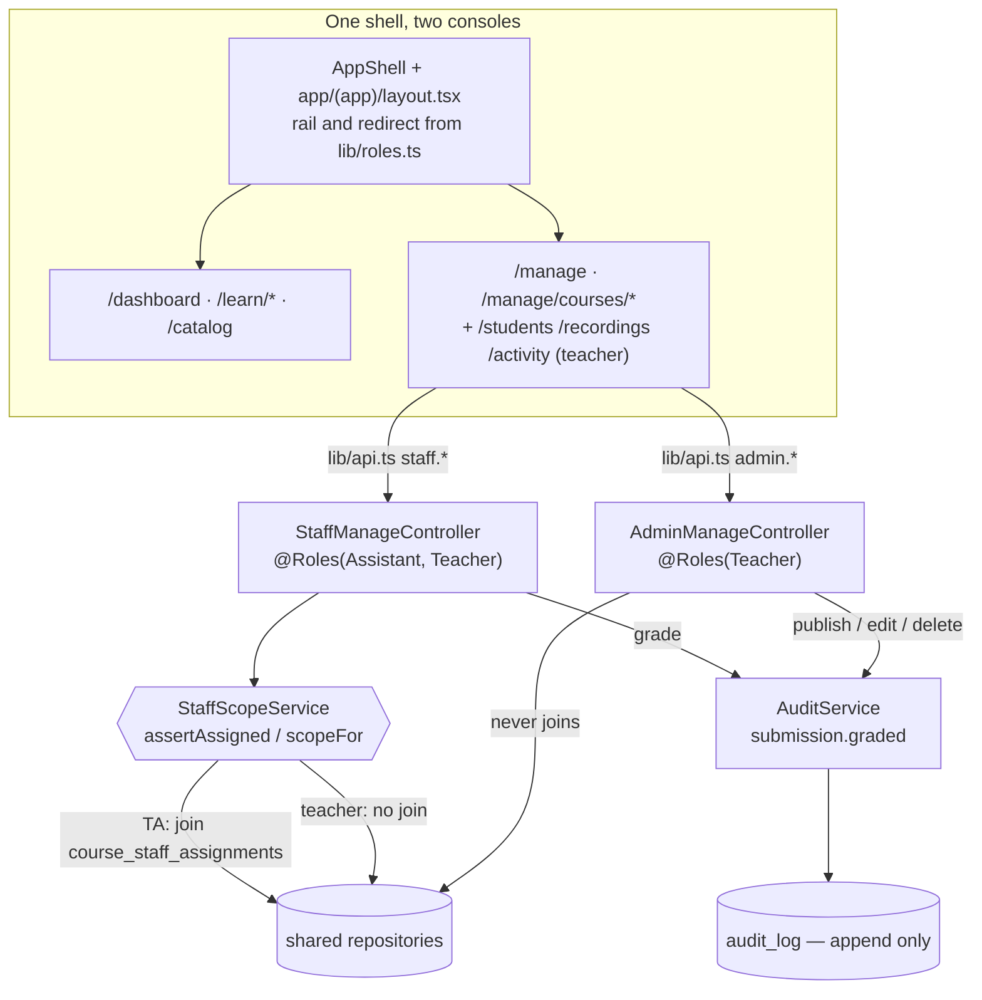
```mermaid
graph TD
    subgraph "One shell, two consoles"
      SHELL["AppShell + app/(app)/layout.tsx<br/>rail and redirect from lib/roles.ts"]
      SHELL --> STUDENTUI["/dashboard · /learn/* · /catalog"]
      SHELL --> MANAGEUI["/manage · /manage/courses/*<br/>+ /students /recordings /activity (teacher)"]
    end

    MANAGEUI -->|"lib/api.ts staff.*"| SC["StaffManageController<br/>@Roles(Assistant, Teacher)"]
    MANAGEUI -->|"lib/api.ts admin.*"| AC["AdminManageController<br/>@Roles(Teacher)"]

    SC --> SCOPE{{"StaffScopeService<br/>assertAssigned / scopeFor"}}
    SCOPE -->|"TA: join course_staff_assignments"| DATA[("shared repositories")]
    SCOPE -->|"teacher: no join"| DATA
    AC -->|"never joins"| DATA

    SC -->|"grade"| AUD["AuditService<br/>submission.graded"]
    AC -->|"publish / edit / delete"| AUD
    AUD --> LOG[("audit_log — append only")]
```

**Two bugs this work surfaced, both fixed.**

The first is worth recording because the test caught it and a reviewer would not have. The in-memory
assessment repository returned the *stored object* from `findSubmissionById`, and `gradeSubmission`
then mutated that same object in place — so `GradingService` read the submission, wrote the grade,
and recorded an audit entry whose `before` and `after` were the identical mutated object. The log
would have shown every mark as never having moved, which is worse than no entry at all because it
looks like evidence. Fixed twice over: the service copies the prior values out before the write, and
the repository hands back a copy so the two drivers stop behaving differently.

The second is smaller. `AppShell` fetched the notification badge for every signed-in user, but
`/notifications` is `@Roles(Role.Student)`. A teacher would have collected a permanent 403 in the
shell itself, on every screen. It now skips the request rather than failing it.

**Verification.**

| Check | Result |
|---|---|
| `npm run test` (unit) | **235 passed** / 19 files — was 204 |
| `npm run test:e2e` | **116 passed** / 2 files — was 84 |
| `npm run lint` (both workspaces) | clean |
| `npm run build:frontend` | clean |
| Driven against the running dev app | teacher upload → visible to student; TA scoped to course-1; TA 404 on course-2; TA 403 on `/admin/*`; grade over max → 400; audit log shows the assistant's grade with before/after |

**Follow-ups / debt.**

- **Audit coverage is now six actions, and the §5.4 gap is unchanged.** `AuditService.record` still
  writes on its own connection *after* the action commits, so a crash in between leaves an action
  done and unlogged. Grading makes this materially worse than it was when only staff assignment was
  audited: a disputed mark with no entry is the exact thing the log exists to answer. It still needs
  the mutation and its audit row in one transaction, and it should land before payments (§5.12).
- **`ManageService.overview` fans out per course** — four `Promise.all` loops issuing a query each
  for enrollments, assessments and recordings, plus one for submissions. Bounded at 100 courses and
  fine at two; it is a genuine N+1 at any real catalog size and wants a grouped read per concern.
  The single-course reads it feeds are already batched.
- **No attendance, quizzes, materials upload, announcements or messages** — §2.2's preset lists them
  and they are not built. The console's course tabs are Roster / Grading / Recordings / Assistants
  and nothing else.
- **Unenrolling a student has no route**, so the roster is read-only for the teacher too, not only
  for the TA. That matches §2.2 for the assistant and understates the admin's powers; the button was
  deliberately not shipped ahead of the endpoint.
- **The annotated-copy field is a URL, not an editor.** §5.5 wants in-platform PDF annotation and §3
  puts files in Cloudflare R2; neither exists. The field records the separate artifact §5.5 asks for
  without pretending to be the tool.
- **Recording "upload" is likewise a URL**, not a file transfer. Bunny Stream (§3) and the signed
  playback URLs §8 requires are both unbuilt, so this stores the reference the student player
  already reads.
- **Deleting a recording destroys every student's watch progress for it** through the FK cascade.
  The UI asks first, but §6's soft-delete convention arguably applies here and does not yet.
- `frontend/components/site/reveal.tsx` still throws a hydration mismatch on the marketing pages —
  `useReducedMotion()` resolves differently on server and client. Pre-existing, untouched, and
  unrelated to this work, but it is now the only React warning in the dev log.

---

## 2026-09-07 (later) — Announcements, live-session scheduling, and a marketplace course page

**What changed.** Three strands, all driven by one instruction from the client: the platform should
work like a course marketplace for the visitor, like Udemy for the student watching recordings, and
the teacher should be able to *"make announcements of the live sessions and quizzes"*.

**1. Announcements (`backend/src/announcements/`).** A new module, two controllers, and the
permission split §2.2 actually specifies: a TA posts to courses they are assigned to via
`POST /staff/courses/:id/announcements`, and only the teacher reaches `POST /admin/announcements`
with an explicit audience. The safety property is structural rather than a check somebody has to
remember: **the staff DTO has no `audience` field at all**, so with `whitelist: true` on the global
pipe a TA who puts `audience: "all_students"` in the body has it stripped before the service runs,
and the audience comes from the URL regardless. Verified over HTTP rather than only asserted in a
test: the smuggled send was recorded as `course:course-1`.

Audience resolves at send time (§5.14) and fans out to the existing notification mailbox rather than
inventing a second inbox. `all_tas` reads `role = 'assistant'` at the moment of sending, so an
assistant hired after the announcement was drafted is still reached. The row stores a
`recipient_count`, deliberately **not** a recipient list, because a stored list is exactly the
frozen membership set §5.14 prohibits.

`/notifications` widened from `@Roles(Student)` to all three roles. That is a loosened role gate and
deserves the scrutiny: it does not widen what anyone can *read*, because every handler is scoped by
`req.user.sub` and the repository's `user_id` predicate is the authorization. An `all_tas`
announcement landing in a mailbox no assistant can open is not a delivery.

**2. Live-session scheduling.** `LiveSessionRepository` was read-only; it gained `create`, `update`
and `remove` on both drivers. No migration was needed, because `live_sessions` from migration 001
already had every column. Teacher-only, because §2.2's preset omits it and §11 records `CRS-11` as
an unresolved disagreement between the prototype and the user-stories board. The service takes a
`StaffActor` and derives `actorRole` from it rather than hardcoding `Role.Teacher`, so widening it
later cannot silently attribute an assistant's action to Dr. Tahir. `zoomLink` goes through the
existing `IsPublicHttpUrl` validator, so `javascript:` and private hosts are rejected at the
boundary; confirmed with a live 400.

**3. The visitor and student surfaces.** The public course page became a real conversion page:
counted facts in the header, outcomes branching on the course's actual `learningMode`, and an
instructor block. The student recordings tab became a course-player, with a player region beside a
collapsible curriculum sidebar, resume-from-position, prev/next, and throttled progress reporting.

The player branches honestly on what `Recording.url` actually is, because Bunny Stream and signed
URLs (§3, §8) are still unbuilt: a direct file gets a real `<video>` with automatic progress, a
recognized embed host gets an iframe **and an admission that cross-origin playback cannot be
observed**, and anything else gets a link-out. Every seeded URL is a `video.example.com` placeholder
and therefore lands in the link-out branch today, so the automatic-progress path is written but
unexercised by fixtures.

**Why.** The client's own words, plus §2.2 for the permission split, §5.11 for scoping, §5.14 for
audience resolution, §5.4 for audit coverage, and §5.1 for keeping completion apart from marks.
Traceability: `CRS-`, `COM-`, `QUZ-`, `TA-R`.

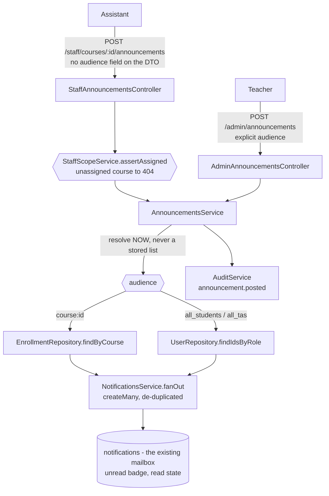
```mermaid
graph TD
    TA["Assistant"] -->|"POST /staff/courses/:id/announcements<br/>no audience field on the DTO"| SC["StaffAnnouncementsController"]
    TCH["Teacher"] -->|"POST /admin/announcements<br/>explicit audience"| AC["AdminAnnouncementsController"]
    SC --> SCOPE{{"StaffScopeService.assertAssigned<br/>unassigned course to 404"}}
    SCOPE --> SVC["AnnouncementsService"]
    AC --> SVC
    SVC -->|"resolve NOW, never a stored list"| RES{{"audience"}}
    RES -->|"course:id"| ENR["EnrollmentRepository.findByCourse"]
    RES -->|"all_students / all_tas"| ROLE["UserRepository.findIdsByRole"]
    ENR --> FAN["NotificationsService.fanOut<br/>createMany, de-duplicated"]
    ROLE --> FAN
    FAN --> INBOX[("notifications - the existing mailbox<br/>unread badge, read state")]
    SVC --> AUD["AuditService<br/>announcement.posted"]
```

**Verification.** Run against the booted app on the memory driver, not inferred:

| Check | Result |
|---|---|
| `npm run lint` both workspaces | clean |
| `npm run build` both workspaces | clean, 21 frontend routes |
| `npm run test` (unit) | **269 passed** / 21 files, was 241 |
| `npm run test:e2e` | **151 passed** / 3 files, was 125 |
| `npm run test:integration` | **48 written, 0 executed**, no Postgres available |
| `/admin/*` as either assistant | 403; teacher 200 |
| assigned vs unassigned course as a TA | 200 vs **404**, never 403 |
| TA smuggling `audience: all_students` | stripped, stored as `course:course-1` |
| TA scheduling a live session | 403 |
| `javascript:` zoom link | 400 |
| student mailbox after three sends | all three present, links are page routes |

**Follow-ups / debt.**

- **Migration `005_announcements.sql` has never executed.** Docker's engine returns HTTP 500 on
  every API version on this machine and there is no native Postgres, so the integration suite
  self-skips: 48 tests written, zero run. Unexercised: the announcements DDL, both CHECK
  constraints, the `notifications_type_check` swap, the `unnest` insert, and the `TIMESTAMPTZ(3)`
  round-trip. The last time an integration suite ran for the first time it found a real
  silently-truncating-cursor bug, so this is not a formality.
- `posted_at` is `TIMESTAMPTZ(3)` although both reads are LIMIT/OFFSET and neither needs it today.
  This is a monotonically growing feed ordered by exactly that column, so a keyset cursor is the
  obvious next change, and the microsecond trap is documented in the entry above.
- **Platform-wide fan-out is synchronous and unpaged.** `findIdsByRole` has no ceiling on purpose,
  because a partial audience is a *wrong* audience, so an `all_students` send at the "thousands of
  students" scale §1 targets belongs in a background job. Recorded in the interface, not built.
- **The §5.4 transaction gap is unchanged and now matters more.** `audit.record` still commits
  separately from the action it describes, and it now covers four more write paths.
- Announcements have no edit and no delete, deliberately: by the time a row exists it has been
  delivered into people's feeds and neither operation can recall it. A retraction is a second
  announcement. The Postgres repository has no UPDATE and no DELETE, which is where that is
  enforced.
- The CI guard that fails a job reporting no executed tests was tightened. It matched a bare
  `N skipped` anywhere in the log, so one legitimate `it.skip` would have failed the job while
  blaming `TEST_DATABASE_URL`. Now anchored to the `Test Files` line, and both branches were
  exercised against real output.
- `DATABASE_POOL_MAX` and `PGSSLMODE` are read straight from `process.env` in `database.module.ts`,
  bypassing `env.ts`'s validation contract, and neither appears in `.env.example`. `PGSSLMODE` is
  the one that matters: it disables database certificate verification.
- `ManageRecordingsService` still hardcodes `Role.Teacher` in its audit entries where the new
  live-session service derives it. Two-line fix, latent until recordings widen to TAs.
- `frontend/components/site/reveal.tsx` no longer throws a hydration mismatch. The first fix
  replaced it with a lint error and did not actually disable the animation, since `initial` is only
  read on a motion component's first render. It now reads the media query through
  `useSyncExternalStore` and honours reduced motion by collapsing the transition duration.

---

## 2026-09-08 — A verification pass over five sessions, and four fixes it earned

**What changed.** No new features. This entry is an audit of the five sessions of work sitting
uncommitted in the tree — Postgres persistence, `CourseStaffAssignment` scoping and the audit log,
the delivery pipeline, the TA/admin console, and announcements + live sessions + the public catalog
— re-read against `CLAUDE.md` rather than against the entries that describe them. Five reviewers ran
in parallel: authorization, audit-trail, scalability, requirements traceability, and a claim-by-claim
check of what the last three log entries assert.

**The claims held.** Every factual assertion in the entries above was verified against the code and
found true: `TIMESTAMPTZ(3)` on `audit_log.created_at` and `announcements.posted_at`,
`course_staff_assignments.assigned_at` still microsecond and still genuinely unpaged, the staff
announcement DTO with no `audience` field behind a global `whitelist: true`, the append-only audit
repository, thirteen repository interfaces with two implementations each, ten audit actions wired
1:1. Nothing above needed retracting. The four fixes below are things nobody had looked for.

**1. The integration suite finally ran in full, and the DDL is sound.** Docker's engine was not
returning HTTP 500 as the last two entries recorded — the daemon was simply not running. Starting
Docker Desktop was the entire fix, which is worth writing down because two consecutive sessions
treated it as an environmental dead end and shipped unexecuted DDL instead. **All five migrations
applied to a real PostgreSQL 15 from an empty schema, 48 of 48 tests green.** The three migrations
that had never touched a database — `003_course_catalog`, `004_public_catalog`,
`005_announcements` — all apply cleanly: both announcement CHECK constraints exist, the
`notifications_type_check` drop-and-re-add landed with `'announcement'` in the union, 004's slug
backfill produced `as-chemistry` / `ielts-preparation-live` / `igcse-english-language` with no
collision and no NULL fallback, and 003's UPDATE correctly matched `course-2` to `live` off its
existing enrollments. The last time an unexecuted migration first ran it found a silent
audit-log paging bug; this time it found nothing, and that is now a fact rather than a hope.

**2. The `before === after` aliasing bug, found a second time.** `in-memory-recording.repository.ts`
returned the stored object from `findRecordingById`, and `update` mutated that same object and
handed it back — so in `ManageRecordingsService.update`, `existing` and `updated` were one object,
and every `recording.updated` audit entry recorded a rename that appeared never to have happened.
This is the *identical* defect the 2026-09-07 entry describes fixing in grading, and which
`in-memory-live-session.repository.ts` carries an explicit comment against. It survived because the
live-session suite has a "before/after pair that actually differs" test and the recordings suite
only asserted that an entry was written at all. Fixed by returning a copy, and the missing test now
exists — verified to fail without the fix (`expected { title: 'After the rename' } to match object
{ title: 'Before the rename' }`) and pass with it. Under the memory driver, which is the default in
development and test.

**3. A draft course's content was readable by any signed-in student.** Migration 004 added
`is_published` and the *public* catalog honours it, so §7.2 read as settled. It was not:
`CoursesService.getCatalog` called `findAll`, not `findPublished`, and `enroll` never checked the
flag. So any student could list an unpublished course, self-enroll on it in one POST, and from
there `assertEnrolled` passes and its recordings, materials and assessments are all readable —
which is the opposite of what a draft is for. §7.2 deliberately left the *enrollment* half of the
flag open; what it did not say, because nobody had traced it, is that the open half reached content
rather than titles. The catalog now reads `findPublished` and `enroll` answers for an unpublished
course exactly as it does for one that does not exist, so a draft's id cannot be confirmed by
trying to enroll on it.

**4. Two by-id write paths were unscoped, and the comments beside them said otherwise.**
`ManageRecordingsService` and `ManageLiveSessionsService` took a bare resource id, read the row and
wrote, with no `assertAssigned` — correct today, because both are only reachable through
`AdminManageController`. But §11 records "widening this is a controller move" as the reason the
narrow reading was safe to ship, and that was **not true**: moving those routes as written would
have let any TA edit or delete every recording and live session on the platform by id. The scope
check now lives in the service where the claim requires it, resolving the course from the resource
itself (§5.11), including on `create`, which took its course id from the URL and checked only that
the course existed. A no-op for the teacher, and the thing that makes the §11 note honest.

Also: `ManageRecordingsService` derives `actorRole` from the caller instead of hardcoding
`Role.Teacher` (the two-line fix §5.4 had been carrying as latent debt), and grading's out-of-scope
404 now returns the same body as its not-found 404 — two different 404 sentences let a TA tell a
real submission id on another course from one that was never issued, which is the enumeration the
status code was chosen to prevent.

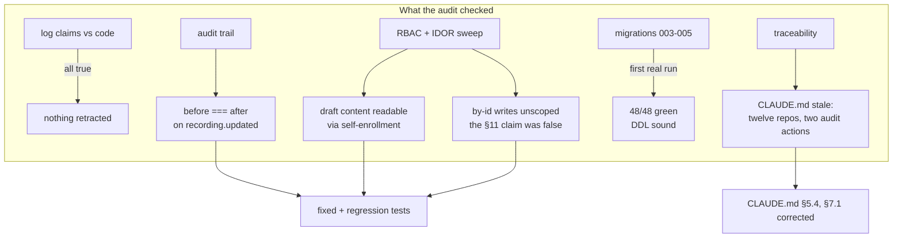
```mermaid
graph TD
    subgraph "What the audit checked"
      C1["log claims vs code"] -->|all true| OK["nothing retracted"]
      C2["RBAC + IDOR sweep"] --> F3["draft content readable<br/>via self-enrollment"]
      C2 --> F4["by-id writes unscoped<br/>the §11 claim was false"]
      C3["audit trail"] --> F2["before === after<br/>on recording.updated"]
      C4["migrations 003-005"] -->|"first real run"| F1["48/48 green<br/>DDL sound"]
      C5["traceability"] --> D1["CLAUDE.md stale:<br/>twelve repos, two audit actions"]
    end
    F2 --> FIX["fixed + regression tests"]
    F3 --> FIX
    F4 --> FIX
    D1 --> DOC["CLAUDE.md §5.4, §7.1 corrected"]
```

**Why.** §5.4 for the audit trail and the aliasing fix, §5.11 for the by-id scoping and the 404
posture, §7.2 for the draft-course gate, §13 for keeping this file and `CLAUDE.md` consistent —
which they were not: §7.1 still said "twelve repository interfaces" and "audit coverage is two
actions", both written before the console existed.

**Verification.** All executed on this machine:

| Check | Result |
|---|---|
| `npm run lint` both workspaces | clean (three unused frontend imports removed; the last entry's "clean" was three warnings) |
| `npm run build` both workspaces | clean |
| `npm run test` (unit) | **274 passed** / 21 files — was 270, four new regression tests |
| `npm run test:e2e` | **151 passed** / 3 files |
| `npm run test:integration` vs PostgreSQL 15 | **48 passed** — all five migrations from an empty schema, first run for 003/004/005 |
| Recording audit regression test without the fix | fails, `before` reads as the after value |

**Follow-ups / debt.**

- **`ManageService.overview` is a confirmed N+1** and now measured: one batched query plus three
  per-course fan-outs plus one more, so 41 queries at 10 courses and **401 at its own
  `OVERVIEW_COURSE_LIMIT` of 100**. It is the console's landing page, hit on every login. The fix is
  four batched reads mirroring `countByCourses`, across two drivers — mechanical, not structural,
  and unchanged from the last entry except that it is no longer an estimate.
- **The §5.4 transaction gap is unchanged**, now carrying ten write paths. Closing it needs a
  transaction-scoped handle both the mutating repository and `AuditLogRepository.record` can share,
  which the repository-per-connection design cannot express. Still owed before payments (§5.12).
- **Hard deletes still cascade away history.** Deleting a live session removes its `Attendance`
  rows, which are the same rows §5.15's Attendance Report aggregates; deleting a recording removes
  every student's watch progress. §6's soft-delete convention arguably covers both and covers
  neither today.
- `CreateRecordingDto.videoUrl` validates with `@IsUrl` while `UpdateLiveSessionDto.zoomLink` uses
  the stricter `IsPublicHttpUrl`. Teacher-only either way, so not a privilege question, but the
  asymmetry looks unintended.
- The in-memory `CourseRepository.findAll`/`findPublished` sort by title with no id tiebreak where
  Postgres orders by `(title, id)`, so paging could diverge between drivers on duplicate titles.
- Whether `is_published` should be one flag or two (`open_for_enrollment` alongside it) is still
  §11's open question. Fix 3 above chose the safe reading — a draft is neither listed nor
  enrollable — which is reversible in one line if Dr. Tahir wants to advertise before opening.

---

## 2026-09-08 (later) — The student dashboard, rebuilt from an annotated reference

**What changed.** The client marked up a screenshot of a Twenty CRM record page with four
annotations saying what each region should become for a student, and the dashboard was rebuilt to
that layout. The reference is worth naming because `app/tokens.css` already cites the same lineage:
the 4px grid, the 13px workhorse type, the quantized row heights and the four-tint text ramp were
drawn from it when the token system was written. So this was a mapping exercise, not a restyle —
the grammar already matched, and nothing new was added to the token file.

Four regions, in the two-column board the reference uses (right column wider):

- **Hero (left/top)** — three states in the priority the annotation sets: a live session that is
  running or starts within the hour, else the most recent unread announcement from the last 48
  hours, else a greeting. The announcement is shown here *and* left in the inbox below, because the
  annotation asks for both and because surfacing something is not the same as reading it.
- **Quick access (left/bottom)** — Recordings, Work, Timetable, Report, each with a live count off
  `DashboardResponse.stats`. Its stated purpose is that the rail is not the only way through the app.
- **Inbox (right/top)** — assessments and announcements normalised into one sorted list: overdue,
  then due-soon, then to-do, then results ready. `status` is rendered as the server derived it and
  never recomputed (§5.10); `locked` and `submitted` are excluded deliberately — one the student
  cannot act on, the other they already did.
- **Materials (right/bottom)** — the same row grammar. With one course the rows are its three
  material categories; with several they are the courses, because a combined count that links to
  only one course is a number the destination cannot account for.

Two deliberate departures from the reference, both because copying the pixel would have copied the
wrong meaning. Its trailing `+` is an *add* affordance in a CRM and every row here navigates, so it
carries a caret. And the course cards were kept below the board, which the reference has no
equivalent of: a student's landing screen without their courses on it would be cloning the form and
losing the function.

**The bug this surfaced, which is the reason it was worth doing.** Migration 005 added
`'announcement'` to the notification type union on the backend, and `frontend/lib/types.ts` was
never widened to match. Two screens — the dashboard and `/notifications` — index a
`Record<NotificationType, Icon>` by that field. The first announcement to reach a student's mailbox
would have resolved to `undefined`, rendered as `<undefined />`, and taken both pages down. The
announcement fan-out shipped in the entry above, so this was live. Union and both maps fixed.

**Also fixed: the dashboard only ever read the first course.** `GET /courses/:id/dashboard` is
per-course, and the old screen called it once. Any student on two courses had the second one's
homework silently missing from a screen whose whole job is to say what needs doing. It now fans out
across every enrollment and aggregates.

**Why.** The client's annotations, plus §5.1 (progress and performance stay apart — completion gets
the meter, marks get numerals), §5.2 (the enrollment's mode decides what the card measures), §5.10
(server-derived status), §5.14 (announcements) and §4 (gold is the one accent; the status chips are
the semantic ramp, not the brand colour). Traceability: `CRS-`, `ASG-`, `QUZ-`, `COM-`, `PRG-`.

**Verification.** `npm run lint` clean both workspaces, `npm run build:frontend` clean at 21 routes,
unit **274 passed**, e2e **151 passed**. Driven against the running dev app on the memory driver:
see the run notes below.

**Follow-ups / debt.**

- The reference's dismissible top banner has no equivalent here. It was left out rather than
  duplicated, since the hero already carries the urgent announcement the annotation describes; if
  the client wants it to follow the student across screens it belongs in `AppShell`, not this page.
- **"Urgent" is inferred, not stored.** An announcement has no priority field, so the hero shows the
  most recent unread one inside 48 hours. If Dr. Tahir wants to mark one as urgent, that is a column
  on `announcements` and a flag on the fan-out, not a heuristic here.
- **Quick access points at the first enrolled course.** With more than one course the sub-label
  names which course it opens, so the destination is at least honest, but a student on three courses
  gets one course's shortcuts. A course switcher on the panel header is the fix.
- The fan-out issues `2 × courses` requests on load. Fine at two courses and no worse than the page
  it replaced, but it wants a single aggregate endpoint rather than a loop the moment a student can
  hold ten.

---

## 2026-09-09 — Rescaled to the numbers it actually runs at, and two hot paths fixed

**The instruction that started this.** Two things from the client, in one sentence. First, the
dense student dashboard stays: *"I already need that style to easier the user experience."* The
previous session's scalability review had flagged that screen as expensive, and the obvious reading
— make it smaller — is the wrong one. Second, and this is the part that reframes everything else:
Dr. Tahir runs about **10 groups of about 30 students each, so roughly 300 students**.

`CLAUDE.md` §1 had said "must scale to thousands of students" since the brief. Three hundred is two
orders of magnitude smaller, and it changes which work is worth doing rather than merely reordering
it. That is now written down as **§7.3**, because leaving it implicit means the next session reads
§7.1's debt list and starts building Redis for three hundred people.

**What the rescale actually decides.** The distinction that survives it is *cost that grows with
data* versus *cost that is merely large but constant*. A primary-key lookup against Postgres on the
same host is a fraction of a millisecond, so twenty of them inside one request is invisible; twenty
**HTTP** requests from a student's phone on Egyptian mobile data is a visibly slow screen. Round
trips and row volume matter here. Query counts mostly do not.

So two things were fixed and several were deliberately not built.

**1. The student Home screen: `2N + 2` requests became 1.** The dashboard endpoint was per course,
so the page fanned out in the browser — `GET /courses`, then a dashboard *and* an assessment list
per enrolled course, then `/notifications`. Each of those is a fresh TLS write, JWT verification and
user lookup before it reads a row, and the panels sat on "Loading files…" until the second wave
landed. The new `GET /dashboard` (`dashboard/student-home.service.ts`) returns the whole screen:
every enrolled course's stats, material counts, next session and assessment list, plus the mailbox.

The layout did not change at all, which was the point. The frontend diff is the fetch and three prop
types; every line that renders a row is untouched.

It is **composition only**, through the same public services the per-course screens use — so each
enrollment check still runs at each call site, and no number on Home is computed by a second
implementation that could drift from the screen it links to. Where a derivation genuinely had to be
shared, it was *extracted* rather than copied: `deriveStats` is now one exported function both
screens call, and `ReportsService.buildPerformance` is the single arithmetic for the averages. The
e2e suite pins this rather than trusting it — `/dashboard` and `/courses/course-1/dashboard` are
fetched in the same test and asserted equal.

The response shape is deliberately **not** a `DashboardResponse` per course. That type repeats
`progress` (which `course.progress` already carries, at two recording reads each) and `studentName`
and `unreadNotifications`, which belong to the student rather than to each course. The aggregate
hoists them and drops the duplicate.

**2. `ManageService.overview`: the query count was the smaller half of the problem.** It was a
`4N + 2` fan-out and the previous entry had it measured at 41 queries for ten courses. Rewriting it
to four count-only reads makes it five queries flat. But the cost that actually bit was **rows**:
the old code fetched every enrollment, every assessment, every submission and every recording across
all courses, into memory, on the console's landing page, so that four `.length` calls and a `Set`
could be taken over them. At ten groups of thirty that is the whole submission table on every login,
to produce six integers.

Three count-only repository methods now exist, each one query, each with both drivers implemented:
`EnrollmentRepository.countDistinctStudents` (distinct *people* — a student in two of the teacher's
groups is one person, and a `SUM` would over-count them), `RecordingRepository.countByCourses`, and
`AssessmentRepository.countUngradedSubmissionsByCourses`. "Ungraded" is still derived from
`corrected_at IS NULL` and never stored (§5.10); the derivation just moved into SQL.

**What was deliberately not built, and why that is a decision rather than an omission.** No Redis.
§7.1 wanted it for the per-process rate limiter, the token denylist and the `JwtStrategy` per-request
lookup, and §5.11 designed a five-condition cache for the `CourseStaffAssignment` check. On **one
replica a per-process structure is correct**, and Redis is a component to operate, back up and fail
over for no user-visible benefit at this size. §7.3 records the trigger to revisit: a second replica
being configured — not a student count. Also not built: pagination on student-facing lists (1–3
courses, ~20 assessments) and `QuizAnalyticsSnapshot` caching.

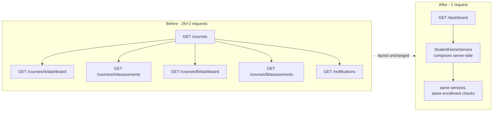
```mermaid
graph LR
    subgraph BEFORE["Before - 2N+2 requests"]
      B1["GET /courses"] --> B2["GET /courses/A/dashboard"]
      B1 --> B3["GET /courses/A/assessments"]
      B1 --> B4["GET /courses/B/dashboard"]
      B1 --> B5["GET /courses/B/assessments"]
      B1 --> B6["GET /notifications"]
    end
    subgraph AFTER["After - 1 request"]
      A1["GET /dashboard"] --> A2["StudentHomeService<br/>composes server-side"]
      A2 --> A3["same services,<br/>same enrollment checks"]
    end
    BEFORE -.->|"layout unchanged"| AFTER
```

**Why.** The client's instruction on the dashboard style, plus §7.3 (new), §5.1 (progress and
performance stay apart), §5.10 (server-derived status, rendered not recomputed), §5.11 (the staff
counts stay scoped — `overview` still resolves its course ids through `coursesInScope` before any
count is taken) and §13. Traceability: `CRS-`, `ASG-`, `PRG-`, `COM-`.

**Verification.** All executed on this machine, not inferred:

| Check | Result |
|---|---|
| `npm run lint` both workspaces | clean |
| `npm run build` both workspaces | clean, 30 frontend routes |
| `npm run test` (unit) | **274 passed** / 21 files |
| `npm run test:e2e` | **157 passed** / 3 files — was 151, six new |
| `npm run test:integration` vs PostgreSQL 15 | **52 passed** — was 48, four new |

The integration run matters most here: the three new count-only queries are **executed** SQL, not
written SQL, and each is asserted against the row-fetching method it replaced rather than against a
literal. If `COUNT(DISTINCT …)` and the old `Set` ever disagree, that test fails. Docker's daemon
was stopped again and starting Docker Desktop was again the whole fix — third time, now reflexive.

**Follow-ups / debt.**

- **`StudentHomeService.getHome` fans out over courses with an unbounded `Promise.all`**, five
  concurrent service calls per course, against a pool of `max: 10`. At one to three courses this is
  nothing. It is the shape that would need a bound if a student could ever hold ten, and it is worth
  remembering that the ceiling is the pool, not the CPU.
- **The aggregate response now carries every assessment of every course.** At ~20 per course that is
  a few KB and fine. It is the field most likely to need trimming first if a course grows a long
  assessment history — a `limit` on what Home carries, with the full list still behind
  `/courses/:id/assessments`.
- `ReportsService.getPerformanceFor` is the one method in the student path that does **not**
  re-assert enrollment, following the existing `LiveSessionsService.getAttendanceSummary` precedent.
  Both current callers assert first. It is documented at its definition, and it is the kind of thing
  that goes wrong when a third caller appears.
- The §5.4 audit transaction gap is **unchanged** and still owed before payments (§5.12).
- Six identical `assertEnrolled` round trips still happen inside one `GET /courses/:id/dashboard`
  (direct, `getCourse`, assessments, materials, live sessions, reports). Removing them would mean
  six enrollment-trusting internal methods — six latent authorization footguns — to save about half
  a millisecond at this scale. **Deliberately left alone**; if it is ever worth doing, memoizing
  `assertEnrolled` per request is the safe shape, not internal variants.

---

## 2026-09-10 — Groups, classmates, and the authoring surface that never shipped (no commit — requirements only)

**No code changed.** This entry records a client instruction and the re-read of the tree it
prompted, because the instruction invalidates part of what `CLAUDE.md` §7.1 claimed and adds an
entity the schema has never had. Writing it down before building anything is the point: the group
decision has a security boundary inside it (below), and that is the kind of thing that is cheap
today and a migration plus an audit later.

**What the client said.** Four things, in one sentence. Dr. Tahir teaches in **groups**; **more than
one group can be enrolled in the same course**; **a student can see their classmates**; **a student
is placed in a group by the assistant or the teacher**. Then, separately: **quiz, assignment and
announcement upload must appear on the student end.**

**Why the first one is not a rename.** The tree has `Course` and it has `Enrollment(studentId,
courseId)`, and the codebase has been quietly using "group" as a synonym for "course" —
`EnrollmentRepository.countDistinctStudents` literally says *"a student in two of the teacher's
groups is one person"*, meaning courses. That reading is now wrong. A course is the curriculum; a
group is the cohort taught it, and several cohorts share one curriculum. It also re-frames §7.3's
numbers: **ten groups is not ten courses** — the course count is plausibly low single digits, and
the thing that grows is groups.

**The consequence that is a security boundary, not a schema shape.** `CourseStaffAssignment` scopes
a TA to a *course* (§5.11). The moment two groups share one course, a TA who runs only one of them
is handed the other group's roster, submissions and announcements — **by a check that still
passes**. Whether TAs are assigned per group or per course therefore has to be settled *before* the
migration, and §5.11's own warning about retrofitting scoping now applies to §5.11.

Three further consequences, all recorded rather than acted on: the **live schedule belongs to the
group** (`LiveSession` keys on `courseId` today, and attendance keys on the session, so attendance
follows for free once the session moves); announcements need a **`group:<id>` audience**, which will
be the common case; and the report side of §5.15 has to decide whether "course average" still means
anything once two cohorts meet on different days.

**Classmates is a new PII surface, not a new list endpoint.** Every student-facing read in this
build is strictly self-scoped — no student can currently learn another exists. Scope is the group,
never the course; the field set is name and avatar and deliberately excludes marks, progress and
attendance, because a classmate list that carries a grade is a leaderboard and a different product
decision. A self-enrolled student (§7.2) is **enrolled but ungrouped** until staff place them, which
must read as a normal state — an empty classmate list and a staff "needs placing" view, not a 403.

**The authoring instruction turned out to be mostly a gap, and the re-read is what established
that.** Enumerated across every controller:

| Piece | Staff can author it | Student sees it |
|---|---|---|
| Announcement | Yes — `POST /admin/announcements`, `POST /staff/courses/:id/announcements` | **Only as a notification.** No student announcements route exists at all. |
| Assignment / homework | **No route anywhere.** Every assessment in the system is seed data. | Yes — list, submit, revise, server-derived status all built. |
| Quiz | **No route, and no engine.** `Question`, `QuestionOption`, `QuizAttempt`, `Answer` are unbuilt; `AssessmentType='quiz'` behaves exactly like an assignment. | Only as that degenerate assignment. |

So the ask is two authoring surfaces plus one student read surface. Note that writing the first of
them *decides* the open §11 question "can a TA create assignments?" the moment the `@Roles()`
decorator is typed — worth one question to the client rather than a default.

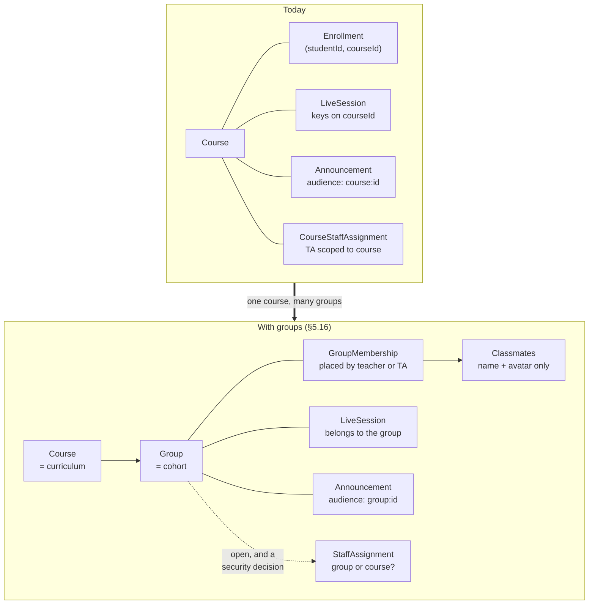
```mermaid
graph TD
    subgraph NOW["Today"]
      C1["Course"] --- E1["Enrollment<br/>(studentId, courseId)"]
      C1 --- L1["LiveSession<br/>keys on courseId"]
      C1 --- A1["Announcement<br/>audience: course:id"]
      C1 --- S1["CourseStaffAssignment<br/>TA scoped to course"]
    end
    subgraph NEXT["With groups (§5.16)"]
      C2["Course<br/>= curriculum"] --> G2["Group<br/>= cohort"]
      G2 --- M2["GroupMembership<br/>placed by teacher or TA"]
      G2 --- L2["LiveSession<br/>belongs to the group"]
      G2 --- A2["Announcement<br/>audience: group:id"]
      G2 -.->|"open, and a<br/>security decision"| S2["StaffAssignment<br/>group or course?"]
      M2 --> CL["Classmates<br/>name + avatar only"]
    end
    NOW ==>|"one course, many groups"| NEXT
```

**Why.** The client instruction of 2026-09-10 (§0 item 1 outranks everything), recorded as
`CLAUDE.md` §5.16 (groups), §5.17 (classmates) and §5.18 (authoring reaches the student end), with
amendments to §2 and §2.2 (placement is a TA power, and is *not* enrollment), §5.11 (where the scope
filter joins), §5.14 (the `group:<id>` audience), §5.15 (which average), §6.1 (`Group`,
`GroupMembership`), §7.1 (the honest "none of this exists"), §7.2 (enrolled but ungrouped) and §7.3
(ten groups ≠ ten courses). Six new questions in §11. Traceability: `CRS-`, `ASG-`, `QUZ-`, `COM-`.

**Follow-ups / debt.**

- **Nothing is built.** This is a specification entry; the schema, the routes and the UI are all
  still to come, and §7.1's inventory now says so explicitly rather than implying groups exist.
- **The four group questions in §11 gate the migration**, and the TA-scoping one gates it hardest.
  Ask before writing `006_groups.sql`.
- **`group.student_assigned` belongs in `AuditAction`** the day placement is built — it is a TA
  mutation, so §5.4 reaches it, and the union type will refuse to compile until it is added.
- Code comments that say "group" and mean "course" are now misleading. Fix them **as the group work
  touches each file**, not in a sweep.
- The §5.4 audit transaction gap is still open and still owed before payments (§5.12) — unchanged
  by any of this, and about to gain another writer.

---

## 2026-09-10 — The group questions, answered (no commit — requirements only)

The entry above closed with four questions gating `006_groups.sql`. The client answered the same
day, and two of the four are now shut. Still no code: this records decisions, and one of them is a
decision **not** to change code yet.

**A group is a standalone class of students.** Asked whether a group belongs to one course or exists
on its own, the answer was *"no, I mean group of students"* — a group has a name and members and
exists before any course is attached, and a course is then **enrolled**, which was the client's verb
from the start. So the shape recorded yesterday was wrong in the one place that would have been
expensive: `Group` gets **no `course_id`**. The link is its own row, `GroupCourse`, and the same
group can in principle be enrolled in two courses. A column would have been a one-way door; a join
table is not, which is the whole reason this was worth asking before writing the migration.

**Enrollment first, placement second** — *"yes, enrolled then grouped by TA."* `Enrollment` stays the
single source of truth for whether a student has a course; membership is a separate, later fact
about which cohort they sit in. That ordering is what keeps §7.2's self-enrollment working
untouched, and it means adding a group to a course does not by itself enroll thirty students. Whether
it *should*, as a convenience, is now its own §11 question — it has a money question inside it, since
a bulk enroll would walk straight past whatever payment gate eventually sits in front of
`CoursesService.enroll`.

**TAs see everything — for now, and that "for now" is load-bearing.** The security question turned
out to have the widest possible answer: *"TAs are allowed to access all groups"*, and when asked
whether that also drops per-course scoping, *"for now keep it as TAs see everything, but it might be
changed."*

This is written up as **§5.11.1, a posture appended to §5.11 rather than a replacement of it**. The
temptation is to read "TAs see everything" as permission to delete `CourseStaffAssignment` and
`StaffScopeService`, and that would be the single most expensive way to comply: §5.11's own thesis
is that retrofitting scoping is how the leak happens, and the client has said in advance that this
may be retrofitted. So the machinery stays, `assertAssigned` stays the one place that decides, and
the posture becomes **one answer inside it** behind a `TA_SCOPE=all|assigned` switch — reversible in
one method and its tests instead of a route-by-route re-audit.

Two things kept separate while doing it. `/admin/*` does not widen: "a TA sees every course" is not
"a TA may unenroll a student or issue a refund", so §2.2's *capability* split is untouched by what is
purely a *visibility* decision. And §5.17's classmate list must not inherit the widening — staff
seeing more says nothing about what a student may see, and a classmate roster copied from a staff
query is the likeliest accidental leak on the student side.

**The shipped code still scopes**, and that is recorded in §7.1 rather than quietly reconciled: a TA
gets a 404 on an unassigned course today, and the unit and e2e suites assert it. Until the flip lands
with the group work, §5.11 describes the code and §5.11.1 describes the intent. Flipping it now would
loosen access in the middle of a specification pass, for a feature whose schema does not exist yet.

**Confirmed, not new:** the fourth answer was *yes* to the authoring gap — assignment, quiz and
announcement upload appearing on the student end is wanted, exactly as §5.18 sets it out.

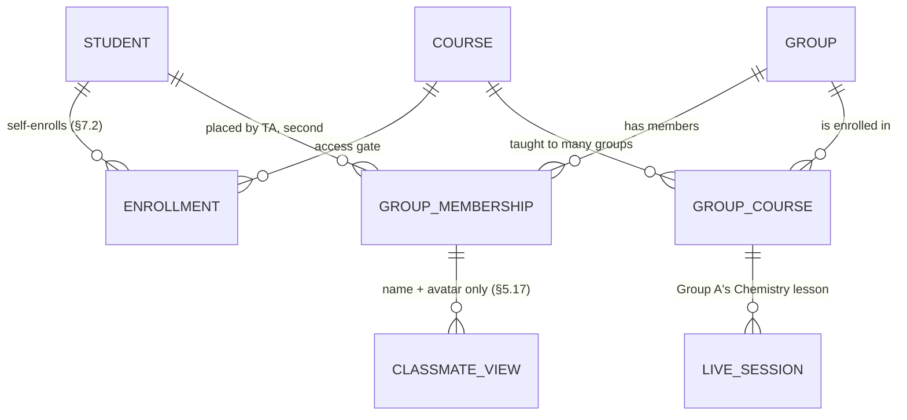
```mermaid
erDiagram
    STUDENT ||--o{ ENROLLMENT : "self-enrolls (§7.2)"
    COURSE  ||--o{ ENROLLMENT : "access gate"
    STUDENT ||--o{ GROUP_MEMBERSHIP : "placed by TA, second"
    GROUP   ||--o{ GROUP_MEMBERSHIP : "has members"
    GROUP   ||--o{ GROUP_COURSE : "is enrolled in"
    COURSE  ||--o{ GROUP_COURSE : "taught to many groups"
    GROUP_COURSE ||--o{ LIVE_SESSION : "Group A's Chemistry lesson"
    GROUP_MEMBERSHIP ||--o{ CLASSMATE_VIEW : "name + avatar only (§5.17)"
```

**Why.** Client answers of 2026-09-10 (§0 item 1). Recorded as `CLAUDE.md` §5.11.1 (new), with
§2.2, §5.15, §5.16, §5.17, §6.1, §7.1, §7.2 and §11 amended to match. Traceability: `CRS-`, `TA-R`,
`ACC-`.

**Follow-ups / debt.**

- **Two questions still gate the migration**, and neither is a security boundary any more: are
  assessments authored per course or per group (propose *author on the course, override the window
  per group*), and does `learningMode` move — note it would land on `GroupCourse`, not `Group`, now
  that a group can span courses.
- **The `TA_SCOPE` flip is unbuilt** and the suites still assert the scoped behaviour. Doing it
  means one branch in `assertAssigned`, a config entry, and updating the tests that assert 404 to
  assert it *per posture* — both directions, not one replaced by the other.
- `group.student_assigned` still owed in `AuditAction`, unchanged from the previous entry.
- The §5.4 audit transaction gap is still open, still owed before payments.

---

## 2026-09-10 — Per-group assessments, and the mode moves with them (no commit — requirements only)

The last two group questions, answered the same day: assessments are authored **per group**, and the
learning mode becomes the **group's** property. Both are one-word answers with long tails, and the
tails are why this is a third entry rather than a line appended to the second.

**Where a per-group assessment actually lives.** Not on the group — a group can be enrolled in two
courses, so "Group A's assignment" is ambiguous in a way "Group A's Chemistry assignment" is not. It
hangs off **`GroupCourse`**, the row that says *this group studies this course*, which is now the
busiest new entity in the model: live sessions, `group:<id>` announcements, assessments and the
learning mode all attach there, because all four describe the pairing rather than either half.

**This is the change that reaches furthest into shipped code.** `StoredAssessment.courseId` is what
every student-facing read filters on — `AssessmentRepository.findByCourse`, both dashboard services,
`ReportsService`, the staff submissions list, and the tests behind all of them. Re-parenting it, plus
moving `Enrollment.learningMode`, means the group migration is not a bolt-on: it re-parents the two
tables the student surface reads most. Migration `006` also has to decide what the existing
course-level seed assessments attach to, since every group-level read will otherwise miss them.

**The compounding consequence, which is the part worth catching now.** A student who self-enrolls
(§7.2) is enrolled but unplaced. That was benign while a group only decided who you sit with. With
assessments per group and mode on the group, an unplaced student opens a course with **no work in it
and no mode to render** — the lessons and recordings still play, so it is not a lockout, it is worse
in one specific way: it looks like a working course that happens to be empty, which is what a student
reports as "the site is broken". Two things follow and neither is optional.
`courses.default_learning_mode` (already shipped, migration 003) becomes the fallback so the dashboard always
has something to render — that column now has a second job. And the staff console needs a prominent
**"enrolled, not yet placed"** queue, because placement stopped being administrative tidying and
became the thing that makes a course usable.

**What per-group authoring costs, and the one column that buys it back.** §5.6 asks for the average
of an assignment across all students, so the teacher can see whether a task was hard. Written once
per group, that becomes ten averages over ten unrelated rows, and averaging the averages is wrong the
moment group sizes differ. A nullable **`origin_assessment_id`** — every copy pointing at the first —
keeps per-group averages as the default while making the cross-group figure a `GROUP BY`. One column
now; inferring "these ten rows were the same task" from matching titles later. It goes in with the
group migration even though nothing reads it yet.

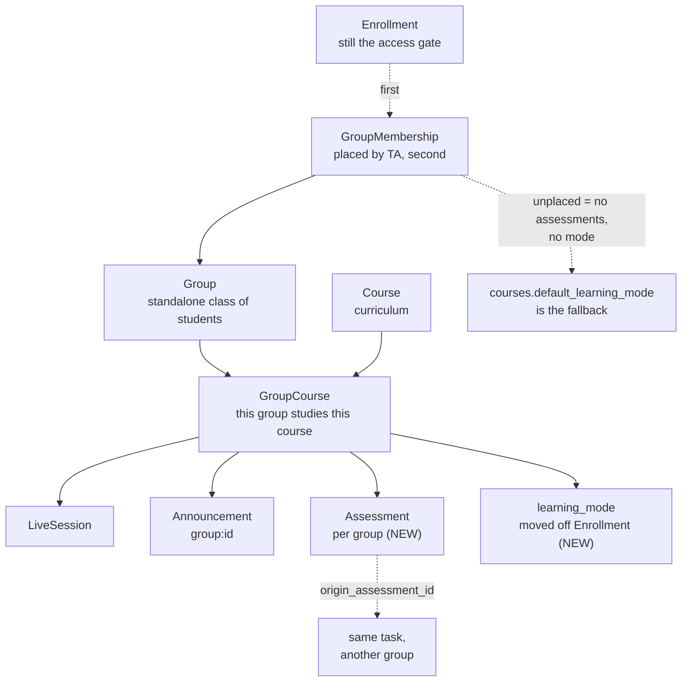
```mermaid
graph TD
    G["Group<br/>standalone class of students"] --> GC
    C["Course<br/>curriculum"] --> GC["GroupCourse<br/>this group studies this course"]
    GC --> LS["LiveSession"]
    GC --> AN["Announcement<br/>group:id"]
    GC --> AS["Assessment<br/>per group (NEW)"]
    GC --> LM["learning_mode<br/>moved off Enrollment (NEW)"]
    AS -.->|"origin_assessment_id"| AS2["same task,<br/>another group"]
    E["Enrollment<br/>still the access gate"] -.->|"first"| GM["GroupMembership<br/>placed by TA, second"]
    GM --> G
    GM -.->|"unplaced = no assessments,<br/>no mode"| FALL["courses.default_learning_mode<br/>is the fallback"]
```

**Why.** Client answers of 2026-09-10 (§0 item 1). Recorded in `CLAUDE.md` §5.2 (mode moves), §5.6
(the cross-group average and its fix), §5.16 (both answers plus the compounding read), §6 and §6.1
(`GroupCourse` carries the mode; `Assessment` re-keys), §7.1 (the two shipped fields that move) and
§7.2 (the unplaced student is no longer benign). §11's four opening group questions are now all
closed; three new ones replaced them. Traceability: `ASG-`, `QUZ-`, `CRS-`, `PRG-`.

**Follow-ups / debt.**

- **Three open questions replaced the four that closed**, and none blocks the schema: does adding a
  group to a course bulk-enroll its members (it has a payment question inside it); how does the
  teacher push one task to ten groups without writing it ten times; and what do the seed assessments
  attach to in `006`.
- **The "enrolled, not yet placed" queue is now a requirement, not a nicety** — it is the only thing
  standing between a self-enrolled student and an empty course.
- `TA_SCOPE` flip, `group.student_assigned` in `AuditAction`, and the §5.4 audit transaction gap all
  unchanged from the previous two entries.

---

## 2026-09-10 — "Write once, pick the groups" — which shrinks the migration (no commit — requirements only)

The last three open questions, answered. One of them corrects the entry immediately above, so that
correction leads.

**The previous entry had the assessment shape wrong.** It read the client's "per group" as *one
assessment row per group* — ten copies of one task — and then spent a paragraph proposing a nullable
`origin_assessment_id` to stitch the copies back together for the cross-group average. The actual
answer was *"he could make a task then to submit for one or more groups with his own selection"*:
the task is written **once** and its **audience** is chosen per group. Duplication never happens, so
there is nothing to stitch. **`origin_assessment_id` is retracted and should not be added.**

**What that changes in the schema, and it is less than yesterday claimed.** `Assessment.courseId`
**stays** — a task is course material — and gains a join, `AssessmentTarget`, one row per targeted
group carrying nullable `available_from` / `available_to` / `due_at` that override the assessment's
own. A teacher setting one deadline for everyone writes none of them; a teacher running two cohorts
a week apart overrides the later one. So yesterday's "the migration re-parents the two tables the
student surface reads most" was an overstatement: **one** field moves (`Enrollment.learningMode` to
`GroupCourse`), and assessments gain a predicate rather than a new parent. §7.1 now says so.

The read is where the work actually is: *the assessments of this course targeted at a group this
student is in.* That is `AssessmentRepository.findByCourse` plus a join, reaching both dashboard
services, `ReportsService` and the staff submissions list — but in the places that already assert
enrollment, not in new access paths. §5.10's server-derived status now reads the override window
where one exists.

**No bulk enroll** — *"not necessary, maybe the assistants and teachers can add to specific
group."* Adding a group to a course enrolls nobody; staff add students to a group one at a time and
`Enrollment` is untouched by placement. This is the answer that keeps §5.12 out of the group work
altogether: nothing about placement can hand somebody a course they have not paid for, once payment
exists. What it costs is a real "add students to this group" surface — at 30 students a group, a
page that adds one at a time is used once and then abandoned, so multi-select from the roster is the
minimum bar even though the write underneath stays per student.

**Seed assessments: regenerated, not migrated.** Left to me, so: they are dev-database furniture,
and inventing a permanent "default group" concept to migrate throwaway rows into would be the schema
paying rent for test data. `006` regenerates the seed. Reversible, and recorded in §7.1 as my call
rather than a client decision.

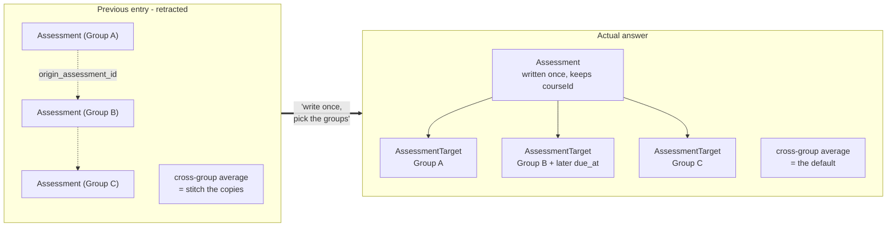
```mermaid
graph LR
    subgraph WRONG["Previous entry - retracted"]
      A1["Assessment (Group A)"] -.->|origin_assessment_id| A0["Assessment (Group B)"]
      A0 -.-> A2["Assessment (Group C)"]
      N1["cross-group average<br/>= stitch the copies"]
    end
    subgraph RIGHT["Actual answer"]
      B0["Assessment<br/>written once, keeps courseId"] --> T1["AssessmentTarget<br/>Group A"]
      B0 --> T2["AssessmentTarget<br/>Group B + later due_at"]
      B0 --> T3["AssessmentTarget<br/>Group C"]
      N2["cross-group average<br/>= the default"]
    end
    WRONG ==>|"'write once,<br/>pick the groups'"| RIGHT
```

**Why.** Client answers of 2026-09-10 (§0 item 1). `CLAUDE.md` §5.6 (the retraction), §5.16 (both
answers), §6.1 (`AssessmentTarget`; `GroupCourse` no longer owns assessments), §7.1 (one field
moves, not two; seed regenerated) and §11 (all seven group questions now closed). Traceability:
`ASG-`, `QUZ-`, `CRS-`, `PRG-`.

**Follow-ups / debt.**

- **Groups are fully specified; what remains is implementation** — `006_groups.sql` and the surfaces
  on it. No group question is open.
- Two design notes to carry into that work: an unplaced student sees an empty course (§5.16, §7.2),
  and "add students to a group" needs multi-select over a per-student write.
- `TA_SCOPE` flip, `group.student_assigned` in `AuditAction`, and the §5.4 audit transaction gap
  are unchanged across all four of today's entries.

---

## 2026-09-10 — Groups, built (migration `006`, `backend/src/groups/`)

Four entries today; the first three were specification. This one is code.

**What exists now.** `006_groups.sql` creates four tables and `backend/src/groups/` is the module on
top of them: a `GroupRepository` with both drivers, `GroupsService` (create, rename, attach and
detach a course, place and remove a student — all six audited), `ClassmatesService`, and three
controllers that carry the role boundary at class level the way `manage/` does —
`AdminGroupsController` is `@Roles(Teacher)`, `StaffGroupsController` is `@Roles(Assistant,
Teacher)`, `ClassmatesController` is `@Roles(Student)`. Reading any one file tells you who can reach
every route in it.

**The split between the two staff controllers is a client decision, not a taste one.** Placement is
on the staff controller because §5.16's answer put it there in as many words — a student is assigned
to a group *"by the assistant or the teacher"*. Creating a group and deciding what it studies stayed
teacher-only, because the client said nothing about who creates one and the narrow reading is what
ships (the same call made for live-session scheduling on 2026-09-07). Reversing it moves routes
between two controllers and leaves `GroupsService` untouched, since it already takes a `StaffActor`
and derives `actorRole` from it rather than assuming Dr. Tahir.

**What is scoped and what deliberately is not.** The one route that names a *course* —
`GET /staff/courses/:id/groups` — goes through `StaffScopeService` like every other `/staff` route,
and an unassigned TA gets the same 404 as for a course that does not exist. The routes that name a
*group* do not, because a group spans courses and there is nothing to scope by — which is also
exactly what the client asked for (§5.11.1: *"TAs are allowed to access all groups"*). So the group
surface already implements the decided posture; what still diverges is the course half, and that
belongs behind a switch inside `assertAssigned`.

**Classmates is built as a new PII surface, not as a list endpoint** (§5.17). Three separate
narrowings, each of which had to be a deliberate choice: enrollment is asserted first, the query
starts from the caller's own memberships rather than from the course roster, and the staff roster
lives on a *different service* — `GroupsService.members` returns email, `ClassmatesService` returns
names — so widening one cannot widen the other by editing a line. A student in two groups gets two
lists rather than one merged set, and an unplaced student gets `[]` rather than an error. The e2e
asserts the field set over the wire (`Object.keys` is exactly `['name', 'studentId']`, and the whole
response body contains no `@`), because that is where a widened shape would actually leak.

**One real defect found, and a test found it rather than a reading.** `ListAuditLogQueryDto` mirrors
`AuditAction` and `AuditTargetType` as runtime arrays, because `@IsIn` needs values and a TypeScript
union has none. Those arrays were plain literals, so the six new `group.*` actions logged correctly
and were then **rejected by the admin log's own filter with a 400** — an action recorded but
unfindable. The spec test that claimed to guard this iterates the array, so it can only prove that
what is listed works and never that anything is missing; it passed throughout. An e2e request to
`/admin/audit-log?action=group.student_assigned` is what surfaced it.

Both arrays are now derived from an exhaustive `Record<AuditAction, true>`, which does not compile
with a union member absent. **That is the generalisable part**: any list-shaped runtime mirror of a
union in this codebase should be written the same way, because the difference between a guard and a
comment claiming there is one is exactly this.

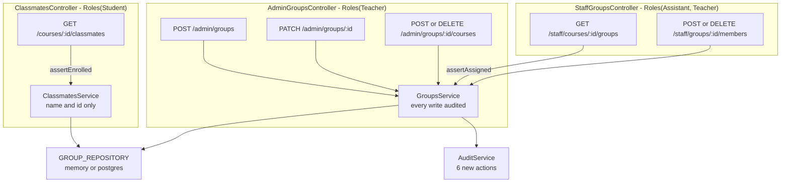
```mermaid
graph TD
    subgraph ADMIN["AdminGroupsController - Roles(Teacher)"]
      A1["POST /admin/groups"] --> S
      A2["PATCH /admin/groups/:id"] --> S
      A3["POST or DELETE /admin/groups/:id/courses"] --> S
    end
    subgraph STAFF["StaffGroupsController - Roles(Assistant, Teacher)"]
      T1["GET /staff/courses/:id/groups"] -->|"assertAssigned"| S
      T2["POST or DELETE /staff/groups/:id/members"] --> S
    end
    subgraph STUDENT["ClassmatesController - Roles(Student)"]
      C1["GET /courses/:id/classmates"] -->|"assertEnrolled"| CS["ClassmatesService<br/>name and id only"]
    end
    S["GroupsService<br/>every write audited"] --> R["GROUP_REPOSITORY<br/>memory or postgres"]
    CS --> R
    S --> AU["AuditService<br/>6 new actions"]
```

**Why.** `CLAUDE.md` §5.16 (groups), §5.17 (classmates), §2.2 (placement is a TA power, enrollment
is not), §5.11 and §5.11.1 (what is scoped and what is not), §5.4 (every staff mutation logged),
§5.2 (the mode lands on `GroupCourse`), §6.1 (the four entities). Traceability: `CRS-`, `ACC-`,
`COM-`, `TA-R`.

**Verification.** All executed on this machine:

| Check | Result |
|---|---|
| `npm run lint` | clean |
| `npm run build` | clean |
| `npm run test` (unit) | **294 passed** / 22 files — was 274, twenty new |
| `npm run test:e2e` | **168 passed** / 3 files — was 157, eleven new |
| `npm run test:integration` vs PostgreSQL 15 | **59 passed** — was 52, seven new |

The integration run is the one that matters most here: **all six migrations applied from an empty
schema**, so `006`'s four tables, both UNIQUE constraints, the CHECK on `learning_mode` and the
cascades are executed SQL rather than written SQL. The idempotence assertions are deliberately made
against Postgres rather than against the in-memory stub, because in memory a JavaScript `find` in
front of the insert does the work and the constraint is never exercised.

**Follow-ups / debt.**

- **`learning_mode` on `group_courses` is written but not read.** A staff caller sets it and it round
  trips; the student surface still reads `Enrollment.learningMode`. That is two sources of truth for
  one value, which is the drift this project keeps warning about, and **it is the next thing to
  close** (§5.2, with `courses.default_learning_mode` as the fallback for an unplaced student).
- **`assessment_targets` is DDL only.** The table exists and is indexed; nothing writes or reads it.
  It lands with the authoring surface (§5.18), and the seed deliberately leaves it empty so the
  student assessment list is not filtered by something no code consults.
- **The e2e suite lost a vitest worker twice today**, both times while the machine was also running
  the integration suite against Docker — `Worker exited unexpectedly`, with roughly half the 168
  tests never starting. It did **not** reproduce on a clean parallel run afterwards (168 passed,
  27s), and the serial form and each file alone have always passed. So this is flakiness under
  load, not a test defect and not something to "fix" by rewriting a test. Recorded because CI runs
  the parallel form on a small runner: if it goes red with the same message, this is the entry
  that says the answer is `--no-file-parallelism` or a bigger runner, not a hunt for a broken
  assertion.
- **No group delete**, deliberately: a group carries placement history and §6's convention is
  soft-delete where history matters. `rename` covers the mistyped-name case. The integration suite
  still asserts the cascades, so a delete by hand cannot orphan rows.
- Code comments that say "group" and mean *course* are now actively wrong; fix them as the remaining
  group work touches each file.
- The §5.4 audit transaction gap is unchanged, and now has six more write paths depending on it.

---

## 2026-09-10 — The learning mode moves to the group (migration `007`)

The previous entry closed with one piece knowingly inert: `group_courses.learning_mode` was written
and never read, while the student surface still read `Enrollment.learningMode`. Two sources of truth
for one value is the drift this project keeps warning about, so it did not get to sit there.

**What changed.** `LearningModeService` is now the only thing that answers *how is this student
taught this course*: the mode of a group they are in that studies the course, else
`courses.default_learning_mode`, else `'recorded'`. Migration `007` **drops
`enrollments.learning_mode`** — deliberately rather than leaving it as a cache, because the copy
goes stale the instant a student is moved between groups, which is the operation groups exist to
support. It is the first destructive migration in the set, and the file itself argues why the
dropped value is derivable: it was written from the course default at self-enrollment and there has
never been a route that edits it.

Seven call sites moved: `CoursesService` (list, detail, enroll), `DashboardService`,
`ReportsService.getSummary`, and the staff roster in `ManageService`. The last one takes the batch
form, `resolveForCourse`, whose query count is bounded by the number of *groups* on the course
rather than the number of students in it — thirty round trips on a page that lists thirty people is
the O(N) §7.3 still says to avoid at this size.

**The structural decision worth recording is `@Global()`.** Once the mode lives on the group, every
service that renders a student's course needs group data — but `GroupsModule` already depends on
`CoursesModule`, so `CoursesModule` importing it back is a cycle, and `forwardRef` would only hide
one. `GroupDataModule` splits the *data* (`GROUP_REPOSITORY`) and the one *derived question*
(`LearningModeService`) out as a global module, exactly as `AuditModule` already does for §5.4.
`GroupsService`, which writes, stays behind `GroupsModule` and is not reachable without importing
it. **A third global module in this codebase should need a better reason than convenience**: global
providers are invisible in a module's import list, which is precisely what makes them worth
rationing.

**One correctness detail that a test now pins.** A student may legally sit in two groups studying
one course. Both the single read and the roster batch resolve to the **longest-standing placement**
(`enrolled_at` order), so the two can never disagree — two reads of one value that differ is worse
than either answer, and the disagreement would surface as a dashboard that renders checkpoints while
the roster says the student is live.

```mermaid
graph LR
    Q["how is this student<br/>taught this course?"] --> G{"in a group<br/>studying it?"}
    G -->|yes| GM["group_courses.learning_mode"]
    G -->|"no - enrolled<br/>but unplaced (7.2)"| CD["courses.default_learning_mode"]
    CD -->|"no such course"| SAFE["'recorded' - renders<br/>checkpoints, not an<br/>attendance timeline"]
    OLD["enrollments.learning_mode"] -.->|"dropped, migration 007"| X["gone"]
```

**Why.** `CLAUDE.md` §5.2 (the mode belongs to the group), §7.2 (an unplaced student still gets a
dashboard), §7.3 (batch the roster, do not batch what is already one or two rows). Traceability:
`CRS-`, `PRG-`.

**Verification.** All executed on this machine:

| Check | Result |
|---|---|
| `npm run lint` | clean |
| `npm run build` | clean |
| `npm run test` (unit) | **299 passed** / 22 files — was 294, five new |
| e2e (`--no-file-parallelism`) | **170 passed** / 3 files — was 168, two new |
| `npm run test:integration` vs PostgreSQL 15 | **59 passed**, all **seven** migrations from an empty schema |

The e2e pair is the one that matters: it asserts over the wire that `course-1` renders recorded and
`course-2` renders live for the same student, when nothing on the enrollment says so any more — and
that the aggregate Home screen and the per-course screen agree, which is the guarantee
`GET /dashboard` was built for and the thing a second resolution path would break.

**Follow-ups / debt.**

- **`assessment_targets` is still DDL only** — the last inert piece of `006`. It lands with the
  authoring surface (§5.18), which is the next real feature: an assessment create/edit/publish route
  (whose `@Roles()` decorator decides §11's open "can a TA create assignments?"), the quiz engine
  behind it, and a student-facing announcements list.
- **No frontend for any of this.** Groups, placement and the classmate list are backend-only; the
  console has no group screen and the student LMS has no classmates panel. The "enrolled, not yet
  placed" queue §5.16 calls a requirement does not exist anywhere yet, and it is what stands between
  a self-enrolled student and a course that looks empty.
- `TA_SCOPE` flip and the §5.4 audit transaction gap: unchanged.

---

## 2026-09-10 — Authoring, and work that is set per group (§5.18, §5.16)

`assessment_targets` had been a table with nothing reading it since migration `006`. This wires it,
and adds the surface that writes it.

**One permission question decided first, because writing the decorator decides it.** §11 had "can a
TA create assignments?" open — the board's `ASG-10` said yes, §2.2's preset omitted it while
granting quizzes. The client answered **yes to both**, which matters beyond the permission: the
preset's literal reading (quizzes yes, assignments no) would have made a role check depend on a body
field, and §2.2 warns against exactly that shape. Authoring therefore lives on
`StaffManageController` under one role rule.

**Targeting is an audience, not a copy.** One `Assessment` row, one `assessment_targets` row per
group, and `assessments.course_id` untouched — so §5.6's "average across all students" stays one
average over one task rather than ten that cannot honestly be combined. The per-group window lives
on the join row as **nullable overrides**: a teacher setting one deadline for everyone writes none
of them, and the COALESCE happens in SQL so `computeStatus` (§5.10) knows nothing about targeting at
all.

**The read side is where the security actually moved.** Enrollment used to be sufficient to read an
assessment. It is not any more: `loadForStudent` now checks enrollment *and* that the task was set
for a group the student is in. Without the second check an assessment id is enough to read — and
submit against — another cohort's work, which is the same class of hole §5.11 guards on the staff
side, arrived at from the student side. `findByCourse` (everything, for staff) and
`findByCourseForGroups` (targeted, for students) are deliberately **two methods rather than one with
an optional filter**: a filter left off defaults to "show everything", and the failure mode is one
cohort reading another's work.

**One tie-break, used twice.** A student may sit in two groups studying one course, which forces a
choice about whose due date applies — and whose learning mode. `StudentGroupsService` now owns that
rule (longest-standing placement first) and both `LearningModeService` and the assessment read go
through it. If they picked differently the same student would get a live dashboard and a recorded
cohort's deadlines, which is a support call nobody could answer. In Postgres it is
`DISTINCT ON (a.id) … ORDER BY array_position($2, t.group_id)`; the integration suite asserts that
reversing the caller's group order really does flip which window applies.

**Three refusals, each because the failure is silent.** A task with no targets is rejected (invisible
to everyone; the teacher finds out on the due date). An inverted window is rejected (§5.10 derives
status from it, so the task is permanently `locked` with nothing to explain why). A target group
that does not study the course is rejected. And **deleting is refused once anything has been
submitted** — a submission is a student's work, §6 keeps history where history matters, and the
honest correction to a live task is to re-aim it or close its window. The FK would cascade happily;
the service does not.

**Announcements finally reach a page.** `GET /courses/:id/announcements` is enrollment-gated and
returns course rows only — a platform-wide announcement already arrived in the mailbox, and filing it
under a course heading would misdescribe it. That was the last piece of §5.18's "authorable but not
readable" gap.

**What is deliberately not built: the quiz engine.** `type: 'quiz'` is accepted and behaves as an
assignment with a mark. `Question`, `QuestionOption`, `QuizAttempt` and `Answer` do not exist,
because §11 still has *how rich must the quiz engine be at launch* open and building a question
model before that is answered is the definition of speculative (§9). Accepting the type now means
the data is labelled correctly when it lands.

```mermaid
graph TD
    A["Assessment<br/>one row, keeps course_id"] --> T1["assessment_targets<br/>group-1"]
    A --> T2["assessment_targets<br/>group-2 + dueAt override"]
    T1 --> S1["student in group-1<br/>inherits the window"]
    T2 --> S2["student in group-2<br/>later deadline"]
    X["student in neither"] -.->|"not targeted"| N["sees nothing -<br/>list empty, detail 404"]
    A --> AVG["one average across<br/>all students (5.6)"]
```

**Why.** `CLAUDE.md` §5.18 (authoring reaches the student end), §5.16 (write once, target groups),
§5.10 (status stays server-derived), §5.6 (one task, one average), §5.4 (four new audited actions),
§2.2 and §11 (`ASG-10` answered). Traceability: `ASG-`, `QUZ-`, `COM-`, `CRS-`.

**Verification.** All executed on this machine:

| Check | Result |
|---|---|
| `npm run lint` | clean |
| `npm run build` | clean |
| `npm run test` (unit) | **315 passed** / 23 files — was 299, sixteen new |
| e2e (`--no-file-parallelism`) | **179 passed** / 3 files — was 170, nine new |
| `npm run test:integration` vs PostgreSQL 15 | **64 passed** — was 59, five new |

The integration additions are the ones that could not be made against an array: that `DISTINCT ON`
really collapses a doubly-targeted student to one row and picks the group the caller ranked first,
that `COALESCE` really applies a per-group override while the untouched fields still inherit, and
that a partial `UPDATE` leaves every column it did not name alone — the COALESCE-per-column shape
that avoids assembling a `SET` list from strings (§8).

**Follow-ups / debt.**

- **The quiz engine is the open one**, and it is a §11 question before it is a build.
- **`InMemoryAssessmentRepository` read a module-level array until today.** Harmless while every
  method was a read; the moment `create`/`update`/`remove` existed it would have leaked writes
  between tests, with the failure surfacing somewhere unrelated. It holds a per-instance copy now,
  and that is worth checking the next time a stub repository grows its first write.
- **No frontend for any of this** — authoring, targeting, groups, placement and the classmate list
  are all backend-only. That is next.
- `TA_SCOPE` flip and the §5.4 audit transaction gap: unchanged, now with four more write paths
  depending on the latter.

---

## 2026-09-10 — Screens for the groups and the work (frontend)

Three days of backend in one day, and none of it had a screen. This is the other half.

**What was built.** Three new pages and two new panels, plus the types and the API client
they read through:

- **`/manage/groups`** (teacher-only) — create a group, add the courses it studies, set each
  pairing's learning mode. The screen's job is to teach the model that everyone gets wrong first:
  a group is a *class of students*, not a subdivision of a course. So the copy says it, the course
  list is a thing you add *to* a group rather than the other way round, and the panel closes with
  the sentence that matters most — adding a course here **enrols nobody**.
- **`/manage/courses/[id]/groups`** (TA-reachable) — placement. Which groups study this course,
  who is in each, add and remove.
- **`/manage/courses/[id]/assessments`** (TA-reachable) — authoring, with the target groups as a
  multi-select and the Set-work button disabled until at least one is picked.
- On the student course page, a **Your class** panel (§5.17) and an **Announcements** panel
  (§5.18).

**The screen that justifies the rest is the "enrolled, not yet placed" list.** It sits at the top
of the course Groups tab, styled as something to act on rather than as a statistic, and it names
the consequence rather than the state: *these students hold this course but sit in no group, so
they have been set no work and their course page looks empty.* It is computed as the enrolled
roster minus the union of every group's members, which is why the rosters are fetched once at the
page level — per-card fetching would let "who is unplaced" disagree with itself while the cards
loaded at different times.

The same state has copy on the student side, and the wording there was the more careful decision.
An empty classmate list must read as *"you have not been added to a class yet"* and not as *"no
classmates"*: the first is a wait, the second is a bug report. It says explicitly that the course
will show no work until then, and that this is expected rather than a fault.

**Field-set discipline held across the boundary.** The staff roster carries an email; the student
classmate panel carries a name and nothing else. They come from different endpoints and are
rendered by different components, so widening one cannot widen the other by editing a line —
which is the property §5.17 asked for, and it survives contact with the UI.

**One structural note.** The Groups and Work tabs are **not** gated on `admin` in
`ManageCourseTabs`, unlike Assistants and Recordings. That is not an oversight: the client granted
a TA placement (§5.16) and authoring (§5.18) explicitly, so hiding those tabs from an assistant
would misdescribe what they can do. Tab visibility has never been access control here (§8) — it is
the server's `@Roles` that refuses, and the rail only decides where to send someone.

```mermaid
graph LR
    T["TA opens<br/>course > Groups"] --> U["Enrolled, not yet placed<br/>(loud when non-empty)"]
    U -->|"place"| G["group roster"]
    T2["TA opens<br/>course > Work"] --> A["set work,<br/>multi-select groups"]
    A --> S["student's course page"]
    G --> S
    S --> P1["Your class (names only)"]
    S --> P2["Announcements"]
    S --> P3["Work - only what<br/>their group was set"]
```

**Why.** `CLAUDE.md` §5.16 (groups and placement), §5.17 (classmates, and the field set), §5.18
(authoring reaches the student end), §2.2 (placement and authoring are TA powers), §7.2 (the
unplaced student), §4 (the app's dense token scale, one Panel, no card inside a card).
Traceability: `CRS-`, `ASG-`, `QUZ-`, `COM-`, `ACC-`.

**Verification.** All executed on this machine:

| Check | Result |
|---|---|
| `npm run lint` (frontend) | clean |
| `npm run build` (frontend) | clean, **33 routes** — was 30 |
| `npx tsc --noEmit` | clean |
| Backend suites, unchanged by this pass | 315 unit / 179 e2e / 64 integration |

And a live smoke test against the built backend on the memory driver, which is the part worth
recording because it is the end-to-end claim §5.18 actually makes:

- signed in as `assistant-1`, read `/staff/courses/course-1/groups` → the Saturday group, 2
  students, recorded;
- created a task targeted at `group-1` → 201, targets `['group-1']`;
- posted a course announcement → reached 2 people;
- signed in as `student-1` → the assessment list grew from 8 to 9 and contained the new task, the
  announcements list contained the new announcement;
- signed in as the teacher → the audit log showed `assessment.created` and `announcement.posted`,
  both with `actorId: assistant-1`, `actorRole: assistant`.

**Follow-ups / debt.**

- **The unplaced-student path was not confirmed over HTTP** in that smoke test — the login rate
  limiter (5/min, working as designed) refused the extra sign-ins the check needed. It *is* covered
  by unit tests on both sides (empty assessment list, empty classmate list, dashboard still renders
  a mode), so this is a gap in the manual evidence rather than in the coverage.
- **Editing a task is API-only.** `PATCH /staff/assessments/:id` and
  `POST /staff/assessments/:id/targets` exist and are tested; the authoring screen offers create,
  list and delete but no edit form yet. Re-aiming a task is the more likely of the two to be wanted
  first.
- **The quiz engine is still the open one**, and still a §11 question before it is a build.
- **No Parent screens**, and no group screen for a parent to read — unchanged.
- `TA_SCOPE` flip and the §5.4 audit transaction gap: unchanged.

---

## 2026-09-10 — The audit gap is closed (the action and its entry now commit together)

Every entry since 2026-09-06 has ended with the same line in its debt list: `AuditService.record`
writes on its own connection *after* the action it describes has committed, so a crash in between
leaves an action done and unlogged. It survived that long for a structural reason, not laziness —
closing it "needs the mutation and its audit row in one transaction, which the
repository-per-connection design cannot express". It is closed now, and the design did not have to
change.

**The mechanism is one `AsyncLocalStorage`.** `DatabaseService` holds the client of an in-flight
transaction in async-local context, and `query` reaches for it before falling back to the pool.
That single line is what lets an existing repository join a transaction **without knowing it is in
one** — which is the whole reason this was expensive before. The alternative was threading a client
parameter through thirteen interfaces and twenty-six implementations that would mostly ignore it,
and updating every caller. Instead services wrap their body in
`this.db.runInTransaction(async () => { … })` and every repository is untouched.

**The part that makes it stay true is that `record` now refuses.** It throws if it is called
outside a transaction, naming the fix in the message. That turns "every TA mutation is logged" from
a property of today's tree into a mechanism — the same job the `AuditAction` union does for the
action list, one layer down. It is not a theoretical guard: it caught `StaffService.unassign` on
the day it was built, a method the wrapping pass had missed, and the failure was a red test rather
than a silent hole in production.

For that assertion to be worth anything it has to be live where the tests run, so
`runInTransaction` **enters the context even on the memory driver**, where it is otherwise a
passthrough. An assertion that only fires in production is not a guard, it is a liability.

**Three properties recorded because they are the ones that bite later.**

- **Nested calls join the outer transaction** rather than opening a second one. Postgres has no
  nested transactions: a second `BEGIN` is a no-op and the inner `COMMIT` ends the *outer* one
  early, silently committing half of it. `AssessmentRepository.setTargets` opens its own
  transaction and is called from inside an audited service method, so this is exercised rather than
  theoretical — and the integration suite asserts it by rolling back around it.
- **The memory driver cannot roll back**, and the method says so plainly instead of pretending
  otherwise. Atomicity is a property of Postgres; the memory driver's job is to keep the shape of
  the code identical so nothing branches on the driver.
- **Ambient state is invisible at the call site**, which is the real cost of this approach. It is
  acceptable because exactly one thing sets it, it is scoped to one async call tree rather than to
  the process, and Node's own context tracking — not a module-level variable — is what keeps two
  concurrent requests from seeing each other's connection.

Eighteen methods across six services were wrapped mechanically, plus two in `StaffService` by hand.
The two-line comment the script left on each one was then stripped: eighteen identical copies of
the same sentence is filler, not explanation, and `runInTransaction` and `record` both carry the
reasoning where a reader will actually look for it.

```mermaid
sequenceDiagram
    participant S as Service
    participant DB as DatabaseService
    participant R as Repository
    participant A as AuditService
    S->>DB: runInTransaction(fn)
    DB->>DB: BEGIN, store client in AsyncLocalStorage
    S->>R: update(...)
    R->>DB: query() - finds the ambient client
    S->>A: record(...)
    A->>A: inTransaction? else throw
    A->>DB: query() - same client
    DB->>DB: COMMIT (or ROLLBACK - both halves)
```

**Why.** `CLAUDE.md` §5.4 (every mutating TA/admin action is logged), §5.12 (this was the stated
prerequisite for payments — an unlogged refund is a money-trail hole), §8 (no string-built SQL: the
ambient client changes *which connection*, never how a statement is assembled). Traceability:
`TA-R`, `ACC-`.

**Verification.** All executed on this machine:

| Check | Result |
|---|---|
| `npm run lint` | clean |
| `npm run build` | clean |
| `npm run test` (unit) | **315 passed** / 23 files |
| e2e (`--no-file-parallelism`) | **179 passed** / 3 files |
| `npm run test:integration` vs PostgreSQL 15 | **67 passed** — was 64, three new |

The three new integration tests are the ones that could only be made against a real database, and
they are the actual claim: an audit write that fails **takes the action down with it** (a group
created inside the transaction is gone after the rollback — before this change the count would have
been one higher, an action done and unlogged); both halves commit together when nothing fails; and
an inner transaction joins the outer one rather than committing half of it.

**Follow-ups / debt.**

- **The unit suite OOM-ed once mid-session** — `Zone Allocation failed`, `spawn UNKNOWN` — with 44
  node processes lingering from a long day of dev servers and test runs. It passes serially and
  passes in parallel from a clean machine. Same family as the e2e worker crash recorded earlier:
  environmental, not a defect, and worth knowing before someone hunts a phantom.
- **Payments (§5.12) no longer has a blocker in front of it.** The refund trail can be built on a
  log that is now as reliable as the write it describes.
- Editing a task is still API-only, the quiz engine is still a §11 question, and the `TA_SCOPE`
  flip is still unbuilt.

---

## 2026-09-10 — The blog: Dr. Tahir's achievements, and the first upload path

**What changed.** A blog, asked for directly: *"a blog page where the teacher, or ta can upload data
(images, videos..etc) with description and the students can view it — think of it like a place of
teacher achievements the students can view."*

Read as a **showcase**, not a CMS. `CLAUDE.md` §9 has a "blog/articles" wish-list line and §6.1 has
a `BlogPost` entity, and it would have been easy to build the generic thing those describe. The
client asked for something narrower: results, certificates, a clip of the results morning, each with
a description. That reading is why `category` defaults to `achievement`, and why the media is a
**list** rather than one `featured_image_url` — the client's word was plural, and one column cannot
hold a video at all.

Migration `008_blog.sql` adds two tables. `blog_posts` is §6.1's entity minus two things: no
`featured_image_url` (the cover is the first image in the gallery, so there is one source of truth
instead of a column that can disagree with the pictures beside it) and no `view_count` (a counter
incremented on every anonymous read turns a cached, crawlable page into a write, and at §7.3's
numbers nobody reads the figure). `blog_post_media` carries `kind`, `url`, `caption`, `position` —
`caption` being the per-item description, because a gallery of five certificates with one paragraph
between them does not answer what was asked.

`backend/src/blog/` is the module: a repository on both drivers, `BlogService`, and two controllers
carrying the whole role boundary at class level — `StaffBlogController` is
`@Roles(Assistant, Teacher)` and `PublicBlogController` is `@Public()` and read-only.

**Four decisions worth the space, because each closes off a worse version.**

**One endpoint, two reading surfaces.** The client said students should see it; the existing `/blog`
page on the marketing site was a hardcoded empty state waiting for exactly this content. Rather than
build a student-scoped duplicate, both read `GET /public/blog`. A published achievement is marketing
material — there is nothing a student may see here that a visitor may not — so a second route would
only be a second place for the publication predicate to be got wrong. What differs is the rhythm:
the marketing site renders it editorially, the console densely, and
`components/blog/media-gallery.tsx` is shared between them because what it holds is not styling but
what `kind` *means*.

**Publication is a clock comparison on read; there is no background job.** §5.13 describes a job
flipping `scheduled` to `published`. This does the same work in the `WHERE` clause —
`status = 'published' OR (status = 'scheduled' AND publish_at <= now())` — against the *database's*
clock, in one shared SQL fragment so the list and the by-slug read cannot drift. A post therefore
goes live on time whether or not anything was running, and no row is rewritten for it to happen.
The cost is that a live post can still *say* `scheduled`, which is accurate history; a derived
`isLive` is what the console shows instead (§5.10). **If scheduled publishing is ever wanted for the
CMS proper, copy this rather than building the job.**

**A TA may author, which overrides §2.2's preset.** That preset said a TA "cannot touch the CMS";
the client named both actors, and per §0 the user wins — §2.2 has been amended rather than left to
contradict the instruction. It is a narrow breach: the *blog* is open to a TA, the rest of the CMS
is not, and a TA may edit only posts they wrote. Nothing here is course-scoped and there is nothing
to scope by — a post belongs to no course, so no `CourseStaffAssignment` row could answer "may this
TA touch it". Authorship stands in, in one method (`assertMayMutate`), so widening it later is a
line and a test rather than a re-audit. `BlogModule` imports no `StaffModule`, and that absence is
the point.

**The first endpoint in this build that takes bytes.** Materials, recordings and submissions all
carry a URL string today, and `is-public-http-url.validator.ts` says in as many words that *"the
real fix is for clients to stop supplying URLs at all — uploads should go through our own storage
with a server-minted key."* `POST /staff/uploads` is that path, and it is deliberately generic
rather than nested under `/staff/blog`, because those three want it next. It attaches nothing to
anything: it stores a file and returns a URL, and turning that URL into a gallery item is a second,
audited call — which is also why the upload itself logs nothing.

Two properties of it are load-bearing. **The client's filename is never read**: the stored name is a
server-minted UUID and its extension comes from the MIME whitelist, so path traversal and
double-extension tricks are structurally impossible rather than things a sanitiser must keep
catching. And **no SVG, no HTML, nothing executable** — these files come back from the API's own
origin and an SVG can carry a script tag. Someone will ask for SVG; the answer is no until the files
are served from a separate origin.

```mermaid
flowchart LR
    subgraph author["Staff — teacher or assistant"]
        F["/manage/blog/[id]<br/>two panels, saved separately"]
    end
    subgraph api["API"]
        U["POST /staff/uploads<br/>whitelist, server-minted name<br/>logs nothing"]
        SB["StaffBlogController<br/>Roles(Assistant, Teacher)<br/>assertMayMutate"]
        PB["PublicBlogController<br/>Public, read-only"]
        DB[("blog_posts<br/>blog_post_media")]
        AL[("audit_log")]
    end
    subgraph read["Readers"]
        M["/blog — marketing site"]
        S["/achievements — student console"]
    end
    F -->|"bytes"| U
    U -->|"url"| F
    F -->|"media[] as a set"| SB
    SB --> DB
    SB -.->|"4 audit actions"| AL
    DB --> PB
    PB -->|"published, or scheduled<br/>and publish_at &lt;= now()"| M
    PB --> S
```

**Why.** `CLAUDE.md` §5.19 is the new requirement and records the instruction verbatim. It touches
§2.2 (the CMS clause, amended), §5.4 (four new audit actions), §5.10 and §5.13 (status and
publication derived server-side), §6.1 (`BlogPost` built, and the `Post` vs `BlogPost` naming
collision in §11 settled in favour of the specific spelling), §8 (upload validation, no executable
content, no raw HTML sink) and §3 (storage behind an interface, because R2 is the client's to
provision). Traceability: `CMS-`, `COM-`, `TA-R`.

**Verification.** Executed on this machine:

| Check | Result |
|---|---|
| backend `npx tsc --noEmit` | clean |
| backend `npm run lint` | clean |
| backend `npm run test` (unit) | **361 passed** / 24 files — was 315, **46 new** |
| backend e2e (`--no-file-parallelism`) | **179 passed** / 3 files, unchanged |
| frontend `npx tsc --noEmit` | clean |
| frontend `npx eslint` | clean |
| frontend `npm run build` | clean — **39 routes**, was 33 |
| `npm run test:integration` | **not run** — see below |

The build failure worth recording is the one that shaped the URLs: `(site)/blog` and `(app)/blog`
both resolve to `/blog`, because a route group adds no path segment. Next refuses it at build time
rather than at runtime, and the in-app surface became **`/achievements`** — which matches the nav
label the client's own framing suggested anyway.

Beyond the suites, the whole thing was **run end to end against a live API** on the memory driver:
an assistant uploaded a real PNG (served back 200 `image/png`), had an SVG refused with a 400, was
refused as a student with a 403, published a post carrying that image, and the post appeared on the
public feed. A second assistant got **403** on editing it while the author and the teacher got 200,
and an unknown id got **404 before** the authorship check rather than a 403 that would confirm the
post exists. A post scheduled four seconds ahead 404-ed immediately and 200-ed six seconds later
with **no job running**, still reading `scheduled` with `isLive: true`. The four new audit actions
were confirmed present with `actorRole` correctly derived (assistant vs teacher) and a before/after
pair that actually differs — and all four were confirmed to pass `/admin/audit-log?action=…`, which
is the exact 400 that §5.4 records the `group.*` actions shipping with.

**Follow-ups / debt.**

- **`008_blog.sql` has never run against a real database.** Docker was unavailable on this machine,
  so its DDL, both CHECK constraints, the `blog_posts_live_idx` partial index and the `TEXT[]` round
  trip are exercised only by the in-memory driver and by `tsc`. **Thirteen integration tests for it
  are written and wired into the same suite; they have not executed.** Run
  `npm run test:integration` against a real Postgres before this ships — every previous first run of
  a migration in this project found something, and the last one found a paging bug no unit test
  could have. This is the single largest piece of unverified work in the change.
- **`.env.example` was not updated** — it is outside this session's write permissions. Two variables
  need adding: `STORAGE_DRIVER` (`none` | `local`; defaults to `none` in production and `local`
  elsewhere, and `local` is *refused* in production) and `UPLOAD_DIR` (defaults to `var/uploads`,
  now gitignored).
- **Reordering the gallery needs a Save, and there is no drag-and-drop.** Up/down buttons, which are
  keyboard-operable and cost nothing; a drag surface is the obvious later polish.
- **Nothing reaps orphaned uploads.** Removing a media row deliberately leaves the bytes: another
  post may reference the same URL, and an author who deletes an image by accident should be able to
  paste it back. A lifecycle rule belongs with R2, not with a request handler.
- **No pagination control on either reading surface.** The API pages (`limit`/`offset`, default 12,
  max 50) and neither UI offers a "load more" yet. At §7.3's numbers that is some way off mattering.
- **Five questions for the client**, all recorded in §11 and none blocking: may an assistant edit
  another's post (shipped as no); may a TA *publish* or only draft (shipped as publish — the one
  place a TA's action reaches anonymous visitors unreviewed); does the blog belong in the visitor
  nav (it already was); is `resource` a category anyone wants (it was inference, and the one to
  drop); and `R2Storage` behind `FileStorage` when the subscription exists.

---

## 2026-09-11 — The blog meets a real database, and the stack meets Docker

**What changed.** Two things that sound like chores and were not: migration `008_blog.sql` was
applied to a real PostgreSQL for the first time, and the whole application was brought up as
containers for the first time. The first found nothing. The second found three bugs, one of which
predates the blog entirely and has been shipping broken for as long as the compose file has existed.

**The database half.** Docker Desktop was installed but not running on this machine — the same
thing that blocked this on 2026-09-10. Started, then `postgres:15-alpine` from an empty schema:
all eight migrations applied, all four seeds, **79 integration tests green**. The blog's own tests
number **twelve**, not the thirteen recorded last time; that was a miscount and both documents are
corrected.

Beyond the suite, the shapes a test asserts only indirectly were checked against the live catalog:
both CHECK constraints on each table, the `blog_posts_live_idx` partial index with its
`WHERE status <> 'draft'`, the `TEXT[]` default, `size_bytes` coming back from `BIGINT` as a
JavaScript number rather than a string, the `ON DELETE CASCADE` to `blog_post_media`, and the
author FK that deliberately does *not* cascade. `publish_at` and `created_at` are `TIMESTAMPTZ(3)`,
which is the precision rule the audit-log paging bug set in migration 002.

Worth stating plainly because every previous first run in this project found something: **this one
found nothing wrong with the migration.**

**The Docker half, which is where the bugs were.**

**1. The stack booted healthy and could not be used.** Compose applies migrations at boot
(`DB_AUTO_MIGRATE=1`) but seeding is a separate CLI step — deliberately, because the fixtures carry
`student@example.com` with a published password hash, and `MigrationRunner.seed` says so. The
consequence nobody had hit: eight migrations land on an empty database, there is no account
anywhere, and the API reports healthy. `DB_AUTO_SEED` is the fix, mirroring `DB_AUTO_MIGRATE` and
**refused outright in production** by `resolveAutoSeed` — the same shape as
`PERSISTENCE_DRIVER=memory` and `STORAGE_DRIVER=local`, and for a sharper reason than either, since
seeding a real database hands out logins. Safe on every boot because every seed file is
`ON CONFLICT DO NOTHING`, which was checked rather than assumed.

**2. Uploads needed a volume and an owner.** The runtime image runs as `USER node` while everything
`COPY`ed into it is root-owned, so `LocalDiskStorage`'s `mkdir` would have failed `EACCES` on the
first upload — a 500 on a working feature, from a permission bit. The image now pre-creates
`/app/backend/var/uploads` owned by `node`, which also decides the ownership of the named volume
Compose seeds from that path. The `upload_data` volume is what makes a file survive
`docker compose up --build`; without it a rebuild discards every uploaded file while the
`blog_post_media` rows pointing at them survive in the Postgres volume. That is the exact failure
`env.ts` describes when it refuses this driver in production, and a volume does not repeal it: one
host's disk still 404s half the files from a second replica.

**3. The frontend could not reach the API at all, and this one is not new.**
`NEXT_PUBLIC_API_URL` is inlined into the client bundle at *build* time, so it has to be an origin
the user's browser can resolve — `http://localhost:3001`. A Server Component rendering *inside* the
web container resolves that to **itself**, and calls Next.js instead of Nest. `/courses/[slug]`
returned **500** and `/blog` rendered "that did not load", with the API and the database both
perfectly healthy.

This predates the blog: `(site)/courses/[slug]` has always been a server-rendered API read. It went
unnoticed because it was the *only* one, and nobody had run the stack in containers. `lib/api.ts`
now resolves a second base URL, `INTERNAL_API_URL` — runtime, deliberately not `NEXT_PUBLIC_`,
since a service name belongs to the private network and has no business in a browser bundle — and
picks between the two on `typeof window`.

One layer down, the same confusion in a different costume: an uploaded file's stored URL is
root-relative (`/uploads/<name>`), which in a browser resolves against the **page's** origin on
:3000 while the file is served by Nest on :3001. Proven rather than reasoned about: the same path
returned 404 from :3000 and 200 from :3001. Every uploaded image would have rendered broken with
the file perfectly intact. `mediaSrc()` resolves it against the browser API origin — and uses the
*browser* value even during server rendering, because the result goes into an `src` the browser
fetches. It stops being needed the day R2 makes every stored URL absolute.

```mermaid
flowchart TB
    subgraph host["Developer's machine"]
        B["Browser"]
    end
    subgraph net["compose network"]
        W["web :3000<br/>Next.js"]
        A["api :3001<br/>Nest"]
        D[("postgres :5432<br/>postgres_data")]
        V[("upload_data<br/>/app/backend/var/uploads")]
    end
    B -->|"page request"| W
    W -->|"server render<br/>INTERNAL_API_URL<br/>http://backend:3001"| A
    B -->|"client fetch + img src<br/>NEXT_PUBLIC_API_URL<br/>http://localhost:3001"| A
    A --> D
    A --> V
```

The rule the diagram encodes, and the one to carry forward: **the browser and the server reach the
API on two different networks.** `npm run dev` cannot tell them apart, because there both are
`localhost`. Anything added to `frontend/` that fetches during server rendering has to be checked
against the compose stack, not only against the dev server.

**Why.** `CLAUDE.md` §3 (the VPS must be migratable without code changes — which requires the
containers to actually work), §5.19 and §7.1 (the blog's stated prerequisite was a real database
run), §7.4 (new, describing the containerized stack), and §8 (the production refusals are security
properties, and two of them now have tests).

**Verification.** Executed on this machine, against real containers:

| Check | Result |
|---|---|
| `npm run test:integration` vs. PostgreSQL 15.19 | **79 passed** — 8 migrations, 4 seeds, empty schema |
| backend `npm run test` (unit) | **369 passed** / 25 files — was 361, 8 new |
| backend e2e | **179 passed** / 3 files, unchanged |
| frontend `tsc --noEmit` / `eslint` | clean |
| `docker compose up --build` | postgres + api + web all start and report healthy |
| API in Docker on the postgres driver | migrations + seeds at boot; `/public/blog` serves 2 of 3 posts |
| upload → attach → anonymous read | PNG stored as `node`, served 200, gallery read back anonymously |
| container recreate | uploaded file **and** post both survive; re-seed a no-op |
| audit trail on real Postgres | `blog_post.created` + `blog_post.media_set`, `actor_role=assistant` |

The scheduled-post behaviour was re-confirmed against the container's own clock rather than a test
double: the 2099-dated fixture stays invisible to `/public/blog` with no job running anywhere.

**One thing was not verified in a container, and it matters that it is stated plainly.** The two
frontend fixes — `INTERNAL_API_URL` and `mediaSrc` — are proven, but not from inside the web image.
Rebuilding that image runs `next build` inside the container, and on this host that exhausts memory
and kills the Docker VM mid-build (twice; the second time the daemon returned
`rpc error: ... EOF` and had to be restarted). The running web container therefore still carries
the *pre-fix* image, and `grep` confirms neither `mediaSrc` nor `INTERNAL_API_URL` appears in its
bundle — which is exactly why it still 500s, and is not evidence against the fix.

What was proven instead, with the locally-built frontend serving against the **Dockerized,
Postgres-backed** API:

- `mediaSrc` — the rendered HTML carries
  `src="http://localhost:3001/uploads/<uuid>.png"` rather than a root-relative path, and that URL
  returns 200 `image/png`. Before the fix the same path returned **404 from :3000 and 200 from
  :3001**, which is the whole bug in two numbers.
- `INTERNAL_API_URL` — an A/B rather than an assertion. Pointed at a dead port
  (`http://127.0.0.1:9`), `/courses/[slug]` returns **500** and `/blog` renders its error state;
  unset, so it falls back to the API on :3001, the same two pages return **200** with real content
  read out of Postgres. The server-side branch demonstrably reads the variable.

The remaining gap is narrow — whether the image *build* picks it up — and CI builds that image on
every push, so it is also the gap most likely to close itself.

**Follow-ups / debt.**

- **`.env.example` still cannot be written from this session** — it is outside the permission
  boundary, and now needs *four* variables rather than two: `STORAGE_DRIVER` (`none` | `local`),
  `UPLOAD_DIR` (default `var/uploads`), `DB_AUTO_SEED` (`0`/`1`, refused in production) and
  `INTERNAL_API_URL` (frontend, server-side only).
- **Nothing tests the two-origin split.** The `typeof window` branch in `lib/api.ts` is the kind of
  thing that is correct today and silently regresses, and the frontend still has no test runner —
  which is also why CI's `verify` job deliberately has no `--if-present` frontend test step.
- **CI builds both images but never runs the compose stack**, so all three bugs above would still
  pass CI today. A smoke job that brings the stack up and curls one server-rendered page would have
  caught every one of them. Cheap, and the obvious next pipeline change — and it would also close
  the one gap this session could not: rebuilding the web image needs more memory than this host has.
- **`/blog` and `/` are prerendered when the *image* is built, and no API is running then.** Both
  are static with a 5-minute revalidate; `/blog/[slug]` and `/courses/[slug]` are dynamic. So a CI-
  built image ships `/blog` holding "that did not load" and `/` with no course grid, and the first
  visitor sees that until ISR regenerates. It heals itself in five minutes and nothing is broken,
  but it is a poor first impression on the two most public pages and no test we run can see it.
  Three ways out — make them dynamic, give the build a live API, or accept it — and the choice is a
  deployment decision rather than a code one. `fetchCatalog` swallowing the failure is *correct* and
  should stay: an unhandled throw there takes the whole build down.
- **A server-side fetch now times out after 10s** (`SERVER_FETCH_TIMEOUT_MS`). Added because an
  unanswered socket is worse than a refused one: a half-started container accepts the connection and
  says nothing, which hangs `next build` for 60s per attempt and fails it after three. A refused
  connection surfaces instantly as the page's own error state. Browser requests are deliberately
  left uncapped — there a human can see it spinning and navigate away.
- **Docker Desktop is installed outside the default path on this machine**
  (`%LOCALAPPDATA%\Programs\DockerDesktop`), which is why two earlier sessions concluded Docker was
  unavailable. It is not; it simply needs starting.

---

## 2026-09-12 — The frontend is rebuilt on the Twenty design system (CMS-, ACC-)

**What changed.** The whole frontend now follows the Twenty design system as its
visual reference, and `docs/frontend-design-system.md` is the contract between the
two. This was not a skin: the token layer was corrected against the real values,
`components/ui.tsx` was split into `components/ui/` one component per file, and
every page was swept for the token names that changed meaning underneath it.

The previous token file already claimed a "twenty.com lineage" and was right about
the shape — the 4px grid, the four-tint text ramp, the four motion durations were
all exact. What it had wrong was everything that needs a source to check against:
the radius scale ran one step large throughout (8px buttons rendered as 16px
pills), the type scale was approximated in px rather than derived, the surface and
border greys had drifted a shade, and the font was Geist rather than **Inter**,
which is the reference's own face.

**The accent is now indigo `#3E63DD`, and that overrides the brief.** CLAUDE.md §4
fixed the brand at black/white/dark-grey/**gold**; asked directly which source
wins, the user chose the reference's indigo. §4 is amended rather than left
contradicting the code, and §4.1 records that reverting is one block of
`--accent-*` values. Gold survives as the amber *status* tag, which means
something different: the accent is "the one action here", a tag is "the state of
that thing".

**Why.** The user's instruction on 2026-09-12, with the Figma file and the Twenty
repository as the named references.

**How the values were actually obtained, because the obvious route was closed.**
The Figma MCP is unusable on this account: `whoami` reports a **View** seat, and
every call returns *"you don't have edit access"* — Dev Mode MCP needs an edit
seat. Rather than guess, the file was opened in a browser, where a View seat
renders it. That established what the linked node even is: `114219-670481` is a
frame called **"Settings Cards"** inside *08 · Settings* on the **Components**
page — the link points at a component library, not a screen.

Numbers then came from `twentyhq/twenty@main`,
`packages/twenty-ui/src/theme/constants/*`, whose header says *"Generated from
design-tokens by scripts/generateThemeTokens.ts"* — those files **are** the
compiled Figma variables. The two sources were cross-checked where both could be
read: the Foundations → Typography frame reads `Title 1 – SB 24px / Title 2 – SB
20px / Title 3 – SB 16px / Base 13px / Small 12px`, which is exactly the rem scale
in the source against its 13px root. Converting Twenty's `color(display-p3 …)`
values to sRGB reproduced the Radix Colors scales they were built from — `#3E63DD`
is Radix Blue 9 — which is itself a check on the conversion.

```mermaid
flowchart TD
  F["Figma: Twenty<br/>node 114219-670481"] -->|MCP: refused, View seat| X["(blocked)"]
  F -->|browser, view-only| V["Structure + type scale<br/>read visually"]
  G["twentyhq/twenty@main<br/>twenty-ui/src/theme"] -->|'Generated from design-tokens'| N["Exact numeric tokens"]
  V --> C{cross-check}
  N --> C
  C -->|agree| T["app/tokens.css<br/>sRGB base + P3 @supports"]
  T --> U["components/ui/*"]
  U --> P["39 routes"]
```

**Four bugs came out of the rebuild, and three of them predate it.**

- **`--fs-sm` was never defined, and twelve elements referenced it.** It is not in
  `tokens.css` at `HEAD` either — the product scale has always been
  `xxs/xs/base/md/lg/xl`. `font-size: var(--fs-sm)` with no such variable is
  invalid at computed-value time, so all twelve inherited the body's 13px instead
  of the smaller size their author plainly intended (every one of them is
  `--fg-tertiary` secondary text). They now use `--fs-xs`. This is the failure
  mode that argues hardest for a token lint: it is invisible in the browser, in
  `tsc`, in `eslint` and in the build, and the only reason it surfaced is that a
  rename sweep made it worth diffing referenced tokens against defined ones. That
  check is two `grep`s and a `comm`, and it is worth keeping.

- **The course-management tab bar rendered twice.** `manage/courses/[id]/layout.tsx`
  owns the tabs, and the `groups` and `assessments` pages each rendered a second
  copy plus a second `<h1>`. From `c96d754`; the new full-width tab hairline is
  what made it obvious. Those pages now use a new `SectionIntro` (`<h2>`), and the
  layout keeps the tabs.
- **`CourseCard`'s stretched link had no focus indicator** — `focus-visible:outline-none`
  on the anchor with nothing put back. Pre-existing. The outline now moves to the
  `::after` box that covers the card, so the whole card rings.
- **The course search field lost its focus ring — that one I caused.** Retiring
  `--focus-ring` left `course-filters.tsx` pairing `outline-none` with a
  now-undefined box-shadow. It uses the shared `Input` and the global outline now.
  The general rule is in CLAUDE.md §7.1: `outline-none` is only ever acceptable
  next to a replacement that is visible.

**Verified.** `tsc --noEmit` clean, `eslint` clean with **zero** warnings,
`next build` green across all 39 routes. Signed in as student and as teacher
against a live API and walked the dashboard, a course and its six tabs, the work
list, the staff overview, courses, students, groups, recordings, activity log,
blog authoring, grading, assistants, and the marketing home — no console errors,
no horizontal overflow. Component geometry was measured in the page rather than
eyeballed: rail item 32px/8px radius, Button 24px/8px/500, Tag 20px/4px/400,
Panel 1px border, body Inter at 13px, `--accent` resolving through the P3 layer.

**Follow-ups / debt.**

- **Responsive behaviour was not verified by rendering.** The browser channel
  could not resize the window — it reported success and the viewport stayed
  1707×735 — so the mobile and tablet layouts were checked by reading the
  breakpoint classes, not by looking at them. The breakpoint structure was not
  changed by this work, so the risk is low, but it is unverified and should be
  the first thing anyone checks on a real device.
- **The Figma gap is still open.** An edit seat on that file would let the MCP
  confirm `01 · Foundations` directly; nothing above should move, but it would
  close the one place where a value was transcribed rather than fetched.
- **No frontend test runner still.** Every check here is `tsc`, `eslint`,
  `next build` and a pair of human eyes. The token-name changes in this commit are
  exactly the class of thing a snapshot test would have caught for free.
- **`tsc` and `eslint` OOM on this host while the dev server is running** — a
  "Zone Allocation failed" system-memory error, not a V8 heap limit, with ~50 node
  processes alive. Stop the dev server before running the checks.
- Twenty's disabled primary button swaps the *background*; ours drops opacity to
  45%, which is low contrast on indigo. Cosmetic, and worth a second look.

---

## 2026-09-12 — The Google account connects (migration `009`, `backend/src/integrations/google/`)

**Written, typechecking, and carrying no tests of its own; never run against
Google.** Saying so up front because §13 asks for it and because the gap is
unusually wide here: the whole point of this slice is an external round trip,
and the external half has never happened. The suite is green — 25 files, 369
tests — but none of them are *these* files, so what that proves is only that
the new module broke nothing beside it. `tsc --noEmit` and that negative are
the whole of the evidence.

### What changed

The client's answer on the Google Forms question was the **full API path**,
chosen explicitly to minimise what Dr. Tahir has to do — *"my goal is to reduce
the technical interaction for the teacher as possible"*. That decides the auth
model. Of the three ways to read form responses, only OAuth makes the teacher's
**recurring** work zero:

| | Teacher setup | Teacher per form | Live data |
|---|---|---|---|
| **OAuth (chosen)** | one click, once | email collection on | yes |
| Service account | none | **share every form** | yes |
| CSV export | none | **export every time** | manual |

The service-account path looks cheaper because it skips the consent screen, and
it is the wrong trade: it charges a sharing step per form forever to save a
one-time fifteen minutes of developer setup.

This migration stops deliberately at **authentication** — no work types, no
form bindings, no response data. The setup has an external lead time and is the
part most likely to be misconfigured, so it is worth being able to connect an
account and prove it can read a form *before* anything depends on it.

- **`009_google_integration.sql`** — one table, `google_oauth_credentials`.
- **`backend/src/integrations/google/`** — `GoogleOAuthService` (the OAuth
  conversation, no database knowledge), `GoogleFormsClient` (two API reads),
  `GoogleIntegrationService` (connect, disconnect, access token, probe),
  `TokenCipher`, both repository drivers, and an admin controller.
- **`docs/google-forms-setup.md`** — the runbook, split into what the developer
  does once and what the teacher does.
- Audit gains `google.connected` / `google.disconnected` and the
  `google_credential` target type.

### Why

CLAUDE.md §3 (integrations behind interfaces, degrade without the
subscription), §8 (sensitive data encrypted at rest), §5.4 (every mutating
staff action audited), §2.2 (integration config is teacher-only).

### Four decisions worth keeping

**No `googleapis` dependency.** That package is tens of megabytes of generated
clients; this needs four HTTP calls and Node 24 has `fetch`. It also keeps the
promise that `pg` is the only heavy runtime dependency here.

**`GOOGLE_DRIVER=none` is the default, including in production.** The same
shape as `STORAGE_DRIVER`, and the same null-provider wiring: `GoogleOAuthService`
and `TokenCipher` resolve to `null`, and the service answers 503 naming the
setup document. Form work still functions as a link — completion tracking
without scores — so this is a real degraded mode rather than a broken one.
There is deliberately **no `mock` driver**: a driver returning plausible
response data is precisely the thing that gets demonstrated to a client and
mistaken for a working integration.

**The OAuth callback is `@Public()`, and the signed `state` is what makes that
safe.** It is reached by a top-level browser redirect carrying no
`Authorization` header, so the global `JwtAuthGuard` would 401 it before any
handler ran. `state` is a short-lived JWT holding the initiating teacher's id
and role, with a `purpose` claim checked on the way back — without which a
normal session token, signed with the same secret, would be accepted here and
anyone reaching the URL could bind **their own** Google account as the
platform's integration.

**The credential row is deleted on disconnect, not soft-deleted.** §6 says
soft-delete where history matters, and it does matter — but the history worth
keeping is *who connected and disconnected this, and when*, which is exactly
what the two audit actions record. Keeping the row would mean retaining a
revoked bearer token forever, which is a liability rather than a record. This is
the one place the codebase's soft-delete habit is wrong.

### The two failure modes that will actually bite

Both are documented in the runbook because neither is guessable:

1. **A Google Form has two different ids.** `/forms/d/<id>/edit` is the one the
   API wants; `/forms/d/e/<other>/viewform` is the link a teacher naturally
   copies because it is the one they send students. Pasting the second gives a
   404 with nothing to indicate the id was the wrong *kind*. `parseFormId`
   detects it — and `forms.gle` short links — and returns a message saying what
   to copy instead. The error messages are the feature here.
2. **An OAuth consent screen in "Testing" status expires refresh tokens after
   seven days.** The integration works, demos successfully, and dies a week
   later looking like an unrelated bug. `last_error` on the credential exists so
   the status screen can say what happened; the real fix is to publish the app.

Plus the one that is not our bug and cannot be worked around: **responses carry
no identity unless the form has "Collect email addresses" on.** No amount of API
access recovers who submitted what. That is a per-form teacher setting, and the
runbook's advice is to set it on a template and copy the form.

```mermaid
sequenceDiagram
    participant T as Teacher (browser)
    participant API as Nest API
    participant G as Google
    T->>API: POST /admin/integrations/google/connect
    API-->>T: authUrl (state = signed JWT, 10 min)
    T->>G: consent (access_type=offline, prompt=consent)
    G->>API: GET /callback?code&state  [no Authorization header]
    API->>API: verify state signature + purpose claim
    API->>G: exchange code
    G-->>API: refresh_token
    API->>API: encrypt (AES-256-GCM), upsert + audit in one transaction
    API-->>T: HTML "Connected as ..."
```

### Follow-ups / debt

- **Nothing has talked to Google.** `tsc --noEmit` is clean; the OAuth round
  trip, the token refresh and `fetchForm` are all unexercised. T1–T4 in
  `docs/google-forms-setup.md` are the script for the first real run.
- **The test suite was not run to completion.** The machine ran out of memory
  (~700 MB free of 8 GB) and node could not reliably spawn; one run executed in
  20s but its summary was lost to a failed pipe. **Re-run `npm test` before
  trusting any of this.** There are also no specs for the new code yet — the
  ones worth writing first are `parseFormId`'s three wrong-link cases and the
  `state` purpose check, since both are security- or usability-load-bearing and
  neither needs a network.
- **No frontend.** There is no integration screen; `status`, `connect`,
  `inspect` and `disconnect` are reachable by curl only.
- **`inspect` is teacher-only and should move to the staff controller** when
  authoring lands, since §2.2 lets a TA author. Widening later is cheaper than
  narrowing.
- **`collectsEmail` can return `null`.** The field's representation has moved
  between Forms API revisions, so it is read where available and otherwise
  inferred from whether responses actually carry an email. Confirm against the
  live API on the first real run and tighten if it is reliably present.
- **Everything above authentication is still unbuilt**: `work_type` on
  assessments, the form binding, response sync, student matching by email, the
  unmatched-response queue, and both analytics surfaces.

---

## 2026-09-12 - The manage console takes Twenty's shape (shell, one header, dense lists)

**Built, typechecking, linting and building clean; never measured in a
browser.** That last clause is the whole caveat and it matters more than usual
for a *visual* parity pass: the Chrome extension was not connected, and a
second session was mid-edit on `backend/src/assessments/` in a state that did
not compile, so the API could not be stood up to sign in either. Nothing below
has been checked against `getComputedStyle` or compared to a screenshot. The
numbers are right in the source; whether they are right on screen is unproven.

### What changed

A surgical pass, not a rewrite - the tokens were already correct, and the work
was making the shell and the `/manage` screens actually use Twenty's own
geometry.

- **The shell is three layers now, not two.** An outer `--shell-bg` (`#191919`
  dark / `#F9F9F9` light), a 220px rail that is *transparent* and has no
  border, and a main panel carrying `--bg-primary`, a 32px cut on its leading
  top corner and a 1px ring drawn as a box-shadow. The corner and the ring are
  the most recognisable thing about the reference's chrome and this build had
  neither.
- **The two stacked header bars became one 40px bar.** `AppShell` used to draw
  a near-empty 56px bar and every page drew its own `PageHeader` underneath it.
  `components/app/page-chrome.tsx` is the plumbing that collapses them: a
  context the shell reads and a page writes via `<PageTitle>`, plus
  `<PageActions>` set once by the new `app/(app)/manage/layout.tsx` for every
  route beneath it. All nine `/manage` routes moved across.
- **`+ Live Session`**, the blue action in that bar - `Button` `primary`/`sm`,
  which gained the reference's 16px radius and 1px `--accent-edge` fill border.
- **The rail** gained a workspace chip, a search/collapse pair and section
  labels, and dropped to 28px nav rows at 4px radius on the 5.9% wash.
- **Four screens left the card idiom** for the dense object-table: Overview,
  Courses, Recordings, Students. Three did not - Groups, Blog and Activity are
  Panel-and-form screens and were left alone deliberately, which does mean the
  console currently speaks two visual languages.

### Why

The user's instruction, with every value measured off the running Twenty app
and supplied directly. CLAUDE.md section 4.1 and `docs/frontend-design-system.md`
are the standing contract this extends; section 11 is what decided the button's
audience.

### The button is teacher-only, and that is a decision

`POST /admin/courses/:id/live-sessions` is `@Roles(Role.Teacher)` (section 11,
still open) and is **per course**, which a global header has no course id to
give. So the button routes to the course list behind a `TODO`, and an assistant
does not see it at all. Showing a TA an action whose destination refuses them
is a broken affordance wearing a feature's clothes; the user confirmed the
gating explicitly.

### Four defects found in review, all fixed

Worth recording because three of them are shapes that will recur:

- **The rail's collapse toggle was inside its own `!collapsed` guard**, so
  collapsing the sidebar destroyed the only control that could expand it.
- **Two equal-specificity Tailwind radius utilities on one element.**
  `IconButton` emitted `rounded-[var(--r-md)]` and five call sites appended
  `rounded-[var(--r-sm)]`; with equal specificity the winner is decided by
  *stylesheet source order*, not by the order in the class string. The
  component now emits exactly one radius. **This is the general hazard of
  merging a `className` into a component that already sets the same property.**
- **`rounded-tl` on the panel is physical**, so the cut corner stayed top-left
  in Arabic while the rail moved right (section 4). Now `rounded-ss`, with a
  mirrored `--shadow-panel-rtl` behind the `rtl:` variant, because a
  box-shadow offset has no logical form.
- Three view chips on `pl-`/`pr-`, now `ps-`/`pe-`.

### Follow-ups / debt

- **No browser verification.** The computed-geometry pass and the side-by-side
  screenshot both still owe. Do them before calling `/manage` pixel-accurate.
- **The student console still has the double header this pass removed from
  `/manage`** - its pages never register a chrome title, so the 40px bar
  renders with no `<h1>` and each page draws its own `PageHeader` below. That
  predates this work rather than being caused by it, but the fix now exists and
  is unapplied on one of the two consoles.
- **Groups, Blog and Activity are still card screens.** A deliberate stop, not
  an oversight, but a half-migrated console is exactly the tell a design review
  looks for.
- `--sp-nav-x` is 6px and is the only value in `tokens.css` off the 4px grid.
  It is measured, and it is named so the exception has one home.

---

## 2026-09-12 — Work types, and analytics that do not name Google (migration `010`)

**369 tests pass across 25 files.** That number also covers the previous entry's
Google connection layer, which had never been test-run — so the two entries
should be read together, and the earlier one's "not yet test-run" caveat is now
discharged. What remains unverified is narrower and named at the bottom.

### What changed

An assessment could only ever be one thing: a window, a mark, and a student who
uploads a file. It can now also be an external link or a Google Form, and the
client asked for two properties that shaped almost every decision here — more
kinds must be addable "without redesigning the entire system", and the analytics
must not be hard-coded to one form.

- **`010_work_types.sql`** — `assessments.work_type` + `external_url`,
  `assessment_google_forms` (the binding and its sync state), `external_results`
  (the mirrored responses), `users.google_email`.
- **`assessments/interfaces/work-repository.interface.ts`** — `WorkRepository`
  and the `ExternalWorkBinder` port, both drivers implemented.
- **`GoogleFormSyncService`** — fetch, match, mirror. **`WorkAnalyticsService`**
  — per-assessment and per-student reads.
- **`WorkAnalyticsController`** + **`WorkAnalyticsGateService`** on `/staff/*`.
- Audit gains `external_result.attached` and the `external_result` target type.

### Why

CLAUDE.md §5.8 (flexible submission types), §5.6 (averages), §5.10 (status
derived server-side), §5.11 (scoping is a query filter), §5.4 (audited staff
mutations), §7.1 (batch reads, no N+1).

### The decision the whole thing rests on

**`external_results` names no vendor.** A `provider` column, an opaque
`external_id`, an identifier string, a score, and the raw payload. Adding
Microsoft Forms or an LTI tool is a new `provider` value and a client class —
no DDL, and no second analytics path. `WorkAnalyticsService` never mentions
Google either; only the sync service does.

It is deliberately **not** merged into `assessment_submissions`, for two reasons
that each independently settle it. A submission is a student's own act that this
platform witnessed and keeps immutable (§5.5); this is a mirror of a record
owned elsewhere that a re-sync legitimately overwrites. And a response can
arrive matching **no student at all** — which `student_id NOT NULL` cannot
represent, and which is the single most important state in the table.

### Matching identity, which is where the honesty lives

Google hands over one fact: an email address, and only if the form was set to
collect one. So:

- Match on the student's LMS address **or** a recorded `google_email` — the
  second is what makes this work in practice, since students fill school forms
  in with personal accounts.
- **Never guess.** No name matching. Unmatched responses are kept, counted, and
  queued. Dropping them makes the completion count silently wrong; fuzzy
  matching eventually attaches one student's mark to another.
- `unmatched` is surfaced at the top level of the analytics payload, because a
  non-zero value means every other number on the screen is *understated* —
  somebody did the work and is being counted as not having done it. That is a
  more urgent message than "three students haven't started".
- Attributing a response records the address, so the same student is not
  reconciled again every week. It is the difference between a queue that drains
  and one that refills.

### Two bugs the build caught in itself

**The scope check that wasn't.** `attach` is addressed by *result* id, and the
first draft had a comment claiming it resolved the course and scoped on it —
while the code did no such thing. A TA could have attributed marks inside a
course they do not hold, which is §5.11's exact failure. Fixed by adding
`findResultById` and resolving result → assessment → course *before* anything
else. A comment describing a check that isn't there is worse than no comment.

**A port, forced by a test smell.** `AssessmentAuthoringService` first depended
on `GoogleFormSyncService` directly, which dragged an OAuth client, a credential
repository and an HTTP client into the graph of every test that creates an
assignment. A test for "the availability window must be coherent" that has to
stub Google is a test whose setup is lying about what the code depends on. The
fix — `ExternalWorkBinder` — is also exactly the extensibility seam the client
asked for, which is the usual sign the decoupling was right rather than merely
convenient.

```mermaid
flowchart LR
  A[assessments<br/>work_type] -->|google_form| B[assessment_google_forms<br/>binding + sync state]
  B -->|sync| C[external_results<br/>provider-agnostic]
  C -->|student_id set| D[analytics + student view]
  C -->|student_id NULL| E[reconciliation queue]
  E -->|staff attach| C
  E -.records address.-> F[users.google_email]
  F -.matches next time.-> C
```

### Follow-ups / debt

- **Migration `010` has never run against a real database.** The suite defaults
  to the in-memory driver, so none of its DDL, CHECKs or the partial index have
  been exercised. Every previous first run in this project found something.
  `TEST_DATABASE_URL` + the integration suite is the next step.
- **Nothing has talked to Google, still.** `bind`, `sync` and `fetchResponses`
  are unexercised against the real API; the credentials are placeholders
  pending the client. `docs/google-forms-setup.md` T1–T4 is the script.
- **No frontend.** Authoring cannot pick a work type, students see no form
  button, and there is no analytics or reconciliation screen. All of it is
  curl-only.
- **`UpdateAssessmentDto` has no `workType`/`externalUrl`.** The repository and
  service support changing a task's delivery; the DTO does not expose it, so
  today it can only be set at creation.
- **Sync is manual.** No scheduled sweep — deliberate (a poller spends Google's
  quota on tasks nobody is looking at), but it means analytics are only as fresh
  as the last press of Refresh, and the student's "completed" flag lags the same
  way. `lastSyncedAt` travels to the UI so it can say so.
- **No specs for the new code.** The 369 cover regressions, not this. The ones
  worth writing first need no network: `parseFormId`'s three wrong-link cases,
  the matching index, and `replaceResults` preserving a manual attribution
  across a re-sync — that last one is a genuine silent-data-loss risk and is
  currently guarded only by a COALESCE and a comment.

---

## 2026-09-12 (later) — The three gaps the requirements audit found

**383 tests across 26 files.** A read of the client's requirements against what
had actually been built, rather than against what the previous entry claimed.
Three things were missing, and one of them was invisible from the code alone.

**`WorkAnalyticsService.forStudent` had no route.** The client's requirement 4
draws the per-student table explicitly — *Student: Ahmed | Work | Type | Status
| Score | Result* — and the service method existed, fully written, called by
nothing. It is the kind of gap that reads as done in a diff and is absent from
the product. Now `GET /staff/courses/:courseId/students/:studentId/work`.

The course id in that path is **access control, not decoration**: it is what
`assertAssigned` scopes on, so a TA cannot read a student's record for a course
they do not hold. A route keyed only on the student would have nothing to scope
by and would hand any staff member every mark that student has ever received.
The results are also filtered to the student's *groups*, the same way their own
list is (§5.16) — a report listing tasks they were never set would show "not
started" against work nobody asked them to do.

**The "View" action had nothing behind it.** Per-question answers were stored in
`external_results.raw` and no endpoint returned them. Now `GET /staff/results/
:resultId`, scoped through the result's own assessment, and deliberately
separate from the roster read: the roster is one row per student rendered for a
whole cohort, and folding the raw payload into it would multiply a table of
thirty by however many questions the form has, to populate a column nobody has
clicked.

**A task's work type could not be changed after creation.** The repository and
the CHECK constraint supported it; `UpdateAssessmentDto` did not expose it. The
fix matters less than the rule it needed: the payload is validated against the
**merged** result, not the patch. Switching to `link` without sending a URL
looks fine as a patch and is only incoherent in combination with what is stored
— the same merge shape the window check has always used.

### Also

`work-types.spec.ts` — 14 tests, no network, covering the two paths that fail
silently. The one that earns its place: **a manual attribution survives a
re-sync.** Google knows nothing about a staff reconciliation, so it resends the
response with no identity, and a naive overwrite would quietly undo the
attribution — no error, the response drifting back into the unmatched queue, and
a student's mark disappearing from the report between one refresh and the next.
That behaviour was previously guarded by a `COALESCE` and a comment.

### Follow-ups / debt

Unchanged from the entry above, minus the three closed here. Still open and
still the honest summary: **migrations 009 and 010 have never run against a real
database**, **nothing has talked to Google**, and **there is no frontend for any
of this** — work types, analytics, reconciliation and the student's form button
are all curl-only. Requirement 1 (the Students tab) and requirement 5 (hybrid
sessions, attendance, calendar) are untouched; the first is blocked on a
permissions decision and the second on a truncated requirements document.

---

## 2026-09-12 - Every text colour in the app was dead, and a browser finally said so

Found while doing the computed-geometry pass the previous entry admitted it
owed. It is the most consequential thing in this project's front end so far and
it had been shipping for some time.

### What was wrong

`text-[var(--fg-secondary)]` **emits no colour at all.** Nor does
`text-[var(--fg-tertiary)]`, `text-[var(--fg-muted)]`, `text-[var(--accent-fg)]`
or any of their 478 siblings. Every one of them silently fell back to the
inherited body colour, so the entire product - both consoles *and* the
marketing site - rendered in one flat `--fg-primary`. Labels, hints, captions,
column headers, inactive nav items and the white text on the blue button were
all the same near-white.

The cause is Tailwind v4's arbitrary-value ambiguity. `text-[...]` can mean
font-size or colour, and a bare `var()` is not resolvable at build time, so
Tailwind has to guess. Where an element carried **both** - and in this codebase
almost every element carries `text-[var(--fs-base)]` too - the size wins and
the colour is dropped.

**`text-[color:var(--fg-tertiary)]` does not fix it** - that was tried and
measured, and it still produced the inherited colour. What works is the
project's own `@theme inline` utilities, which `globals.css` had defined from
the start and which nothing was using: `text-fg`, `text-fg-2`, `text-fg-3`,
`text-fg-4`, `text-accent-fg`. Those emit a real `color` declaration and track
the theme.

So all 478 call sites moved across, and `globals.css` gained the three mappings
it was missing (`--color-fg-inverted`, `--color-chip-red-fg`,
`--color-chip-green-fg`).

### Why it survived so long

Because nothing that runs in CI can see it. It typechecks, it lints, it builds,
and the class *names* are all correct - the defect exists only in the generated
stylesheet. Every previous verification of this front end was a build, and a
build cannot fail on a utility that quietly emits nothing.

**The general rule: never write `text-[var(--x)]` for a colour.** Use the named
`@theme` utility. The same ambiguity trap is why `IconButton` had two competing
`rounded-*` utilities last commit - this codebase has now been bitten twice by
one class of Tailwind behaviour, in two different properties.

### Measured, at last

At 1440px, against the production build, both themes:

| | expected | measured |
|---|---|---|
| rail | 220px, transparent, no border | 220x786, `rgba(0,0,0,0)`, `0px` |
| header | 40px, `0 12px` | 40px, `0px 12px` |
| panel | `32px 0 0 0` + 1px ring | `32px 0px 0px`, ring present |
| `+ Live Session` | 24px, r16, `#3E63DD`, 13/500, white | 24px, 16px, p3 accent, 13/500, `rgb(255,255,255)` |
| shell / panel / nav / hint (dark) | `#191919` `#171717` `#b3b3b3` `#818181` | all four exact |
| shell / panel / nav / hint (light) | `#F9F9F9` `#FFFFFF` `#666` `#999` | all four exact |

The button's label measured `#EBEBEB` before this fix and `#FFFFFF` after,
which is the single clearest proof of the bug and of the repair.

### Two more defects the browser caught

- **The role chip was stretched across the whole rail** by a `flex-1` that had
  no business being there. It is a chip; it sizes to its text now.
- **The theme toggle changes `data-theme` but does not repaint** - both palettes
  are exactly right on load, and switching at runtime needs a reload to take
  effect. **Pre-existing and not from this work**: `body`'s own hand-written
  `background: var(--bg-primary)` in `globals.css` fails the same way and was
  never touched. Left open deliberately rather than guessed at; it wants its
  own session.

### Also in this commit

The three remaining card screens (CLAUDE.md §7.1's "console speaks two visual
languages"): **Activity** and **Blog** became dense object-tables. **Groups**
did not, and the code says why - each group carries an editable set of course
pairings with a per-row action, which a 32px row cannot hold; doing it properly
means splitting it into a table plus a `/manage/groups/[id]` record page, which
is a routing change and not this pass's business. It took the dense gutter and
the row idiom for its inner lists.

And a bug found on the way: the front end's `AuditAction` union carried **six**
of the backend's **twenty-seven**, so the activity log rendered a blank label
and no tone for every group change, every authored assessment, every blog post,
every announcement and every live session. `Record<AuditAction, string>` cannot
catch this - a union missing members is still satisfiable, and the check only
fires the other way. Synced, with labels and tones for all twenty-seven, and a
comment saying the two files have no compile-time link.

### Follow-ups / debt

- **The theme toggle needs a reload.** Described above; open.
- **The student console still renders its own `PageHeader` under the shell's
  40px bar.** Unchanged from the previous entry, and now the only place the two
  consoles disagree.
- **Nothing stops `text-[var(--some-colour)]` coming back.** A lint rule
  forbidding the pattern is the obvious guard and does not exist yet.

---

## 2026-09-13 - The student Home screen takes the reference layout

The client supplied an annotated screen and asked for the student dashboard to
match it: one primary **Join Session** action in the header with the session's
time beside it, a portrait card at the centre, and coloured icons in the rail.

### What changed

- **`components/app/join-session.tsx`** - the header action, in two forms.
  With a session it is an `<a>` carrying the Zoom link; with none it is a
  **``**, and that is the whole design of it. A disabled `<button>` or an
  `<a>` with no destination is a control that looks live and goes nowhere; a
  span is not focusable, is not announced as a control, and carries *"No
  session right now"* as its own text. The stamp is a sibling rather than a
  child, so the link does not announce as "Join Session 8:00PM 25/9/2026".
- **`components/app/teacher-portrait.tsx`** - Dr. Tahir's illustration, with an
  initials fallback on load failure. The asset is the client's, so it can be
  genuinely absent from a checkout, and a broken-image glyph in the hero of the
  first screen a student sees is much worse than initials. **The file belongs
  at `frontend/public/teacher-portrait.png`;** until it is there the fallback
  renders and the screen still reads as finished.
- **The dashboard** is rebuilt into the reference's two columns: portrait card
  over per-section shortcuts on the left, required tasks over enrolled courses
  on the right. It is the first **student** page on `PageTitle`/`PageActions`,
  so it is also the first without the stacked double header.
- **The two columns are locked to equal height** (client's follow-up note the
  same day: *"I don't want one side longer than the other"*). The grid is
  `items-stretch` and the trailing section in each column carries `flex-1`, so
  whichever side is shorter absorbs the slack rather than ending above its
  neighbour. Measured: both columns span 48-589, delta 0. The cost is a patch
  of empty space inside whichever trailing card is shorter, which is the
  bargain equal columns always makes and is what was asked for.
- **The rail's icons are tinted**, one tone per entry, off the tag palette. The
  classes are written out rather than interpolated - `text-chip-${tone}-fg`
  compiles to nothing and loses every colour in production while looking right
  in dev. `globals.css` gained the four chip mappings it was missing, for the
  reason §12 of the design-system doc now gives.

### Why

A direct client instruction, and it supersedes nothing in CLAUDE.md. Two rules
it did *not* get to override: progress is still per learning mode rather than
one number (§5.1, §5.2 - "80% watched" and "80% attended" are different facts,
which is why `CourseProgress` is a union), and every figure still comes from
`GET /dashboard` rather than being arranged to fill the reference's shape.
Where the reference had a control this product has no feature for, the row is
absent rather than inert.

### Verified in a browser

Signed in as the seeded student against the production build. The empty state
renders `SPAN`, no `href`, `tabIndex -1`, not focusable. A live session was
then scheduled through `POST /admin/courses/:id/live-sessions` as the teacher
and the header switched to the filled accent button reading
`+ Join Session  12:31AM 13/9/2026`. The five rail icons measured five distinct
colours.

### Follow-ups / debt

- **The portrait asset is not in the repo.** The fallback covers it; the screen
  is not finished until the file lands.
- **The student console is now half-converted**: the dashboard uses the shell's
  40px header, every other student page still draws its own `PageHeader` below
  an otherwise empty bar. That inconsistency is now visible rather than
  theoretical.

---

## 2026-09-13 - The dashboard rebuild is reverted; the previous board keeps the new header

The rebuild of the day before replaced the student board wholesale with the
reference's own shape. The client's reaction was that it *"made it narrow"* and
asked for the previous design back - with the boxes aligned and the portrait in
it. Both halves of that are fair, and the second one explains the first.

**What "the four boxes" meant.** The client had named *"the box of the
notification, the box of the materials, the box of the quick access, and the
box of the welcoming"* - which are the panels of the **previous** board, not of
the rebuild. That was a description of the screen they already had, read as a
description of the one being built. The rebuild's fixed `420px` left column was
also genuinely narrower than the old fluid `5fr / 6fr`, so "narrow" was
literal.

So `app/(app)/dashboard/page.tsx` is restored to its pre-rebuild state and
three things are carried across rather than the whole thing being kept:

- **The header.** `PageTitle` + `PageActions` with `JoinSessionAction`, so the
  board keeps the reference's 40px bar and its one primary action, including
  the non-focusable "No session right now" span. The page's old `PageHeader`
  and its local `JoinSessionButton`/`LivePip` are deleted - the pulsing dot
  now lives in `components/app/join-session.tsx`.
- **The alignment.** `items-start` becomes `items-stretch`, each column's
  `StaggerList` gets `h-full`, the trailing `StaggerItem` in each gets
  `flex-1`, and the two trailing `Panel`s get `h-full`. All four are needed:
  stretching the grid item alone leaves the panel inside it at its content
  height, which is exactly how the first attempt looked aligned by measurement
  (columns 48-589, delta 0) while still reading as ragged on screen. Measured
  after: the **boxes** themselves both end at 757, delta 0.
- **The portrait**, replacing the student's own initials disc in the greeting.
  The greeting is from the teacher, and a student does not need their own
  monogram shown back to them.

**`components/app/teacher-portrait.tsx` and `join-session.tsx` survive the
revert** and are the reason it was cheap: the two pieces worth keeping were
already components rather than lines inside the page.

### Follow-ups / debt

- **The portrait asset is still not in the repo.** `public/teacher-portrait.png`
  does not exist, so the initials fallback is what renders. Attaching the image
  to a chat message does not put it on disk.
- The portrait only appears in the hero's **greeting** state. With a live or
  imminent session the hero shows the session instead, which is the priority the
  original annotation set. Worth confirming the client wants it that way rather
  than in all three states.
- `/dashboard` is now the only student page on the shell's 40px header; the
  rest still draw their own. Unchanged from yesterday and still open.

---

## 2026-09-19 — Chat unit 1: the Full admin becomes a real role (`AUTH-1`, `AUTH-3`)

First unit of the redesign to write backend code. Run through the three-agent pipeline:
`redesign-planner` produced `docs/phases/unit-1/PHASE_PLAN.md` (993 lines), the coordinator ruled on
its eight open questions in `COORDINATOR_RULINGS.md`, and this is the executor's pass.
`docs/phases/unit-1/EXECUTION_NOTES.md` has the real command output.

**A previous executor run died on a session limit having written nothing**, and its brief died with
it. That is why the rulings are a file rather than a prompt, and why the execution notes are appended
step by step instead of written at the end.

### What landed

`Role.Admin` — a sixth role, identical to the teacher in permission and distinct in identity, because
attribution is the entire reason it is a role rather than a second teacher account. Migration `011`
widens `users_role_check` and `audit_log_actor_role_check` to admit `'admin'`. Both staff role sets are
defined once (`auth/staff-roles.ts`) and applied at 14 `@Roles` decorator sites covering 63 routes.
An `admin-1` / `admin@example.com` fixture exists in both drivers. `AUTH-3` adds
`auth/capabilities.ts` — the four withheld verbs as an exhaustive `Record` — and moves
`DELETE /staff/groups/:groupId/members/:studentId` to teacher/admin with a 403.

### The part that mattered, and it was not the enum

**Fourteen hand-written `actorRole` ternaries would have made the new role useless.** Nine services
carried an expression collapsing the role to a binary, in two families that failed in *opposite*
directions: seven sites `role === Assistant ? Assistant : Teacher` (an admin logged as **teacher**),
five `role === Teacher ? Teacher : Assistant` (an admin logged as **assistant**, landing inside the
assistant activity trail that `PEOPLE-5` will render). Two more in `staff/staff.service.ts` were
hardcoded `Role.Teacher`.

Nothing would have errored. Migration `011` makes the column *able* to hold `'admin'`, so **the
database accepts the lie** — and the audit log has no UPDATE and no DELETE path, so every entry
written in that window would have been wrong permanently. The role would have existed and provided
exactly none of the attribution it was added for.

All fourteen now go through one `actorRoleOf` (`auth/actor-role.ts`), which **validates and throws**
rather than defaulting: a role that is not a `Role` member means the actor construction upstream is
broken, and filing it as `assistant` to keep the request alive is how the defect recurs.

The plan's sequencing put this refactor *before* the decorators widened, so the window never opened.

### Two tests that were made to fail on purpose

Neither of these is worth having unless it can fail, and both were checked rather than assumed.

- `auth/role-guards.spec.ts` discovers every controller with `import.meta.glob` and reflects `@Roles`
  off all 25 of them. It exists because **adding a `Role` member produces zero compile errors** — no
  `Record<Role, …>`, no `switch` on a role, anywhere in either workspace — so a missed widening (loud)
  and an over-widening (**silent**, and the `/admin/*` hole) are both found only by enumeration.
  Verified by over-widening `/admin/audit-log` to the assistant (2 failures) and by reverting
  `StaffManageController` to its old role pair (1 failure), then restoring both.
- The service-layer refusal in `groups.controller.spec.ts` asserts the capability check runs **before**
  any repository read. The first version spied on `findMembers` and `removeMember` and **passed even
  with the check moved after the group read** — `assertMay` still threw before those two. Strengthened
  to spy on `findById`, the actual first read, which does fail in the wrong position. A test that
  cannot fail is a comment; this one nearly shipped as one.

### Not done, and why

**Migration `011` has never run against real PostgreSQL.** No Docker daemon on this machine, nothing
on 5432, no `psql`. `SPEC-12` is the open gate. So Definition-of-Done point 2 is **NOT MET**, `AUTH-1`
is held at `[~]` and unit 1 is **not** complete — the *environment* blocked verification, not the
work. `011` is the lowest-risk migration in the plan (two CHECK widenings, strictly looser, no data
loss possible), which is what makes authoring it unverified defensible where it would not be for
`DOM-1`'s destructive collapse. The integration suite **skipped itself**: 81 tests skipped, and a
skipped suite is not a passing one.

### Scope narrowed, deliberately

`AUTH-2` moved to unit 2 and `AUTH-4` to unit 5 (`docs/CHANGELOG.md` has the full argument). The
forcing constraint is mechanical: `AUTH-2`'s migration `014` joins `groups.course_id`, which `DOM-1`'s
`013` creates, and `MigrationRunner` sorts filenames lexicographically — so a `014` with no `013`
applies straight after `012` and aborts every boot and every integration run. The better reason is
that `groups.assistant_id` (`DOM-2`) and `assistant_group_assignments` (`AUTH-2`) record the same
authorization-bearing fact twice, and designing them in different units is how they end up
disagreeing. Nothing downstream slipped: unit 5 depended on units 1 **and** 2 either way.

### Follow-ups found and recorded rather than fixed

- **`/notifications` is absent from `API_SPEC.yaml` entirely** — three implemented routes, widened by
  this unit, with no entry in a spec marked `[x]` and validated.
- Two `/admin/*` spec paths carry `x-roles: [… assistant]` (`/admin/students/{studentId}`,
  `/admin/announcements/reach`) against the rule that `/admin/*` is teacher/admin and unscoped. Both
  are unimplemented target routes, so nothing is wrong in the code — but the contract disagrees with
  itself.
- `GET /admin/assistants` now lists the Full admin, and `StaffService.assign` refuses a
  non-assistant — so the course-staff picker shows a row it cannot act on. The emitted `role` field is
  what lets the console suppress it; `PEOPLE-4` owns the screen.
- `Assistant.lastSeenAt` has no source anywhere in the repository. Filed as `PEOPLE-6` `[!]`, emitting
  `null`. Populating it means a write on every authenticated request for a figure nobody has asked to
  act on.

---

## 2026-09-20 — Phase 1 complete; the migration gate closed

`SPEC-12` had been the hard gate since phase 0: migrations 009 and 010 had never run against a real
database, and unit 1 wrote `011` on top of them. Docker Desktop was started and the suite run against
a **fresh, empty** database created beside the dev one — `CREATE DATABASE lms_migtest` rather than
dropping `tahirelshazli_postgres_data`, which held 27 tables of existing data.

All eleven migrations applied in order, four seed files, **81/81 integration tests passed**.

**It found nothing, and that is the notable part.** 001–008 had each found something on their first
real run. The one defect unit 1's review specifically predicted — `010`'s `score NUMERIC(10,2)`
coming back from `pg` as the string `"85.00"`, the same class as the audit cursor bug — was probed
directly and is already handled: the repository declares the row type as `string | null` and maps
through `numOrNull`. The risk was real; the code was already right.

`011` was verified behaviourally rather than merely applied: `admin` inserts, `'admln'` is rejected by
`users_role_check`, and `audit_log_actor_role_check` admits `admin`. Review risk R-5 — Postgres having
named the inline CHECK something other than `<table>_<column>_check`, which would have aborted the
migration — did not materialise.

**Chat unit 1 is COMPLETE**, all nine conditions of `PHASE_ROADMAP.md` §2. Final state: 467 unit ·
216 e2e · 81 integration · frontend 301 pre-existing errors, 0 in `lib/`.

The pipeline itself earned its keep three times: the planner refused to build `AUTH-2` and proved why
from `MigrationRunner`'s lexicographic sort; the reviewer caught the executor overstating twice and
caught a capability spec that could not fail; and two executors died on session limits without
corrupting anything, because the handoff lives in files.

**Not done:** `SPEC-16` and `SPEC-17` — two `API_SPEC.yaml` reconciliations unit 1 surfaced, both
awaiting a decision (`D-7`, `D-8`), which is why unit 0 stays `[~]`. Next is unit 2 (`DOM-1` + the
re-homed `AUTH-2`), in a new conversation.

---

## 2026-09-20 — Unit 2a: the group becomes the centre

Unit 2 arrived oversized and the planner said so with numbers rather than an adjective: four
migrations, three destructive, one **one-way**; 46 source files carrying `learning_mode` logic; two
new tables; five frontend-visible response shapes; 22 `StaffScopeService` call sites. The
coordinator split it at the boundary the planner recommended, and the boundary is not a convenience
— it is a verified migration gate. `015`'s backfill joins `groups.course_id`, so `013` has to have
landed and been proven first, and a unit boundary is the strongest form of "verified first"
available. It also puts the project's two irreversible `DROP TABLE`s in different reviews.

**Slice 2a landed three things.**

`DOM-0` retired the learning mode. Every course is taught the same way now — recordings *and* live
sessions — so the axis had nothing left to switch on. The visible consequence is not the dropped
columns but the response shape: course progress was a discriminated union,
`{type:'recorded'} | {type:'live'}`, and it collapsed into **one** shape carrying completion and
attendance side by side. A course with no sessions reports `0 of 0` rather than serving a different
shape. `CLAUDE.md` §11.1 non-negotiable 2 is restated where the type is declared, in the backend and
in the mirror, and a test asserts the two percentages are never blended into a third.

`DOM-1` is the one-way door. `group_courses` collapsed into `groups.course_id`, reversing an
argument `CLAUDE.md` §6.1 made at length and lost to the client. The migration **refuses rather than
guesses** on two conditions, not one: a group holding two courses, and a group holding **zero** —
the second reachable through `GroupRepository.create`, and not named anywhere in the plan. Both
messages name the offending group, because the operator who has to fix it by hand will look nowhere
else. The abort tests were written and run **before** the happy path was validated, each in its own
Postgres schema, and they assert the rollback as well as the throw: `group_courses` intact,
`course_id` absent, no ledger row. A `pg_dump` of the dev database was taken first.

`DOM-2` gave the group its `assistant_id`, `meets` and `room`, and widened the rename-only PATCH
into the whole `GroupWrite` — which retired the two `/groups/:id/courses` routes, since a group's
course is a field on it now. Moving a populated group to another course is refused with 409, an
assumption stated as one in the code and ratified rather than invented: `Enrollment` is the access
gate, so re-pointing silently would leave every member enrolled on the old course while being
targeted by work set for the new one.

**The rule that outlives this slice:** `groups.assistant_id` is a **display** field and is never an
authorization input. `assistant_group_assignments` (2b) decides reach. The two look like the same
fact and are allowed to disagree, which is exactly why the rule is written on the column, on the
interface, in the mirror, in the spec, and asserted by an e2e test that names an assistant on a
group and proves they still get a 404.

**Two process points worth keeping.** The migration renumber was done as step 1, with no code:
`DATABASE_PLAN.md` predated `DOM-0` and assigned `012` to `users.status`, and a `014` authored with
no `013` applies straight after `012` and aborts every boot. And the seeds were regenerated in
lock-step with each migration rather than as a tail task — the integration suite calls
`runner.seed()` in the same `beforeAll` as `runner.migrate()`, so a stale fixture fails the
migration gate at setup, which is the gate failing silently rather than a test failing loudly.

`GroupDataModule` stays `@Global()`, but the cycle it was built to break is gone with
`LearningModeService`. That is written on the module, so nobody cites it later as precedent for a
fourth global module.

**Verified:** 471 unit (from 467) · 217 e2e (from 216) · **87 integration from an empty schema**
(from 81), 0 skipped, all 13 migrations applied against real PostgreSQL 15. `frontend/lib/` stayed
at 0 typecheck errors; the legacy `app/` and `components/` count rose 301 → 326, every one of them
a screen that rendered a Live/Recorded badge or branched on `progress.type`, and deliberately not
patched — `SHELL-4` deletes that code.

Next is unit 2b — `DOM-3`, `DOM-4`, `AUTH-2`, `DOM-5` — in a new conversation.

## 2026-09-20 — unit 2a remediation: the seven closable follow-ups

`redesign-reviewer` returned `APPROVED WITH FOLLOW-UP` on slice 2a with nine findings, none of them
a security or authorization defect. Seven are now closed, `F2A-8` was the coordinator's, and `F2A-9`
stays open by design — migration `012` is applied and its ledger row written, so the file is
immutable and the only legal correction is a later migration.

Two of the seven were more than the line they were reported as.

**The `null` one was a root cause, not two call sites.** `@IsOptional()` skips every other validator
when the value is `null` as well as `undefined`, so `PATCH /admin/groups/:id {"name": null}`
validated — and then the two drivers disagreed, Postgres `COALESCE`ing it to a 200 no-op while the
memory driver wrote `name = null`. The fix is a named decorator, `@IsOptionalNotNull()`, and a
convention that greps: `@IsOptional()` where the column is nullable, `@IsOptionalNotNull()` where it
is not. **38 fields across seven DTO files** turned out to have the shape, not two — blog, tasks,
recordings, live sessions and the student profile as well as groups.

**The tie-break test had to be built to fail.** `addMember` stamps `assignedAt` from the clock, so
any test that appends placements passes with the comparator deleted. `student-groups.service.spec.ts`
uses a fake timer to write the March placement before the February one; run with the comparator
removed it fails, which is the only thing that makes it evidence.

The `API_SPEC.yaml` drift was reconciled **toward the spec**: `POST` and `PATCH /admin/groups` now
answer a `GroupSummary` like every other group response, so `memberCount` is no longer a required
property that nothing emitted. `frontend/lib/types.ts`'s `GroupWrite` — which named the PATCH body
while the spec's `GroupWrite` is the POST body — became `GroupPatch`.

**Verified:** 473 unit (from 471) · 217 e2e, unchanged because the new assertions sit inside
existing tests · 87 integration on a database created empty immediately before the run, 0 skipped,
all 13 migrations from nothing. `frontend/lib/` still at 0 typecheck errors; the legacy total is
unchanged at 326.

Unit 2a's status is the coordinator's call; slice 2b — `DOM-3`, `DOM-4`, `AUTH-2`, `DOM-5` — is
unstarted and untouched.

## 2026-09-20 — unit 2, slice 2b-i: the registration queue, and course lifecycle

Ruling R-5 split 2b again, at the same kind of boundary that produced the 2a/2b split: `014` is
additive, `015` is destructive, and `AUTH-2` is the only item in the unit carrying an authorization
contract. This slice is the additive half — `DOM-3`, `DOM-4`, `DOM-5`. Migration `015` was not
authored, not even as an empty file, and nothing under `backend/src/staff/` was touched.

**Registration is now a queue.** `users.status` is `waiting | active | rejected`; registering
creates a `waiting` student and returns `{ status: 'waiting' }` with **no token**. Staff clear the
queue from `/admin/students?status=waiting` with `POST /admin/students/:id/accept` — which
activates, enrols on the group's course and places the student in the group inside **one**
transaction — or `.../reject`, which keeps the row and marks it refused.

The part worth writing down is where the gate went. `login` refusing to mint a token is the obvious
half and the weaker one: every token issued before a rejection keeps working until it expires. The
gate that closes it is one clause in `JwtStrategy.validate`, which already re-reads the user from
the database on every request for existence and role — `status` has exactly that property, so it
cost a condition on a query that was already running, at the chokepoint every route goes through.
Both are built; the second has a named test, because without one it is simply forgotten.

The second thing worth writing down is the explicit `'waiting'`. `users.status` defaults to
`'active'`, which is right for every account that predates the queue and wrong for every one written
after it. A service that leaned on that default would not fail — the waiting queue would just always
be empty, and accounts that needed approval would quietly not need it. So the spec asserts the value
passed to `UserRepository.create`, not the row that comes back, and an e2e proves a fresh
registration cannot sign in.

`POST /courses/:id/enroll` is gone rather than re-roled — a student cannot enrol themselves at all
now. `CoursesService.enroll` stays and is what `accept` calls, so its three properties kept their
tests, retargeted at the service. One consequence rippled further than expected: a signed-in student
with zero enrollments is no longer reachable through the API, so four e2e cases that needed one
moved to an account accepted into a cohort studying a course that holds none of the fixtures.

`DOM-5` added `POST|PATCH /admin/courses` on a new controller in `CoursesModule`, beside the
repository that owns the aggregate. A course is created as a **draft**; publishing is a separate,
deliberate PATCH, because a course that published itself would put an empty outline on the
marketing site.

Ruling R-2's five documents were amended — `students.mode` is struck everywhere, including the
`StudyMode` enum and the two schemas that made `mode` **required** on a field nothing emits.

**Verified:** 515 unit / 32 files (from 473/29) · 224 e2e (from 217) · **103 integration on a
database created empty immediately before the run, 0 skipped, all 14 migrations from nothing**.
`frontend/lib/` still at 0 typecheck errors; the legacy total moved 326 → 328, both new errors under
`app/` and both caused by this slice's contract changes (`api.courses.enroll` is gone;
`register` no longer returns a user). Unit 4 deletes those files.

Slice 2b-ii — `AUTH-2`, `D-10`, `015`, the final `DOM-6` pass — is unstarted and untouched.

## Unit 2, slice 2b-ii — scope (2026-09-20)

`AUTH-2`, `D-10`, migration `015`, the final `DOM-6` seed pass. The last slice of phase 2 and the
one carrying the unit's authorization contract.

An assistant's reach moved from the **course** grain to the **group** grain.
`course_staff_assignments` is gone; `assistant_scopes` (how wide) and `assistant_group_assignments`
(which groups) replace it behind one repository interface with two drivers. A course is reachable
when a held group studies it, which migration `013` made derivable — the reverse was never true,
and that gap was the leak.

**`D-10` is the point of the slice.** Until today any assistant could fetch any group and its
roster, every member's name and email included. Every staff group route is now scoped through one
chokepoint — `GroupsService.requireGroup` — and an out-of-scope group answers **404 with a message
byte-identical to a genuine miss**, on the reads *and* the placement write. Both messages are one
exported `const` each and are asserted `===` against the genuine-miss path **in the same test**,
for the course and for the group, because a spec comparing against its own literal would pass while
the property was gone.

**The contract held.** The seven cases in `staff-scope.service.spec.ts` pass unmodified against
completely rewritten internals; the only edit is the `beforeEach` provider. The four
`assign`/`unassign` cases were deleted with the methods they tested under ruling R-8, and their
properties restated at the group grain. The two `groups.assistant_id`-grants-nothing tests from 2a
still pass unmodified: the display field is read by nothing that decides access.

`015` was written **last**, after the rewrite was green, and committed with its final caller. Real
run on the dev database after a `pg_dump`: 1 course grant became 1 group grant, and both assistants
came out with an explicit `assigned_groups` row — a migration never grants "sees everything".

**Verified:** 517 unit / 32 files (from 515) · 228 e2e · **110 integration on a database created
empty immediately before the run, 0 skipped, all 15 migrations from nothing** (from 103).
`frontend/lib/` still at 0 typecheck errors; the legacy total moved 328 → 340, all twelve in
`app/(app)/manage/courses/[id]/staff/page.tsx` — a screen for a route that no longer exists, which
unit 4 deletes.

One open question is recorded rather than answered: whether an assistant may read work analytics
for a task targeted at a group they do not hold (`B-4`). Nothing was guessed; the gate is unchanged.

---

## 2026-09-21 — slice 2b-ii reviewed; the second door gets a decision, not a patch

**`APPROVED WITH FOLLOW-UP`** (`docs/phases/unit-2/REVIEW_2B_II.md`). The reviewer did not take the
executor's numbers on trust: it re-ran all three suites on its own tree (517 / 228 / 110, 0 skipped),
created an empty database and applied all fifteen migrations into it, read the resulting
`assistant_scopes` rows directly, and re-derived every claim in the execution notes — the seven
unmodified contract cases hunk by hunk, the four deleted cases, the twenty-one untouched call sites,
the four `===`-against-a-genuine-miss assertions, and ruling R-1 by grep *and* by both behavioural
tests. It reported **no finding attributable to the change itself**. That is the first slice in
unit 2 to come back that way.

**What it did find is that the slice closed one of two doors.** `D-10` scoped every route that names
a **group**. The routes that name a **course** are still course-grained — and once scope lives at the
group grain, those are no longer the same thing. An assistant given one cohort of IGCSE was still
reading every cohort on the course: names, emails and averages from the roster, the whole submission
queue, analytics for tasks set to groups they cannot open, and the ability to *target* new work at
those groups. Roughly 150 students where the grant was thirty. Pre-existing, not a regression — the
executor had seen the shape of it, named the analytics instance `B-4`, and refused to invent the
answer, which was the right call: the alternative on hand was not "refuse" but "silently narrow a
denominator", and two staff members seeing different completion rates for one task with nothing
failing is worse than an open door that is written down.

**The user ruled: narrow everything to the held groups** — `D-23`, filed as task `AUTH-6`, and
deliberately **not** folded into phase 2. The deciding argument was not the size of the leak but the
disagreement: `AUTHORIZATION_MODEL.md` already said *any* assistant-facing read or write is
group-scoped, and a model the code contradicts is worse than either rule adopted honestly. The
accepted cost is stated rather than discovered — each affected screen now needs an explicit ruling on
whether its numbers may depend on who is looking.

The other gating finding was a documentation line that had quietly become the most dangerous kind:
`AUTHORIZATION_MODEL.md:217` read *"group scope → 404. **Built**"*, which a future agent would cite to
conclude the question was settled. It is qualified now, with a second row naming the open course door
and pointing at `AUTH-6`, and the strike-through in `IMPLEMENTATION_PLAN.md` narrowed from *closed* to
*partly closed*.

`AUTH-2` is `[x]`. **Unit 2 is complete.** Three follow-ups remain and none blocks phase 3: an
assistant created at runtime still gets no scope row (`D-20`, fails closed, `PEOPLE-4` owns it), a
dead frontend screen that `SHELL-4` deletes, and a once-seen `npm run test:e2e` teardown abort
(exit `3221226505`) that CI must not be able to read as a pass — invoke vitest directly when CI is
authored.

*Bookkeeping: the new decision is `D-23`, not `D-11`. `D-11` was taken on 2026-09-20 by the
`@IsOptional()`-over-`NOT NULL` ruling, and the series had already run to `D-22`.*

---

## 2026-09-21 — Unit 3 (Mail) complete; the pipeline itself changes for units 3-5

Units 3-5 run through a different process than the rest of the redesign: instead of three separate
`redesign-planner`/`redesign-executor`/`redesign-reviewer` subagents, Claude stays one continuous
session as orchestrator and reviewer, and **Antigravity** (Google's CLI, via the `agy-delegate`
skill, model `claude-opus-4-6-thinking`) writes the code — the user's explicit request (`D-24`). The
safeguards travel unchanged: a written phase plan first, an independent re-verification of the
actual diff rather than the implementer's self-report, and the same nine-point completion gate.

**Getting Antigravity to actually run took two findings before real work happened.** A first
smoke-test dispatch reported `"completed"` and touched nothing — its headless permission system had
soft-denied the first tool call against a stale allowlist from an unrelated project, and the relay's
own success detection didn't catch that shape of failure. The user approved
`--dangerously-skip-permissions` after seeing it. On the real unit-3 dispatch, Antigravity's account
quota ran out mid-build — the mail module, migration, and service were already built correctly, but
it never reached lint, the integration run, or its own final report. Per the user's instruction to
keep working alone rather than wait out a ~4.5-hour reset, Claude finished the remainder directly:
one trivial lint fix, and the actual Postgres integration run (starting the repo's existing, already
-present but stopped `tahir-test-db` container on port `55432` — deliberately not the live
`tahirelshazli-db` on `5432`, which the integration suite's `DROP SCHEMA` would have destroyed).

**What landed (`MAIL-1`..`3`):** a `MailSender` port shaped exactly like `FileStorage`
(`none|log|smtp`, 503 when unconfigured), a `mail_deliveries` table (migration `016`) storing
recipient and template only — never the body, `SmtpMailSender` is the one file in the codebase that
imports `nodemailer`, and `MailService.send` mirrors `AuditService.record`'s
throws-outside-a-transaction contract. `PasswordResetNotifier` is gone; `AuthService` now injects
`MailService`, and `requestPasswordReset` — previously not transaction-wrapped at all — now commits
the reset token and its mail delivery row together. `MailModule` is deliberately **not** `@Global()`;
the cap stays at three.

**Verified:** 536 unit / 34 files (from 517/32) · **112 integration, 0 skipped, migration 016
applied from an empty schema** (from 110) · lint clean but for one pre-existing, unrelated warning.
Two things are recorded as open rather than guessed: the four non-password-reset template shapes are
provisional until their real callers exist (units 5/9/10), and `MAIL_DRIVER=log` is not refused in
production the way `STORAGE_DRIVER=local` is (judged lower-risk; revisit if wrong). Full detail in
`docs/phases/unit-3/`. Units 4 (Shells) and 5 (People and groups) follow the same pipeline next.
