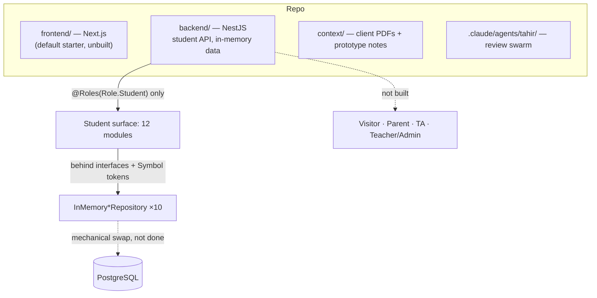
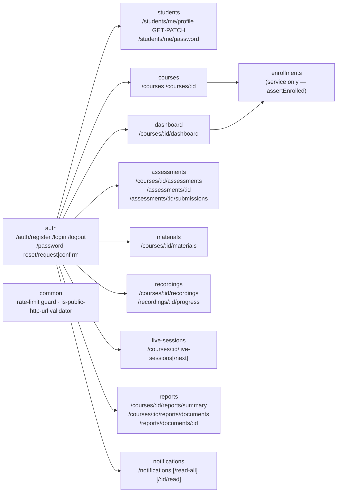
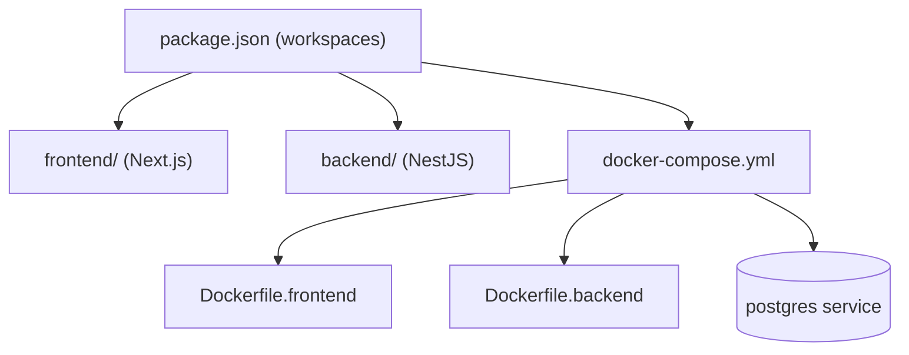
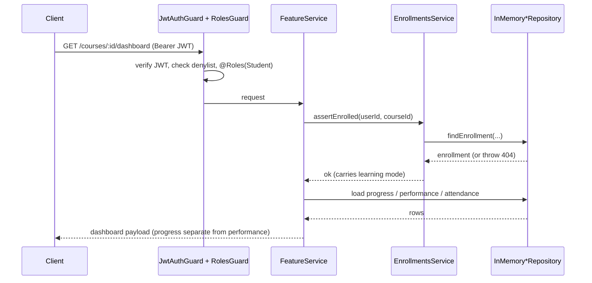
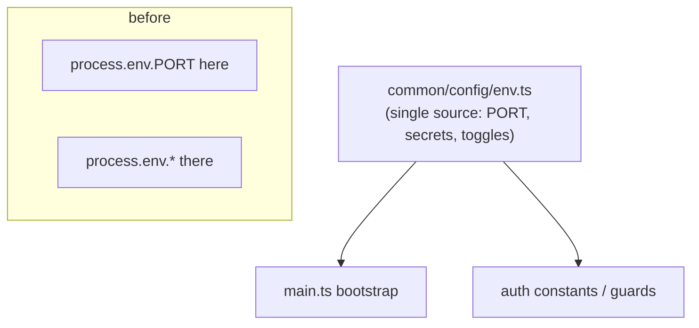

# Project Log — Tahirelshazli.com Educational Platform

Running narrative of what this project is and how it got here, in prose and diagrams.
Maintained by Claude Code per `CLAUDE.md` §13. Newest dated entries at the bottom;
the **Current state** block below is overwritten each update.

---

## Current state (as of 2026-09-06)

The repository is a monorepo scaffold with a **NestJS backend** and a **Next.js frontend**,
targeting the stack fixed in the signed agreement (Next.js + NestJS + PostgreSQL + Bunny Stream +
Cloudflare R2 + Hostinger VPS, all behind swappable interfaces).

**Backend — the student-facing API surface is built and tested; nothing else is.** Of the five
roles in `CLAUDE.md` §2, only **Student** has endpoints. Twelve feature modules
(`auth`, `students`, `courses`, `enrollments`, `dashboard`, `assessments`, `materials`,
`recordings`, `live-sessions`, `reports`, `notifications`, plus `common` for rate-limiting and
validators) expose ~30 routes, every protected one gated `@Roles(Role.Student)`. Auth is
JWT + argon-style hashing behind a `PasswordHasher` interface, with a token denylist for logout,
rate limiting on auth routes, and password-reset request/confirm.

**Persistence is entirely in-memory.** Every repository sits behind an interface and a DI `Symbol`
token, with an `InMemory*Repository` implementation. No Postgres driver is installed in `backend/`
yet — all data is lost on restart and nothing survives a second replica. The known interface-shape
debt (no list/batch/count methods, no pagination) is documented in `CLAUDE.md` §7.1 and is
deliberately cheapest to fix before a real DB implementation exists.

**Frontend is the untouched `create-next-app` starter** — `app/page.tsx` is still the template.
No marketing site, no LMS screens.

**Tooling:** the ruflo meta-harness is installed (`.claude/`, `.claude-flow/`, `.mcp.json`), plus a
project-specific 8-agent read-only review swarm under `.claude/agents/tahir/` driven by
`/swarm-review`.

### Backend module / route map

---

## 2026-08-27 — Project scaffold

**What changed.** Initial monorepo created: root `package.json` workspace, `frontend/` from
`create-next-app` (TypeScript + Tailwind), `backend/` from the NestJS starter, `docker-compose.yml`
with separate `Dockerfile.backend` / `Dockerfile.frontend`, a `database/` folder, `.env.example`,
and a `README.md` documenting the agreed stack. `brief.txt` and the `context/` PDFs
(signed agreement, both client meeting reports, prototype walkthroughs) were added as the
source-of-truth material that `CLAUDE.md` §0 ranks.

**Why.** Establishes the stack fixed in `context/download.pdf` — Next.js + NestJS + PostgreSQL on
Hostinger, explicitly *not* the Next.js-API-routes + Supabase path from the older background notes
(`CLAUDE.md` §3).

**Follow-ups.** Everything — no application code yet. Frontend never progressed past this starter.

---

## 2026-08-29 — Student-facing API modules (commits `2ecae94`, `a09b055`)

**What changed.** The student backend was built out across two commits. First `auth`, `courses`, and
`assessments`; then the rest of the student platform surface — `students` (profile + password
change), `dashboard`, `enrollments`, `materials`, `recordings` + progress, `live-sessions`,
`reports`, `notifications`. Each module follows the same shape: controller → service →
repository-interface (`Symbol` DI token) → `InMemory*Repository`. DTOs with `class-validator`
guard every request body and query. `assertEnrolled` in the enrollments service is the shared
gate for course-scoped student reads. Auth hardening landed alongside: JWT strategy, `RolesGuard` +
`@Roles` decorator, `Role` enum (`visitor|student|parent|assistant|teacher`), bcrypt-style hashing
behind `PasswordHasher`, a token denylist service for logout, per-route rate limiting
(`InMemoryRateLimitStore`), and password-reset request/confirm behind a `PasswordResetNotifier`
interface. Unit specs (14 `*.spec.ts`) and an e2e spec cover the surface.

**Why.** Phase 1 (`CLAUDE.md` §7) — "student authentication, student dashboard & course pages,
database architecture." Maps to prototype areas `ACC-` (accounts/auth), `CRS-` (courses),
`ASG-`/`QUZ-` (assessments), `PRG-` (progress), `REP-` (reports). `CLAUDE.md` §5.1 (progress ≠
performance) and §5.2 (recorded vs. live mode) shape the dashboard and reports responses; §5.10
(status computed server-side) shapes assessment status.

**Follow-ups / debt.** In-memory only, no Postgres driver. N+1 reads in `assessments.service.ts`
and `courses.service.ts`; dashboard calls `assertEnrolled` 4× / `getProgress` 2× per load; no
pagination anywhere; rate limiter + token denylist are per-process (break under multiple replicas);
`JwtStrategy` does a user lookup per request. All catalogued in `CLAUDE.md` §7.1.
Open decisions this pressures: `due_at` semantics, missing `missed` assessment status,
`Attendance` storing `attended: boolean` (can't encode `late`) — `CLAUDE.md` §11.

---

## 2026-08-29 — Ruflo meta-harness + LMS review swarm (commit `aed7c1d`)

**What changed.** Installed ruflo (`.claude/` settings, helpers, skills, generic agent library;
`.claude-flow/`, `.swarm/`, `.mcp.json`, `.agents/`). Added a **project-specific review swarm** of
8 read-only agents under `.claude/agents/tahir/`, plus the `/swarm-review` command that orchestrates
them in waves of three (a hard-won cap — six parallel agents once hit the session 429 and all died).

| Agent | Team | Owns |
|---|---|---|
| `lms-team-lead` | Lead | Final verdict, dedup, CLAUDE.md drift detection |
| `lms-sec-rbac` | Security | TA scoping via `CourseStaffAssignment`, `@Roles` coverage, IDOR/BOLA |
| `lms-sec-appsec` | Security | Auth, JWT, rate limiting, uploads, signed URLs, secrets |
| `lms-sec-datatrail` | Security | Audit-log coverage, refund trail, server-derived status, PII |
| `lms-arch-scale` | Architecture | In-memory→Postgres path, N+1, pagination, per-process state |
| `lms-arch-maintain` | Architecture | Module boundaries, swappable interfaces, DTO validation, naming |
| `lms-review-code` | Review | Diff correctness **and** verification gate for other agents' findings |
| `lms-review-reqs` | Review | Traceability to prototype codes, scope-creep guard, open-decision surfacing |

**Why.** `CLAUDE.md` is large, the requirements shift (§0), and security is the client's stated top
priority (§8). The swarm encodes the spec into reviewers so finished work is checked against it.

**Follow-ups.** Swarm is read-only — it never edits. Fixes are always a separate explicit step.

---

## 2026-09-06 — Auth defaults + centralized port config (commit `eb8b804`)

**What changed.** Tightened auth defaults and moved port configuration into a single
`common/config/env.ts` module rather than reading `process.env` ad hoc. `docs(claude)` commit
`542ccdb` alongside corrected the `CLAUDE.md` §7.1 debt inventory and closed half of the attendance
keying decision (`AttendanceRecord` now settled to key on `sessionId`, matching §6.1; the
`present|absent|late` vs. `attended: boolean` question stays open).

**Why.** `CLAUDE.md` §3 (infrastructure behind configuration, never hardcoded) and §8 (secure
defaults, secrets in env). Keeps the VPS→cloud migration a config change, not a code change.

**Follow-ups.** This log file itself was introduced in this session (`CLAUDE.md` §13) and
backfilled with the history above. Next material work is still the Postgres repository
implementation and the first non-student role (TA / `CourseStaffAssignment`, §5.11).
