# Project Log — Tahirelshazli.com Educational Platform

Running narrative of what this project is and how it got here, in prose and diagrams.
Maintained by Claude Code per `CLAUDE.md` §13. Newest dated entries at the bottom;
the **Current state** block below is overwritten each update.

---

## Current state (as of 2026-09-08)

The repository is a monorepo with a **NestJS backend** and a **Next.js frontend**, on the stack
fixed in the signed agreement (Next.js + NestJS + PostgreSQL + Bunny Stream + Cloudflare R2 +
Hostinger VPS, all behind swappable interfaces).

**Backend — four of five roles now have a working API.** Of the five roles in `CLAUDE.md` §2,
**Student**, **Assistant** and **Teacher** have full surfaces and **Visitor** now has a partial one
(the public catalog); only **Parent** has nothing. Seventeen feature modules (`auth`, `students`,
`courses`, `enrollments`, `dashboard`, `assessments`, `materials`, `recordings`, `live-sessions`,
`reports`, `notifications`, `staff`, `manage`, `announcements`, `public`, `audit`, plus `common`)
sit behind global `JwtAuthGuard` + `RolesGuard`. `staff` owns the `CourseStaffAssignment` scoping
every TA endpoint joins through (§5.11); `manage` is the work surface built on it — overview,
roster, grading, the recording library, live-session scheduling and the people directory;
`announcements` carries the send-time audience resolution §5.14 requires; `public` is the only
unauthenticated surface besides health and auth; `audit` owns the append-only log, now covering
**ten actions**.

**Persistence is driver-selected.** All thirteen repository interfaces have *two* implementations —
an `InMemory*Repository` and a `Postgres*Repository` — bound through
`database/repository.provider.ts` by the `PERSISTENCE_DRIVER` env var. `memory` is the default in
development and test and is **refused outright in production**. Five migrations:
`001_student_platform.sql`, `002_staff_and_audit.sql`, `003_course_catalog.sql`,
`004_public_catalog.sql`, `005_announcements.sql`.

**The integration suite has now run in full.** It covers all thirteen repositories and holds 48
tests, and as of **2026-09-08 all five migrations have been applied to a real PostgreSQL 15 from an
empty schema with all 48 green** — the announcements DDL and both its CHECK constraints, the
`notifications_type_check` swap, 004's slug backfill and 003's learning-mode UPDATE included.
Docker's engine was simply stopped rather than broken; starting Docker Desktop was the whole fix.
The CI guard that fails a job reporting no executed tests still matters, because the suite
self-skips and exits 0 wherever `TEST_DATABASE_URL` is unset.

**Delivery is wired.** `npm install && npm run dev` runs the whole thing with no database and no
config; CI lints, builds, and runs unit + e2e + integration (against a Postgres service) plus both
container image builds on every push and PR. Both images built and ran from the repo root when
that was last verified on 2026-09-07; they have **not** been rebuilt since. CI still builds them on
every push.

**Frontend covers the marketing site, the student LMS and the TA/admin console.** `app/(site)`
marketing, `app/(app)` product shell — student LMS *and* `/manage/*` — and `app/(auth)`
authentication: 30 page files compiling to 21 build routes, a shared token system in
`app/tokens.css`, and an API client in
`lib/api.ts` covering every student, staff and admin route. One `AppShell` serves every signed-in
role and picks its rail from `lib/roles.ts`. Builds, typechecks and lints clean.

**Tooling:** the ruflo meta-harness (`.claude/`, `.claude-flow/`, `.mcp.json`) plus a
project-specific 10-agent review swarm under `.claude/agents/tahir/`, driven by `/swarm-review`.

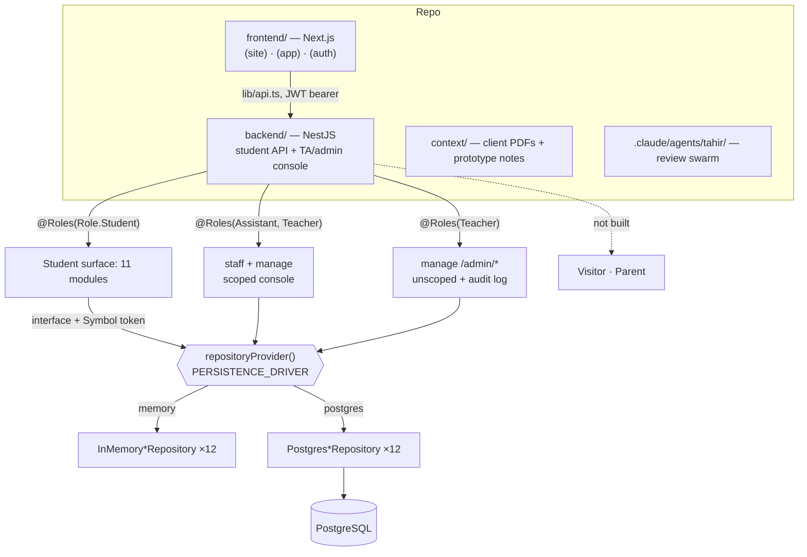

### Backend module / route map

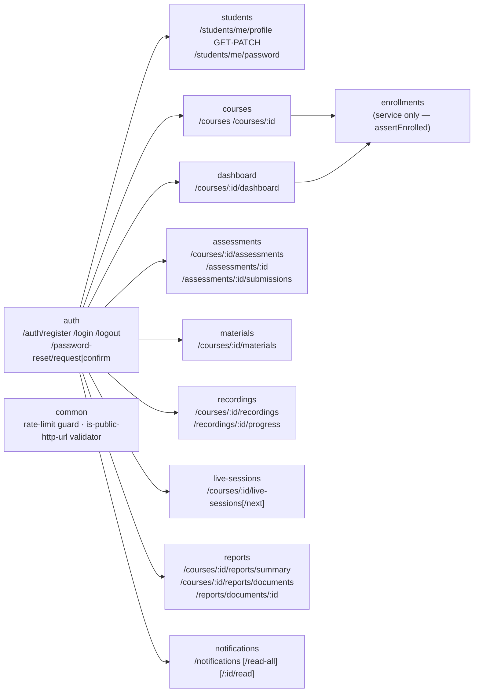

---

## 2026-08-27 — Project scaffold

**What changed.** Initial monorepo created: root `package.json` workspace, `frontend/` from
`create-next-app` (TypeScript + Tailwind), `backend/` from the NestJS starter, `docker-compose.yml`
with separate `Dockerfile.backend` / `Dockerfile.frontend`, a `database/` folder, `.env.example`,
and a `README.md` documenting the agreed stack. `brief.txt` and the `context/` PDFs
(signed agreement, both client meeting reports, prototype walkthroughs) were added as the
source-of-truth material that `CLAUDE.md` §0 ranks.

**Why.** Establishes the stack fixed in `context/download.pdf` — Next.js + NestJS + PostgreSQL on
Hostinger, explicitly *not* the Next.js-API-routes + Supabase path from the older background notes
(`CLAUDE.md` §3).

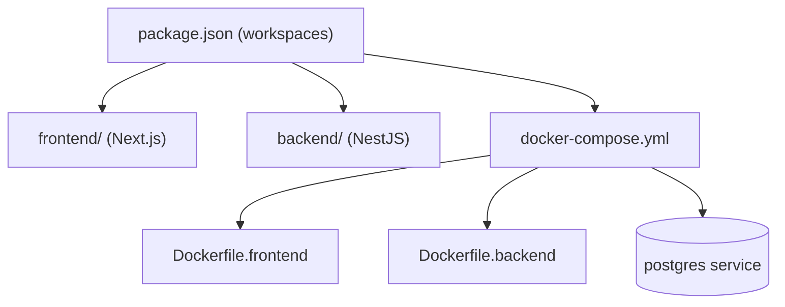

**Follow-ups.** Everything — no application code yet. Frontend never progressed past this starter.

---

## 2026-08-29 — Student-facing API modules (commits `2ecae94`, `a09b055`)

**What changed.** The student backend was built out across two commits. First `auth`, `courses`, and
`assessments`; then the rest of the student platform surface — `students` (profile + password
change), `dashboard`, `enrollments`, `materials`, `recordings` + progress, `live-sessions`,
`reports`, `notifications`. Each module follows the same shape: controller → service →
repository-interface (`Symbol` DI token) → `InMemory*Repository`. DTOs with `class-validator`
guard every request body and query. `assertEnrolled` in the enrollments service is the shared
gate for course-scoped student reads. Auth hardening landed alongside: JWT strategy, `RolesGuard` +
`@Roles` decorator, `Role` enum (`visitor|student|parent|assistant|teacher`), bcrypt-style hashing
behind `PasswordHasher`, a token denylist service for logout, per-route rate limiting
(`InMemoryRateLimitStore`), and password-reset request/confirm behind a `PasswordResetNotifier`
interface. Unit specs (14 `*.spec.ts`) and an e2e spec cover the surface.

**Why.** Phase 1 (`CLAUDE.md` §7) — "student authentication, student dashboard & course pages,
database architecture." Maps to prototype areas `ACC-` (accounts/auth), `CRS-` (courses),
`ASG-`/`QUZ-` (assessments), `PRG-` (progress), `REP-` (reports). `CLAUDE.md` §5.1 (progress ≠
performance) and §5.2 (recorded vs. live mode) shape the dashboard and reports responses; §5.10
(status computed server-side) shapes assessment status.

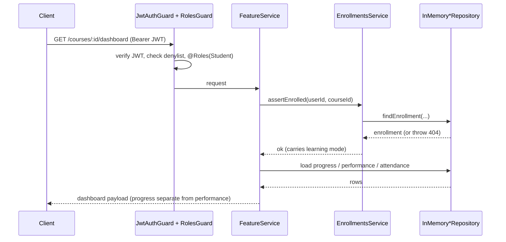

**Follow-ups / debt.** In-memory only, no Postgres driver. N+1 reads in `assessments.service.ts`
and `courses.service.ts`; dashboard calls `assertEnrolled` 4× / `getProgress` 2× per load; no
pagination anywhere; rate limiter + token denylist are per-process (break under multiple replicas);
`JwtStrategy` does a user lookup per request. All catalogued in `CLAUDE.md` §7.1.
Open decisions this pressures: `due_at` semantics, missing `missed` assessment status,
`Attendance` storing `attended: boolean` (can't encode `late`) — `CLAUDE.md` §11.

---

## 2026-08-29 — Ruflo meta-harness + LMS review swarm (commit `aed7c1d`)

**What changed.** Installed ruflo (`.claude/` settings, helpers, skills, generic agent library;
`.claude-flow/`, `.swarm/`, `.mcp.json`, `.agents/`). Added a **project-specific review swarm** of
8 read-only agents under `.claude/agents/tahir/`, plus the `/swarm-review` command that orchestrates
them in waves of three (a hard-won cap — six parallel agents once hit the session 429 and all died).

| Agent | Team | Owns |
|---|---|---|
| `lms-team-lead` | Lead | Final verdict, dedup, CLAUDE.md drift detection |
| `lms-sec-rbac` | Security | TA scoping via `CourseStaffAssignment`, `@Roles` coverage, IDOR/BOLA |
| `lms-sec-appsec` | Security | Auth, JWT, rate limiting, uploads, signed URLs, secrets |
| `lms-sec-datatrail` | Security | Audit-log coverage, refund trail, server-derived status, PII |
| `lms-arch-scale` | Architecture | In-memory→Postgres path, N+1, pagination, per-process state |
| `lms-arch-maintain` | Architecture | Module boundaries, swappable interfaces, DTO validation, naming |
| `lms-review-code` | Review | Diff correctness **and** verification gate for other agents' findings |
| `lms-review-reqs` | Review | Traceability to prototype codes, scope-creep guard, open-decision surfacing |

**Why.** `CLAUDE.md` is large, the requirements shift (§0), and security is the client's stated top
priority (§8). The swarm encodes the spec into reviewers so finished work is checked against it.

**Follow-ups.** Swarm is read-only — it never edits. Fixes are always a separate explicit step.

---

## 2026-09-06 — Auth defaults + centralized port config (commit `eb8b804`)

**What changed.** Tightened auth defaults and moved port configuration into a single
`common/config/env.ts` module rather than reading `process.env` ad hoc. `docs(claude)` commit
`542ccdb` alongside corrected the `CLAUDE.md` §7.1 debt inventory and closed half of the attendance
keying decision (`AttendanceRecord` now settled to key on `sessionId`, matching §6.1; the
`present|absent|late` vs. `attended: boolean` question stays open).

**Why.** `CLAUDE.md` §3 (infrastructure behind configuration, never hardcoded) and §8 (secure
defaults, secrets in env). Keeps the VPS→cloud migration a config change, not a code change.

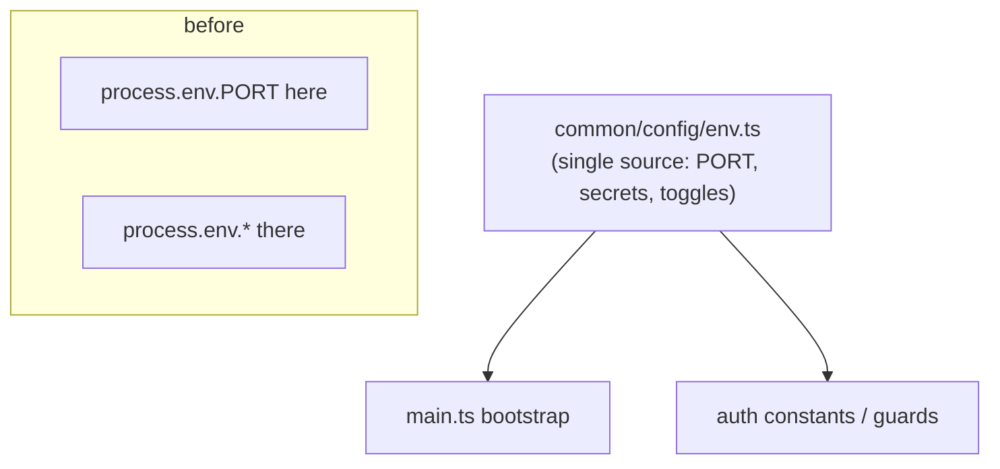

**Follow-ups.** This log file itself was introduced in this session (`CLAUDE.md` §13) and
backfilled with the history above. Next material work is still the Postgres repository
implementation and the first non-student role (TA / `CourseStaffAssignment`, §5.11).

---

## 2026-09-06 — Frontend: marketing site, student LMS shell, auth (commit `6e1e8ad`)

**What changed.** The frontend stopped being the `create-next-app` starter. Three route groups
now cover 20 pages: `app/(site)` — home, about, courses index, course detail, blog, contact;
`app/(app)` — dashboard, notifications, profile, and the seven `learn/[id]` screens (overview,
recordings, materials, assessments, assessment detail, sessions, report); `app/(auth)` — login,
register, forgot-password, reset-password. `lib/api.ts` is a single typed client over every
student route the backend exposes, with `ApiError` carrying the status through; `lib/session.tsx`
holds the JWT and the current user; `lib/types.ts` mirrors the backend response shapes exactly, so
a change to a controller's payload breaks the build rather than a screen at runtime.

**Why.** `CLAUDE.md` §7 Phase 1 — "homepage & marketing pages, about / courses / contact, student
authentication, student dashboard & course pages, fully responsive design". The two surfaces are
deliberately different: the marketing site is editorial and spacious, the LMS is dense and
token-driven, per §4 (black / white / dark grey / gold accent, gold never a background).

Two domain rules are visible in the markup rather than buried. §5.1 — progress and performance
render as **two separate blocks** on the course overview and the report screen; there is no
combined percentage anywhere. §5.2 — the course shell renders checkpoints for a recorded
enrollment and an attendance timeline for a live one, switching on the mode the enrollment
carries, not on a client guess. Live sessions are plain links (Google Meet / Zoom URLs), which is
the client's stated assumption in §11, not API automation.

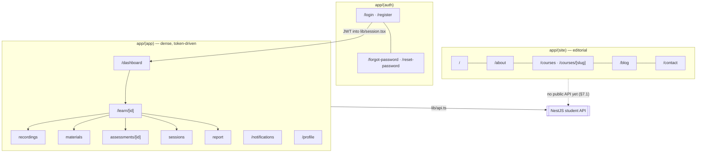

**Swarm additions.** The review swarm grew from eight agents to ten with a matched pair for this
surface: `lms-fe-build` (the only agent in the set that writes — it knows the two-surface design
contract and the backend's exact response shapes) and `lms-fe-review`, its read-only counterpart,
which checks token discipline, the surface boundary, contrast in both themes, reduced motion, and
whether the UI actually matches what the API returns.

**Follow-ups / debt.** The marketing site has no backend to read from — §7.1's Visitor row is
still empty, so course cards, blog posts and testimonials come from `lib/site-content.ts`, whose
header marks every seeded image and figure as a placeholder that must not go live unreplaced. The
contact form has nowhere to POST (`components/site/contact-form.tsx`) and says so in a comment
rather than pretending to send. No parent, TA or admin screens — those roles have no API.

---

## 2026-09-06 — Postgres persistence + swarm-driven security and scale fixes

**What changed.** The single largest gap in `CLAUDE.md` §7.1 — *"persistence is entirely
in-memory"* — is closed. Every one of the ten repository interfaces now has a second
implementation, `Postgres*Repository`, alongside the original `InMemory*Repository`. No module
knows which one it got: `database/repository.provider.ts` binds the `Symbol` token to one or the
other from `PERSISTENCE_DRIVER`, read once at wiring time.

The supporting pieces are all new: `DatabaseService` (a pooled `pg` client that stays dormant when
no connection string is configured), `MigrationRunner`, `migrations/001_student_platform.sql` (17
tables — exactly what the student surface touches, not the whole §6 domain), a development seed
that mirrors the in-memory fixtures row for row, and `db:migrate` / `db:seed` CLI entry points.
`test/postgres-repositories.integration-spec.ts` covers all ten against a real database and
`describe.skip`s itself when `DATABASE_URL` is absent, so the suite stays green on a machine with
no Postgres.

The driver choice is a safety boundary, not a preference. `memory` is the default in development
and test and is **refused outright in production** — an unset value there resolves to `postgres`
and then fails on the missing `DATABASE_URL`, rather than quietly serving traffic from a
process-local array. That single rule also disposes of the swarm's one critical finding: the
seeded `teacher@example.com` / `password123` account can no longer exist on a production instance,
because the repository holding it cannot be selected there. `db:seed` refuses production for the
same reason.

**Why.** `CLAUDE.md` §3 (PostgreSQL is the decided stack; infrastructure behind interfaces so the
VPS is migratable without code changes) and §7.1, which called the swap "mechanical" — it was,
because every repository already sat behind an interface and a token. The two implementations
being interchangeable is the point: the in-memory path stays as the zero-dependency development
and test story.

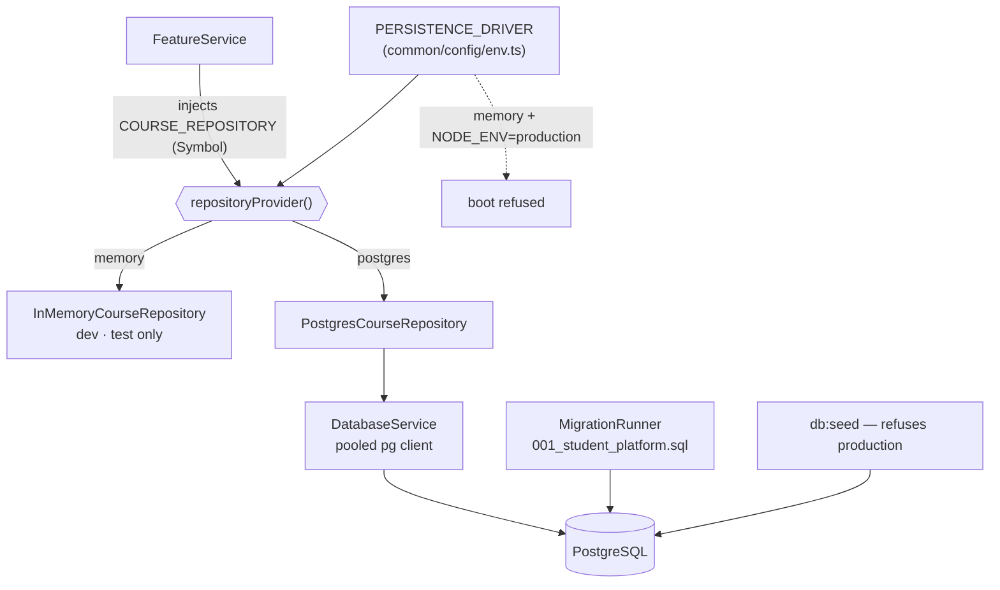

**Alongside it, the review swarm ran and its findings were fixed.** The ones that changed code:

| Finding | Fix |
|---|---|
| Guards were opt-in per controller | `JwtAuthGuard` + `RolesGuard` registered **globally**; `@Public()` and `@AnyRole()` are now the explicit exits, so a new controller is protected by default rather than by remembering |
| No health route, but `Dockerfile.backend` health-checked one | Added `/health` (public); the three e2e tests that pinged `GET /` follow it |
| 404-vs-403 message oracle in assessments and recordings | Collapsed to one indistinguishable 404, so an unenrolled student cannot probe which course ids exist |
| Submission reads and writes took no owner | Owner is now a repository-method parameter, not a service-layer check — changed while there were only two implementors to update |
| N+1 reads (`CLAUDE.md` §7.1) | Batch methods on the course and assessment-submission interfaces; the three service loops now issue one query. Over in-memory arrays these were free; over Postgres they were about to become real round trips |
| Duplicated recordings query in the dashboard | Read once, passed down |
| Light-theme contrast failure, five React Compiler `set-state-in-effect` errors | Fixed; `frontend` lints clean |

**Verification.** 153 unit tests, 63 e2e, `nest build`, frontend `next build` + `tsc --noEmit` +
`eslint` — all green. The integration suite is written but unrun here: no Postgres on this machine.
One e2e run in four failed two tests with `ECONNRESET`; three consecutive runs after it passed, so
it is flaky rather than broken — worth watching, not yet worth chasing.

**Housekeeping.** `.env.example` gained `PERSISTENCE_DRIVER`, `DB_AUTO_MIGRATE` and `PORT`;
`docker-compose.yml` now sets them, including the `PORT: 3001` its forwarded port always assumed.
The scaffold-era `database/schema.sql` and `database/seed.sql` are **not** what runs — they are the
§6 design outline and they disagree with the migration on column shapes, so both now say so in
their headers and point at `backend/src/database/`.

**Follow-ups / debt.** The integration suite needs a real database run before anyone trusts it.
The rate limiter and token denylist are still per-process, and `JwtStrategy` still does a user
lookup per request — all three want the same Redis that `CLAUDE.md` §5.11 says to introduce once,
not four times. No pagination on any list endpoint; the interfaces now have batch reads but still
no list or count methods, and §7.1's warning holds — those are cheapest to add *before* a third
implementor exists. Still only one of five roles has a backend.

---

## 2026-09-06 — User-stories board reconciled into the spec (no commit yet)

**What changed.** No code. The FigJam user-stories board — 129 role-scoped stickies plus nine
sequence diagrams, the artifact of the 30 Jul 2026 client meeting — was read against the built
surface and against `CLAUDE.md`, and four places where the two reference artifacts *disagree with
each other* are now written down instead of living in one session's head.

The board was previously a bare link at the bottom of `CLAUDE.md` §12 with no rank. It now sits at
**§0 item 4**, beside `report 1.pdf` rather than above it: it is that meeting's own output, not a
later correction of it. Everything below it renumbered by one, and the two cross-references inside
§0 that named item numbers were fixed with it.

The substantive edits, all of them recording a conflict rather than resolving one:

- **§2.2** gained a paragraph naming the two TA powers the board grants and the preset omits —
  `ASG-10` (create and publish assignments independently) and `CRS-11` (schedule and share Zoom
  links). The instruction is to ship the narrower preset and treat both as questions, because the
  board and the prototype doc are **peers** under §0, so neither overrides the other.
- **§5.9** now marks its own TA clause as contested. That sentence was the single line a future
  session would have read as settled before writing `@Roles(Role.Assistant)` on a report endpoint.
  The teacher half is untouched; only the TA half is flagged.
- **§11** gained three bullets and had its TA-reports bullet rewritten. The rewrite matters most:
  §11 previously argued "the meeting outranks the prototype, so the default is *yes*." The board
  breaks that argument — it puts all five `REP-*` stickies in the Owner column and gives the TA
  none, while still granting `QUZ-12` and `PRG-05`, so the 30 Jul meeting and the prototype now
  agree *against* §5.9. The bullet now says to check which PDF §5.9 actually came from before
  writing the decorator.
- **§11** also records two board stories that have **no entity anywhere in §6 or §6.1** — `COM-08`
  (student comments and questions on a lesson) and `CMS-13` (course reviews and ratings from past
  students). Neither is in the §9 wish list either, so neither was ever costed, and both are real
  features with their own moderation surface rather than columns on an existing table.

**Why.** `CLAUDE.md` §0 exists to make the precedence between reference artifacts explicit, and it
had a gap: the board was cited nowhere in the ranking while being the source that contradicts §5.9.
§13 asks that entries name the section that motivated them — this one is §0 and §11 themselves.

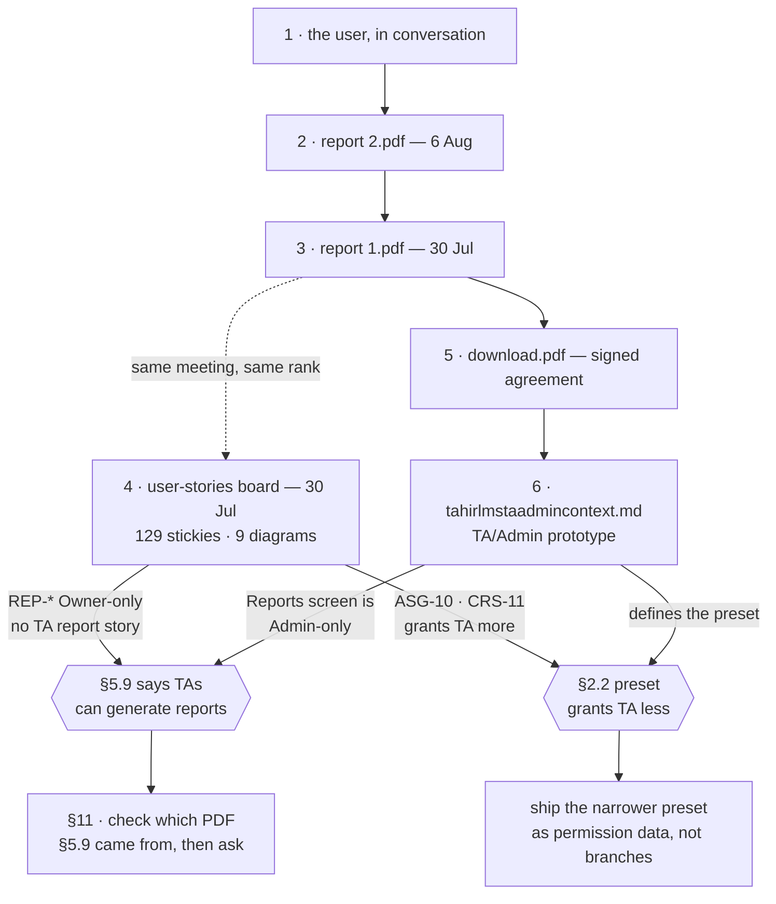

**Coverage, for the record.** Of the board's 129 stickies: Student ~17 built and 3 partial of 35;
Visitor ~10 of 15 but as static pages only, with no public API behind any of them; Owner 0 of 51,
TA 0 of 16, Parent 0 of 12. Of the nine sequence diagrams only the *read* half of Frame 1
(assignment upload and grading) exists — there is no upload endpoint, so the
`Frontend → BackendAPI → FileStorage` leg is absent and `fileUrl` is a client-supplied URL. The
quiz auto-marking, payment-to-enrollment, reCAPTCHA, Google Sign-In, Google Forms and WhatsApp
flows are all unbuilt. Nothing built *contradicts* the board; it is simply far ahead of the code.

**Follow-ups / debt.** The board transcription was supplied in conversation and is **not** in
`context/` — the same gap §12 already records for the fuller TA/Admin doc, and now noted in the
same place. Two `CLAUDE.md` claims are worth verifying at the source rather than inherited: §5.9's
TA clause (which meeting?) and §2's "parent manages payments", which the board contradicts by
putting every paying story in the Student column and leaving the parent only `PAY-14`/`PAY-15`.
That last one was deliberately left out of this pass and is still unrecorded in §11.

---

## 2026-09-06 — `CourseStaffAssignment` scoping and the audit log (no commit yet)

**What changed.** The two primitives every TA and admin surface will sit on, plus the smallest
surface that makes them live rather than plumbing nobody has run.

Two new modules, `backend/src/staff/` and `backend/src/audit/`, and one migration,
`002_staff_and_audit.sql`. Both follow the shape the student surface already uses: an interface, an
`InMemory*` and a `Postgres*` implementation, bound by `repositoryProvider()` off
`PERSISTENCE_DRIVER`.

**`StaffScopeService` is the piece that matters.** It is the direct counterpart of
`EnrollmentsService.assertEnrolled` — same job, different table — and it takes a `StaffActor`
(`{ id, role }`) rather than a bare user id. That signature is the point: with a bare id there is no
way to express "an admin skips the join", so every caller would re-derive the bypass and one of them
would eventually get it wrong in the direction that grants access. `scopeFor()` returns a
discriminated union rather than an optional `courseIds`, so a caller cannot read an undefined field
and treat it as "no restriction" — the same bug as forgetting the check, arrived at politely.

An unassigned course now **404s rather than 403s** for a TA, implementing the posture `CLAUDE.md`
§5.11 had listed as proposed. A spec asserts that a held-but-wrong course and a course that does not
exist return the identical message, because a 403 confirms existence and lets a TA enumerate the
catalog one id at a time.

**The audit log is append-and-read only**, and that is enforced by the interface having no update
and no delete rather than by a database trigger — a trigger would also block the GDPR redaction path
§8 may need, which should arrive as its own named and itself-audited operation. `audit_log` carries
**no foreign keys**, deliberately: deleting a course is itself an auditable action, and a FK would
either cascade the evidence away or block the deletion the log exists to record. `actor_role` is
stored at write time, so a TA later promoted does not retroactively read as having acted as an
admin.

Two things fell out of building it that are worth naming. Audit ids are not `randomUUID()` — they
are `<ms>-<sequence>-<uuid>`, because the id is also the feed's sort tiebreak and same-millisecond
writes are the normal case, not an edge one; with a random id two events in one request display in a
coin-flip order. And the page cursor is a `(createdAt, id)` pair for the same reason: a keyset cursor
on a non-unique key skips rows. Both are covered by tests that freeze the clock.

**The surface**, three routes, deliberately minimal:

| Route | Role | What it proves |
|---|---|---|
| `GET /staff/courses` | assistant + teacher | The TA sees only assigned courses; the admin reaches the same route unscoped |
| `GET·POST·DELETE /admin/courses/:courseId/staff` | teacher | Assignment is admin-only (§2.2) and audited on both sides |
| `GET /admin/audit-log` | teacher | "Which assistant did what" (§5.4), filterable by actor, course, action, target |

Supporting changes to existing code, each the smallest that would do:
`CourseRepository.findAll(limit, offset)` (the admin's unscoped read, and the first paginated
repository method in the codebase), `UserRepository.findByIds` (so the staff panel does not N+1 for
names), and `CoursesModule` now exports `COURSE_REPOSITORY` so `StaffModule` shares the instance
rather than building a second in-memory store with its own state.

**Why.** §5.11 — scoping is a query filter, and getting the table in before the TA surface exists is
the whole argument; retrofitting the join is how the leak happens. §5.4 for the audit log. §2.2 for
TA-to-course assignment being admin-only. Board codes: `TA-R1`/`TA-R2` (a TA cannot touch accounts),
`ACC-11`, `CRS-13`, and the `who took the action` annotation on `ASG-11`.

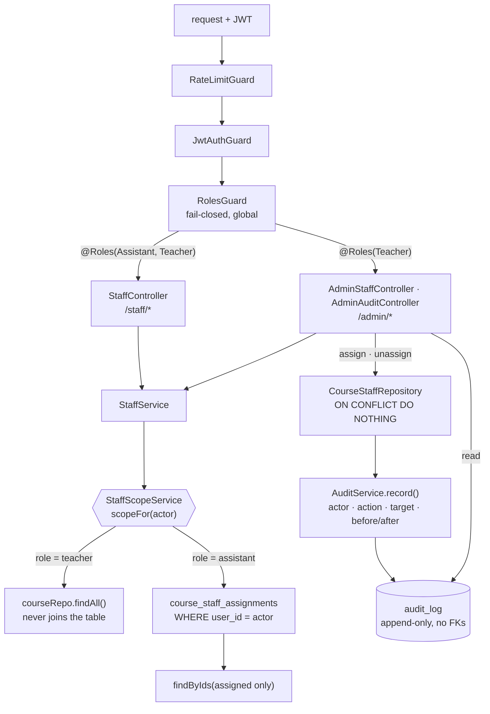

**Verification.** 196 unit tests (31 new across `staff-scope.service.spec.ts`,
`staff.controller.spec.ts`, `audit.service.spec.ts`) and 84 e2e — `test/staff.e2e-spec.ts` is new and
is the only place proving an unassigned TA is stopped over HTTP through the *real* guards, since the
unit specs override them. `nest build` and `tsc --noEmit` clean. The backend has no ESLint config;
lint is a frontend-only step here.

Two honest caveats. The e2e suite crashed one worker on the first parallel run with
`Worker exited unexpectedly` and then passed three runs in a row, parallel and sequential — the same
flakiness the 2026-09-06 persistence entry recorded, now easier to hit with two files booting
`AppModule` at once. And the integration suite now covers twelve repositories instead of ten,
including the ON CONFLICT idempotency, the `ON DELETE CASCADE`/`RESTRICT` split on
`course_staff_assignments`, jsonb round-tripping, and keyset paging over deliberately tied
timestamps — but **it still has not run against a real database**. Docker Desktop was not running on
this machine, so migration `002` has been typechecked and reasoned about, not executed.

**Follow-ups / debt.**

- `AuditService.record` writes after the action it describes has committed, on its own connection.
  A crash between the two leaves an action done and unlogged. The fix is a transaction-scoped
  repository handle, and it should land **before** the payments surface (§5.12), where the gap is a
  money-trail hole rather than a missing line.
- Migration 002 and the two new Postgres repositories are unrun. `docker compose up -d postgres`
  then `TEST_DATABASE_URL=... npm run test:integration` is the whole job.
- No UI. These routes are reachable only over HTTP; there are still no TA or Admin screens.
- The permission preset is still shape, not data. §2.2 asks for it to be configurable and §11 leaves
  per-TA configurability open; today the only thing that varies per TA is *which courses*, which is
  the part that had to exist first. The `ASG-10` and `CRS-11` questions this file's previous entry
  recorded are still unanswered and still cheap to answer while the preset is two roles wide.

---

## 2026-09-07 — Delivery pipeline, a runnable sample, and the first real-database run

**What changed.** The delivery surface went from "documented" to "executed". Everything below was
run on this machine, not reasoned about.

*The sample you can actually run.* `npm install && npm run dev` now works from a fresh clone with
no database and no `.env`. It could not before: `resolvePort` defaulted the API to **3000**, which
is the port Next.js takes, so `npm run dev` started both and one of them lost the race — while
`frontend/lib/api.ts` had always pointed at **3001**. Every other file in the repo already assumed
the 3000/3001 split; the default was the single outlier, so it moved to 3001 rather than the six
files around it moving to 3000. Verified end to end: `GET /health` 200, login as
`student@example.com` returning a 304-character JWT, `GET /courses` returning the seeded AS
Chemistry course with progress and performance as separate objects (§5.1), and `/`, `/courses`,
`/login`, `/dashboard` all rendering 200.

*Containers that build.* All four Dockerfiles were unbuildable and had been since the scaffold.
Each copied only a workspace's `package*.json` and ran `npm ci` — but this is an npm workspaces
monorepo whose only lockfile is at the root, and `npm ci` without a lockfile exits non-zero. There
were also two competing pairs that had already drifted (`docker-compose.yml` built
`backend/Dockerfile`; CI built `Dockerfile.backend`, and only the latter pair had HEALTHCHECKs).
Consolidated to the root pair, both now building from the repo root; the workspace pair is deleted.
Added the root `.dockerignore` that never existed — the build context had been shipping
`node_modules/`, `.git/` and the client's PDFs under `context/`. Both images build, and the API
image was **run** in `NODE_ENV=production` against real Postgres: it boots, reports
`Listening on 3001 (production, persistence=postgres)`, and its container healthcheck reaches
`healthy`.

*CI that runs something.* The old workflow ended in `npm run test --if-present`, and the root
`test` script called `test:frontend`, which called a script the frontend workspace does not have —
so the step failed, and `--if-present` was load-bearing in the worst way. The root `test` now maps
to the workspaces that actually have tests, deliberately without `--if-present`: a missing test
script should be a visible absence, not a silent pass. CI grew an e2e step, a Postgres service
container for the integration suite, and — because that suite `describe.skip`s itself when
`TEST_DATABASE_URL` is unset — a guard step that **fails the job if the suite reports no executed
tests**, which is the only thing standing between "integration tests pass" and "integration tests
never ran". That guard was then tested against real vitest output in three states — green, a
self-skipped suite, and an injected failing test — and rejects the last two. The step writes
`set -o pipefail` explicitly rather than inheriting it from GitHub's default shell, because piping
into `tee` otherwise returns `tee`'s exit code and a failing suite would report success; and the
workflow declares `permissions: contents: read`, since no step writes to the repository. Image
builds moved onto pull requests too; a Dockerfile broken since the scaffold is the argument. A `deploy` job carries the contracted shape (§3) — migrations as their own step
before the new image serves traffic, `DB_AUTO_MIGRATE` left off — and is gated inert on a
`DEPLOY_ENABLED` repository variable, because the VPS is the client's to provision and guessing a
hostname is worse than an obvious gap.

**The bug the integration suite found on its first run.** It had never executed against a real
database; the previous two attempts stopped because Docker was not running. It ran, and 32 of 33
passed. The failure was real, and it was in the audit log.

`audit_log.created_at` was `TIMESTAMPTZ` — microseconds. The feed's keyset cursor `(created_at, id)`
is built in JavaScript from the value read back, and a JS `Date` carries only milliseconds. So
Postgres stored `22:31:29.889842`, the cursor came back as `22:31:29.889`, and the next page's
row-wise `(created_at, id) < (cursor)` compared against a strictly *smaller* timestamp — matching
nothing in that millisecond. Proven directly in SQL: the truncated cursor returned **0** rows where
the full-precision one returned 3.

The consequence is worse than a failing test. **The admin audit log silently stopped after page
one** — no error, just an empty second page — and dropped any entry sharing the boundary
millisecond. §5.4 exists so the teacher can see which assistant did what; an audit trail that
quietly hides its own entries fails that requirement precisely where it matters. It was also
Postgres-only: the in-memory driver compares the same truncated strings on both sides and pages
correctly, so the two drivers disagreed while `audit-cursor.ts` documented that they page
identically.

Fixed by making the column `TIMESTAMPTZ(3)` — matching the storage to the precision the reader can
represent, which is what makes both drivers agree. Ordering inside a millisecond is not lost: audit
ids are `<ms>-<sequence>-<uuid>` exactly so the id breaks the tie. Migration `002` was amended in
place rather than a `003` added, because it has provably never been applied outside a throwaway
test database (§7.1 said so, and this run confirmed it by applying both migrations to an empty
schema). Re-verified over HTTP against the production image: paging with `limit=2` now walks all 7
entries across 4 pages, 7 distinct, no gaps and no repeats.

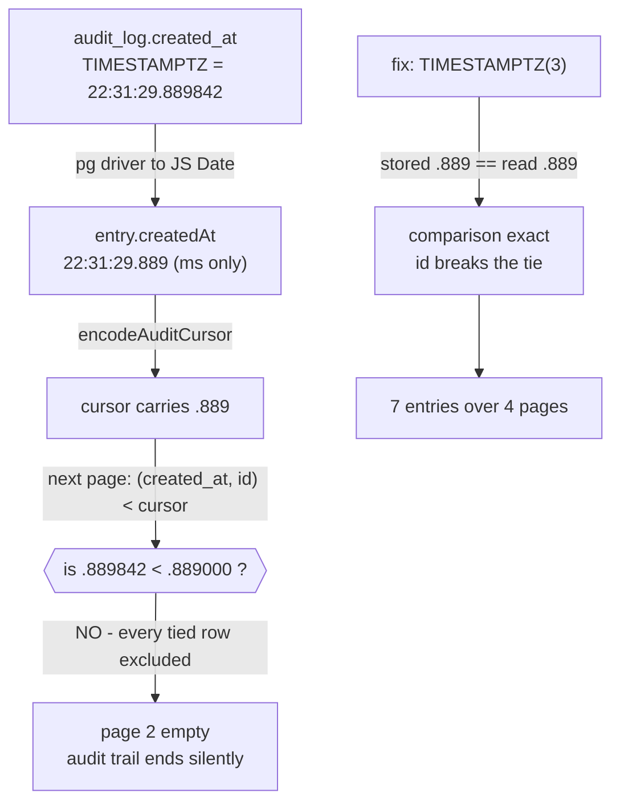

**Why.** §3 — CI/CD and containerized deployment are contracted deliverables, and infrastructure
stays behind configuration. §5.4 for the audit-log fix. §7.1's standing debt item "the integration
suite has still not been run against a real database" is now closed, and it paid for itself on the
first run.

**Verification.** All of it executed, none inferred:

| Check | Result |
|---|---|
| `npm run lint:backend` / `lint:frontend` | clean |
| `npm run build:backend` / `build:frontend` | clean; 20 page routes, 23 entries after SSG expansion |
| `npm run test` (unit) | **196 passed** / 18 files |
| `npm run test:e2e` | **84 passed** / 2 files |
| `npm run test:integration` vs PostgreSQL 15 | **33 passed** — was 32 passed / 1 failed before the fix |
| `docker build` both images | both succeed; API image 257MB |
| API image run in `NODE_ENV=production` | boots on real Postgres, healthcheck `healthy` |
| `npm run dev` from a clean tree | API 3001 + web 3000, login and authenticated reads work |

**Follow-ups / debt.**

- `NEXT_PUBLIC_API_URL` is inlined into the client bundle at build time, so the web image is
  environment-specific and a staging build cannot be promoted to production unchanged. That is a
  Next.js property rather than a choice, and it is the one place §3's "no hostname in the artifact"
  cannot be fully honoured. It is a build argument so the value lives in the pipeline, not the source.
- The `deploy` job is inert until the VPS exists and `DEPLOY_ENABLED` is set. Its rollout step is an
  explicit placeholder rather than a guessed `ssh` invocation.
- `backend/src/common/config/env.ts` is the boot-time security contract — secrets, CORS, proxy hops,
  persistence driver — and has **no unit tests at all**. Changing a default there today is caught by
  nothing, which is uncomfortable for the file that decides whether production can boot on a dev
  signing key.
- `docker compose` no longer bind-mounts source or runs `start:dev`; it builds and runs the same
  production images CI builds. Local hot-reload iteration is `npm run dev`, which is faster anyway.
- `backend/src/database/migrations/002_staff_and_audit.sql` was amended in place, which is only
  defensible while it stays unshipped. Both `backend/audit/` and the migrations directory are still
  **untracked** — nothing has been committed, let alone applied to a durable environment. The moment
  this is committed and applied anywhere real, the same class of edit needs a forward `003`. The
  migration ledger records filenames with no content checksum, so drift would not be detected
  automatically.
- `course_staff_assignments.assigned_at` is still microsecond `TIMESTAMPTZ`. Harmless today because
  nothing pages on it; it now carries a comment pointing at the `audit_log` precedent so the same
  bug is not reintroduced the day it gets a cursor.

---

## 2026-09-07 — The TA & admin console, and teacher-uploaded recordings

**What changed.** The teacher and the teaching assistant now have a working console, and it is the
*same application* the student signs into rather than a second one. `AppShell` picks its navigation
from `lib/roles.ts`, `app/(app)/layout.tsx` routes each role into its own half, and everything below
is shared: one login, one shell, one design system.

On the backend this is a new `manage` module sitting on the `staff` foundation laid last week. It
adds four services — `ManageService` (overview, roster, course outline), `GradingService`,
`ManageRecordingsService`, `DirectoryService` — behind exactly two controllers, because the role
boundary should be one thing a reader checks rather than a decorator hunt:

- **`StaffManageController`** — `@Roles(Assistant, Teacher)`, mounted at `/staff/*`. Every handler
  passes the caller to a service that begins with `StaffScopeService`. A TA sees their assigned
  courses; the teacher sees everything through the identical route.
- **`AdminManageController`** — `@Roles(Teacher)`, mounted at `/admin/*`. Joins through nothing.

The second half of the ask: **Dr. Tahir can now upload recordings**, and a student watches them
immediately — the Udemy-shaped loop the client described. `RecordingRepository` grew
`findByCourseForStaff`, `create`, `update` and `remove` on both drivers; no migration was needed
because `recordings` already had the columns. The upload writes into the same table the student
recordings page has always read, which the e2e suite asserts rather than assumes: publish as the
teacher, then fetch as the student and find it there with `watchedSeconds: 0`.

**Why.** The client asked for it directly, in these terms: an admin dashboard integrated with the
user dashboard, working for both the teacher and the assistant, with the assistant held to the
restrictions already recorded; the teacher able to upload recordings for students to watch.

Traceability: `CRS-` (course roster and library), `ASG-` (grading and feedback), `PRG-` (per-course
averages), `TA-R` (the assistant's restricted subset), `ACC-` (the people directory and TA
assignment). The permission split is `CLAUDE.md` §2.2's preset; the scoping rule is §5.11; the audit
coverage is §5.4; the averages are §5.6; keeping marks apart from completion is §5.1.

**Recording writes are teacher-only, deliberately.** §2.2's preset grants a TA materials and never
recordings, and the client's phrasing was specifically that *the teacher* uploads them. The service
takes a `StaffActor` rather than assuming admin, so widening this later is moving three routes
between controllers — not a redesign. It is flagged in §11 territory rather than silently decided.

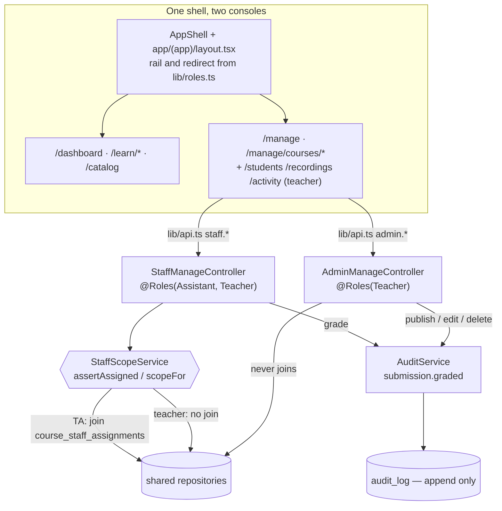

**Two bugs this work surfaced, both fixed.**

The first is worth recording because the test caught it and a reviewer would not have. The in-memory
assessment repository returned the *stored object* from `findSubmissionById`, and `gradeSubmission`
then mutated that same object in place — so `GradingService` read the submission, wrote the grade,
and recorded an audit entry whose `before` and `after` were the identical mutated object. The log
would have shown every mark as never having moved, which is worse than no entry at all because it
looks like evidence. Fixed twice over: the service copies the prior values out before the write, and
the repository hands back a copy so the two drivers stop behaving differently.

The second is smaller. `AppShell` fetched the notification badge for every signed-in user, but
`/notifications` is `@Roles(Role.Student)`. A teacher would have collected a permanent 403 in the
shell itself, on every screen. It now skips the request rather than failing it.

**Verification.**

| Check | Result |
|---|---|
| `npm run test` (unit) | **235 passed** / 19 files — was 204 |
| `npm run test:e2e` | **116 passed** / 2 files — was 84 |
| `npm run lint` (both workspaces) | clean |
| `npm run build:frontend` | clean |
| Driven against the running dev app | teacher upload → visible to student; TA scoped to course-1; TA 404 on course-2; TA 403 on `/admin/*`; grade over max → 400; audit log shows the assistant's grade with before/after |

**Follow-ups / debt.**

- **Audit coverage is now six actions, and the §5.4 gap is unchanged.** `AuditService.record` still
  writes on its own connection *after* the action commits, so a crash in between leaves an action
  done and unlogged. Grading makes this materially worse than it was when only staff assignment was
  audited: a disputed mark with no entry is the exact thing the log exists to answer. It still needs
  the mutation and its audit row in one transaction, and it should land before payments (§5.12).
- **`ManageService.overview` fans out per course** — four `Promise.all` loops issuing a query each
  for enrollments, assessments and recordings, plus one for submissions. Bounded at 100 courses and
  fine at two; it is a genuine N+1 at any real catalog size and wants a grouped read per concern.
  The single-course reads it feeds are already batched.
- **No attendance, quizzes, materials upload, announcements or messages** — §2.2's preset lists them
  and they are not built. The console's course tabs are Roster / Grading / Recordings / Assistants
  and nothing else.
- **Unenrolling a student has no route**, so the roster is read-only for the teacher too, not only
  for the TA. That matches §2.2 for the assistant and understates the admin's powers; the button was
  deliberately not shipped ahead of the endpoint.
- **The annotated-copy field is a URL, not an editor.** §5.5 wants in-platform PDF annotation and §3
  puts files in Cloudflare R2; neither exists. The field records the separate artifact §5.5 asks for
  without pretending to be the tool.
- **Recording "upload" is likewise a URL**, not a file transfer. Bunny Stream (§3) and the signed
  playback URLs §8 requires are both unbuilt, so this stores the reference the student player
  already reads.
- **Deleting a recording destroys every student's watch progress for it** through the FK cascade.
  The UI asks first, but §6's soft-delete convention arguably applies here and does not yet.
- `frontend/components/site/reveal.tsx` still throws a hydration mismatch on the marketing pages —
  `useReducedMotion()` resolves differently on server and client. Pre-existing, untouched, and
  unrelated to this work, but it is now the only React warning in the dev log.

---

## 2026-09-07 (later) — Announcements, live-session scheduling, and a marketplace course page

**What changed.** Three strands, all driven by one instruction from the client: the platform should
work like a course marketplace for the visitor, like Udemy for the student watching recordings, and
the teacher should be able to *"make announcements of the live sessions and quizzes"*.

**1. Announcements (`backend/src/announcements/`).** A new module, two controllers, and the
permission split §2.2 actually specifies: a TA posts to courses they are assigned to via
`POST /staff/courses/:id/announcements`, and only the teacher reaches `POST /admin/announcements`
with an explicit audience. The safety property is structural rather than a check somebody has to
remember: **the staff DTO has no `audience` field at all**, so with `whitelist: true` on the global
pipe a TA who puts `audience: "all_students"` in the body has it stripped before the service runs,
and the audience comes from the URL regardless. Verified over HTTP rather than only asserted in a
test: the smuggled send was recorded as `course:course-1`.

Audience resolves at send time (§5.14) and fans out to the existing notification mailbox rather than
inventing a second inbox. `all_tas` reads `role = 'assistant'` at the moment of sending, so an
assistant hired after the announcement was drafted is still reached. The row stores a
`recipient_count`, deliberately **not** a recipient list, because a stored list is exactly the
frozen membership set §5.14 prohibits.

`/notifications` widened from `@Roles(Student)` to all three roles. That is a loosened role gate and
deserves the scrutiny: it does not widen what anyone can *read*, because every handler is scoped by
`req.user.sub` and the repository's `user_id` predicate is the authorization. An `all_tas`
announcement landing in a mailbox no assistant can open is not a delivery.

**2. Live-session scheduling.** `LiveSessionRepository` was read-only; it gained `create`, `update`
and `remove` on both drivers. No migration was needed, because `live_sessions` from migration 001
already had every column. Teacher-only, because §2.2's preset omits it and §11 records `CRS-11` as
an unresolved disagreement between the prototype and the user-stories board. The service takes a
`StaffActor` and derives `actorRole` from it rather than hardcoding `Role.Teacher`, so widening it
later cannot silently attribute an assistant's action to Dr. Tahir. `zoomLink` goes through the
existing `IsPublicHttpUrl` validator, so `javascript:` and private hosts are rejected at the
boundary; confirmed with a live 400.

**3. The visitor and student surfaces.** The public course page became a real conversion page:
counted facts in the header, outcomes branching on the course's actual `learningMode`, and an
instructor block. The student recordings tab became a course-player, with a player region beside a
collapsible curriculum sidebar, resume-from-position, prev/next, and throttled progress reporting.

The player branches honestly on what `Recording.url` actually is, because Bunny Stream and signed
URLs (§3, §8) are still unbuilt: a direct file gets a real `<video>` with automatic progress, a
recognized embed host gets an iframe **and an admission that cross-origin playback cannot be
observed**, and anything else gets a link-out. Every seeded URL is a `video.example.com` placeholder
and therefore lands in the link-out branch today, so the automatic-progress path is written but
unexercised by fixtures.

**Why.** The client's own words, plus §2.2 for the permission split, §5.11 for scoping, §5.14 for
audience resolution, §5.4 for audit coverage, and §5.1 for keeping completion apart from marks.
Traceability: `CRS-`, `COM-`, `QUZ-`, `TA-R`.

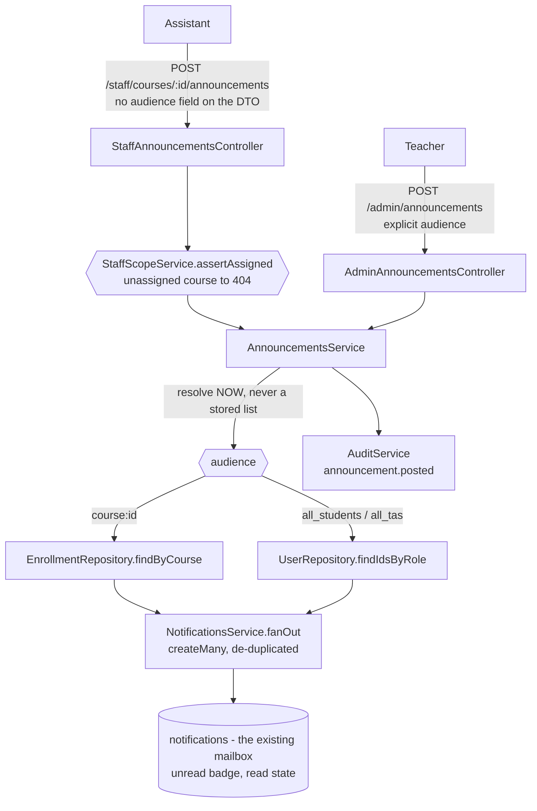

**Verification.** Run against the booted app on the memory driver, not inferred:

| Check | Result |
|---|---|
| `npm run lint` both workspaces | clean |
| `npm run build` both workspaces | clean, 21 frontend routes |
| `npm run test` (unit) | **269 passed** / 21 files, was 241 |
| `npm run test:e2e` | **151 passed** / 3 files, was 125 |
| `npm run test:integration` | **48 written, 0 executed**, no Postgres available |
| `/admin/*` as either assistant | 403; teacher 200 |
| assigned vs unassigned course as a TA | 200 vs **404**, never 403 |
| TA smuggling `audience: all_students` | stripped, stored as `course:course-1` |
| TA scheduling a live session | 403 |
| `javascript:` zoom link | 400 |
| student mailbox after three sends | all three present, links are page routes |

**Follow-ups / debt.**

- **Migration `005_announcements.sql` has never executed.** Docker's engine returns HTTP 500 on
  every API version on this machine and there is no native Postgres, so the integration suite
  self-skips: 48 tests written, zero run. Unexercised: the announcements DDL, both CHECK
  constraints, the `notifications_type_check` swap, the `unnest` insert, and the `TIMESTAMPTZ(3)`
  round-trip. The last time an integration suite ran for the first time it found a real
  silently-truncating-cursor bug, so this is not a formality.
- `posted_at` is `TIMESTAMPTZ(3)` although both reads are LIMIT/OFFSET and neither needs it today.
  This is a monotonically growing feed ordered by exactly that column, so a keyset cursor is the
  obvious next change, and the microsecond trap is documented in the entry above.
- **Platform-wide fan-out is synchronous and unpaged.** `findIdsByRole` has no ceiling on purpose,
  because a partial audience is a *wrong* audience, so an `all_students` send at the "thousands of
  students" scale §1 targets belongs in a background job. Recorded in the interface, not built.
- **The §5.4 transaction gap is unchanged and now matters more.** `audit.record` still commits
  separately from the action it describes, and it now covers four more write paths.
- Announcements have no edit and no delete, deliberately: by the time a row exists it has been
  delivered into people's feeds and neither operation can recall it. A retraction is a second
  announcement. The Postgres repository has no UPDATE and no DELETE, which is where that is
  enforced.
- The CI guard that fails a job reporting no executed tests was tightened. It matched a bare
  `N skipped` anywhere in the log, so one legitimate `it.skip` would have failed the job while
  blaming `TEST_DATABASE_URL`. Now anchored to the `Test Files` line, and both branches were
  exercised against real output.
- `DATABASE_POOL_MAX` and `PGSSLMODE` are read straight from `process.env` in `database.module.ts`,
  bypassing `env.ts`'s validation contract, and neither appears in `.env.example`. `PGSSLMODE` is
  the one that matters: it disables database certificate verification.
- `ManageRecordingsService` still hardcodes `Role.Teacher` in its audit entries where the new
  live-session service derives it. Two-line fix, latent until recordings widen to TAs.
- `frontend/components/site/reveal.tsx` no longer throws a hydration mismatch. The first fix
  replaced it with a lint error and did not actually disable the animation, since `initial` is only
  read on a motion component's first render. It now reads the media query through
  `useSyncExternalStore` and honours reduced motion by collapsing the transition duration.

---

## 2026-09-08 — A verification pass over five sessions, and four fixes it earned

**What changed.** No new features. This entry is an audit of the five sessions of work sitting
uncommitted in the tree — Postgres persistence, `CourseStaffAssignment` scoping and the audit log,
the delivery pipeline, the TA/admin console, and announcements + live sessions + the public catalog
— re-read against `CLAUDE.md` rather than against the entries that describe them. Five reviewers ran
in parallel: authorization, audit-trail, scalability, requirements traceability, and a claim-by-claim
check of what the last three log entries assert.

**The claims held.** Every factual assertion in the entries above was verified against the code and
found true: `TIMESTAMPTZ(3)` on `audit_log.created_at` and `announcements.posted_at`,
`course_staff_assignments.assigned_at` still microsecond and still genuinely unpaged, the staff
announcement DTO with no `audience` field behind a global `whitelist: true`, the append-only audit
repository, thirteen repository interfaces with two implementations each, ten audit actions wired
1:1. Nothing above needed retracting. The four fixes below are things nobody had looked for.

**1. The integration suite finally ran in full, and the DDL is sound.** Docker's engine was not
returning HTTP 500 as the last two entries recorded — the daemon was simply not running. Starting
Docker Desktop was the entire fix, which is worth writing down because two consecutive sessions
treated it as an environmental dead end and shipped unexecuted DDL instead. **All five migrations
applied to a real PostgreSQL 15 from an empty schema, 48 of 48 tests green.** The three migrations
that had never touched a database — `003_course_catalog`, `004_public_catalog`,
`005_announcements` — all apply cleanly: both announcement CHECK constraints exist, the
`notifications_type_check` drop-and-re-add landed with `'announcement'` in the union, 004's slug
backfill produced `as-chemistry` / `ielts-preparation-live` / `igcse-english-language` with no
collision and no NULL fallback, and 003's UPDATE correctly matched `course-2` to `live` off its
existing enrollments. The last time an unexecuted migration first ran it found a silent
audit-log paging bug; this time it found nothing, and that is now a fact rather than a hope.

**2. The `before === after` aliasing bug, found a second time.** `in-memory-recording.repository.ts`
returned the stored object from `findRecordingById`, and `update` mutated that same object and
handed it back — so in `ManageRecordingsService.update`, `existing` and `updated` were one object,
and every `recording.updated` audit entry recorded a rename that appeared never to have happened.
This is the *identical* defect the 2026-09-07 entry describes fixing in grading, and which
`in-memory-live-session.repository.ts` carries an explicit comment against. It survived because the
live-session suite has a "before/after pair that actually differs" test and the recordings suite
only asserted that an entry was written at all. Fixed by returning a copy, and the missing test now
exists — verified to fail without the fix (`expected { title: 'After the rename' } to match object
{ title: 'Before the rename' }`) and pass with it. Under the memory driver, which is the default in
development and test.

**3. A draft course's content was readable by any signed-in student.** Migration 004 added
`is_published` and the *public* catalog honours it, so §7.2 read as settled. It was not:
`CoursesService.getCatalog` called `findAll`, not `findPublished`, and `enroll` never checked the
flag. So any student could list an unpublished course, self-enroll on it in one POST, and from
there `assertEnrolled` passes and its recordings, materials and assessments are all readable —
which is the opposite of what a draft is for. §7.2 deliberately left the *enrollment* half of the
flag open; what it did not say, because nobody had traced it, is that the open half reached content
rather than titles. The catalog now reads `findPublished` and `enroll` answers for an unpublished
course exactly as it does for one that does not exist, so a draft's id cannot be confirmed by
trying to enroll on it.

**4. Two by-id write paths were unscoped, and the comments beside them said otherwise.**
`ManageRecordingsService` and `ManageLiveSessionsService` took a bare resource id, read the row and
wrote, with no `assertAssigned` — correct today, because both are only reachable through
`AdminManageController`. But §11 records "widening this is a controller move" as the reason the
narrow reading was safe to ship, and that was **not true**: moving those routes as written would
have let any TA edit or delete every recording and live session on the platform by id. The scope
check now lives in the service where the claim requires it, resolving the course from the resource
itself (§5.11), including on `create`, which took its course id from the URL and checked only that
the course existed. A no-op for the teacher, and the thing that makes the §11 note honest.

Also: `ManageRecordingsService` derives `actorRole` from the caller instead of hardcoding
`Role.Teacher` (the two-line fix §5.4 had been carrying as latent debt), and grading's out-of-scope
404 now returns the same body as its not-found 404 — two different 404 sentences let a TA tell a
real submission id on another course from one that was never issued, which is the enumeration the
status code was chosen to prevent.

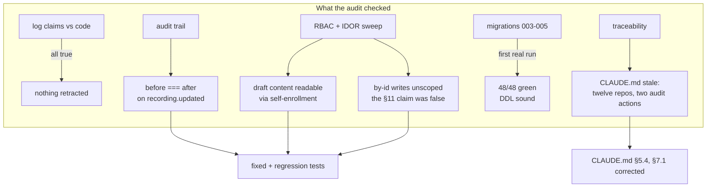

**Why.** §5.4 for the audit trail and the aliasing fix, §5.11 for the by-id scoping and the 404
posture, §7.2 for the draft-course gate, §13 for keeping this file and `CLAUDE.md` consistent —
which they were not: §7.1 still said "twelve repository interfaces" and "audit coverage is two
actions", both written before the console existed.

**Verification.** All executed on this machine:

| Check | Result |
|---|---|
| `npm run lint` both workspaces | clean (three unused frontend imports removed; the last entry's "clean" was three warnings) |
| `npm run build` both workspaces | clean |
| `npm run test` (unit) | **274 passed** / 21 files — was 270, four new regression tests |
| `npm run test:e2e` | **151 passed** / 3 files |
| `npm run test:integration` vs PostgreSQL 15 | **48 passed** — all five migrations from an empty schema, first run for 003/004/005 |
| Recording audit regression test without the fix | fails, `before` reads as the after value |

**Follow-ups / debt.**

- **`ManageService.overview` is a confirmed N+1** and now measured: one batched query plus three
  per-course fan-outs plus one more, so 41 queries at 10 courses and **401 at its own
  `OVERVIEW_COURSE_LIMIT` of 100**. It is the console's landing page, hit on every login. The fix is
  four batched reads mirroring `countByCourses`, across two drivers — mechanical, not structural,
  and unchanged from the last entry except that it is no longer an estimate.
- **The §5.4 transaction gap is unchanged**, now carrying ten write paths. Closing it needs a
  transaction-scoped handle both the mutating repository and `AuditLogRepository.record` can share,
  which the repository-per-connection design cannot express. Still owed before payments (§5.12).
- **Hard deletes still cascade away history.** Deleting a live session removes its `Attendance`
  rows, which are the same rows §5.15's Attendance Report aggregates; deleting a recording removes
  every student's watch progress. §6's soft-delete convention arguably covers both and covers
  neither today.
- `CreateRecordingDto.videoUrl` validates with `@IsUrl` while `UpdateLiveSessionDto.zoomLink` uses
  the stricter `IsPublicHttpUrl`. Teacher-only either way, so not a privilege question, but the
  asymmetry looks unintended.
- The in-memory `CourseRepository.findAll`/`findPublished` sort by title with no id tiebreak where
  Postgres orders by `(title, id)`, so paging could diverge between drivers on duplicate titles.
- Whether `is_published` should be one flag or two (`open_for_enrollment` alongside it) is still
  §11's open question. Fix 3 above chose the safe reading — a draft is neither listed nor
  enrollable — which is reversible in one line if Dr. Tahir wants to advertise before opening.
